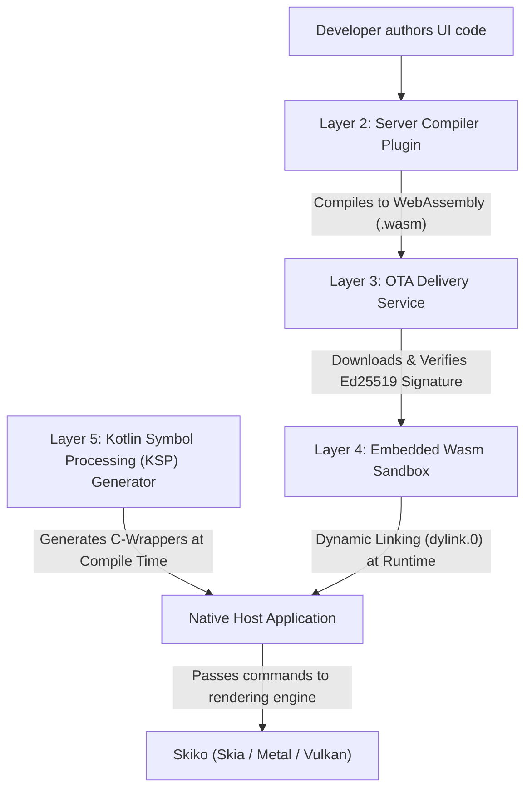
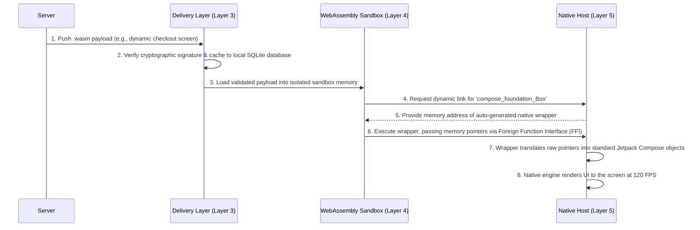

# Technical Specification (v3.0): Zero-Bridge Server-Driven Compose via WebAssembly Dynamic Linking

**Document Version:** 3.0 (Finalized Architecture Blueprint)  
**Target Platforms:** Android (Application Programming Interface (API) 26+) & iOS (iOS 15+)  
**Core Thesis:** Eliminate application-level User Interface (UI) component bridges by compiling Kotlin Compose code into compact WebAssembly (Wasm) bytecode modules that dynamically link at runtime to pre-compiled native Compose Multiplatform engines.

---

## 1. Executive Summary & Strategic Motivation

### The Problem with Traditional SDUI & Component Bridges
Traditional Server-Driven User Interface (SDUI) architectures rely on coarse-grained JavaScript Object Notation (JSON) or Protobuf schemas mapping to platform-native components (e.g., `Column`, `Text`, `Button`). When attempting to scale this into dynamic Server-Driven Experiences (SDE), teams hit the **"Widget Bridge Bottleneck"**:

1. **Massive Maintenance Burden:** Every new Modifier, custom layout, or animation curve requires updating the bridge schema, serialization protocol, and dual client renderers.
2. **Feature Lag & Divergence:** Dynamic screens are constrained to a tiny subset of what Jetpack Compose / SwiftUI offer.
3. **High Latency (The Zipline/Javascript Bottleneck):** Attempting to drive 120 Frames Per Second (FPS) UI updates across a Javascript bridge via JSON or Byte Array serialization causes massive frame drops due to translation overhead and garbage collection pauses.

### The Objective: Zero-Bridge Dynamic Compose via Wasm
Build an execution engine where mobile developers author arbitrary Kotlin Jetpack Compose code that compiles into compact WebAssembly (Wasm) bytecode modules (**15 KB – 50 KB**). These modules are delivered Over-The-Air (OTA) and execute inside an embedded Wasm interpreter.

Crucially, **the dynamic module does not bundle the Compose runtime or rendering engine.** Instead, it uses Wasm's Shared Linear Memory Model and **Dynamic Linking (`dylink.0`)** to bind directly against the full Compose Multiplatform engine already compiled into the native app binary. This allows for lightning-fast, zero-copy layout mutations.

---

## 2. System Layering & Interop Blueprint

The system is composed of 5 discrete layers, built almost entirely in Kotlin. We will produce a deeply technical specification document for each of these layers.

### Layer Architecture & Technology Map

```mermaid
flowchart TD
    subgraph Layer1 ["[Layer 1: Authoring (Server)](specs/layer-1-authoring.md)"]
        L1[Language: Pure Kotlin 2.0+]
        L1F[Framework: Standard Jetpack Compose]
    end
    subgraph Layer2 ["[Layer 2: Compiler Plugin (Server)](specs/layer-2-compiler.md)"]
        L2[Language: Pure Kotlin]
        L2F[Framework: K2 Intermediate Representation (IR) Compiler Plugin]
    end
    subgraph Layer3 ["[Layer 3: Delivery & Security (Device)](specs/layer-3-delivery.md)"]
        L3[Language: Kotlin Multiplatform (KMP)]
        L3F[Framework: ZiplineLoader Fork]
    end
    subgraph Layer4 ["[Layer 4: Sandbox Engine (Device)](specs/layer-4-sandbox.md)"]
        L4[Language: C99 / Pure Kotlin / Pure Swift]
        L4F[Framework: Wasm3 / Chicory / WasmKit]
    end
    subgraph Layer5 ["[Layer 5: Native Host Wrappers (Device)](specs/layer-5-host.md)"]
        L5[Language: Kotlin Multiplatform (KMP)]
        L5F[Framework: Kotlin Symbol Processing (KSP)]
    end
```

### Layer Details & Links

* **[Layer 1: Developer Authoring Tier (Server)](specs/layer-1-authoring.md)**
  * **Responsibility:** Developers write standard UI code. They are restricted to using the standard Compose dependencies that are pre-compiled into the client application.
* **[Layer 2: The Server Compiler (Kotlin IR Plugin)](specs/layer-2-compiler.md)**
  * **Responsibility:** A custom Kotlin Compiler Plugin intercepts calls to `androidx.compose.*`. It treats all Compose functions as external unresolved imports, emitting a WebAssembly (Wasm) file with a `dylink.0` section.
* **[Layer 3: OTA Delivery & Security (The Zipline Fork)](specs/layer-3-delivery.md)**
  * **Responsibility:** Downloads the WebAssembly (Wasm) payload over the network. Verifies Ed25519 cryptographic signatures and handles SQLite caching.
* **[Layer 4: Embedded Wasm Virtual Machine](specs/layer-4-sandbox.md)**
  * **Responsibility:** Executes the WebAssembly (Wasm) bytecode in a secure sandbox. Operates on a linear memory model without heavy Javascript garbage collection.
* **[Layer 5: The Native Host (KSP Wrapper Generator)](specs/layer-5-host.md)**
  * **Responsibility:** Maps WebAssembly (Wasm) imports (raw numbers) to on-device Compose functions (Kotlin objects) using auto-generated Kotlin Symbol Processing (KSP) wrappers.

---

## 3. How the Layers Connect (Interconnectivity)

The following diagram illustrates how code moves from the developer's machine, through the compiler, and links dynamically into the native host device.



---

## 4. User Execution Flow: Landing an Experience on a Phone

When a user opens the application, the following sequence occurs to render a dynamic Server-Driven Experience (SDE) at 120 Frames Per Second (FPS).



---

## 5. Deep Dive: The Shared Brain & KSP Synchronization

Because WebAssembly (Wasm) only understands numeric primitives (`i32`, `i64`), complex high-level types must be marshaled across the Foreign Function Interface (FFI) boundary using wrapper functions.

### The Overload Problem
Compose has hundreds of overloads (e.g., multiple `Button` functions). WebAssembly (Wasm) cannot have multiple imports with the exact same string name. 

### The Solution: `dogwood-symbol-naming`
We will build a standalone Kotlin Multiplatform (KMP) library containing a deterministic naming algorithm. 
* The **Compiler Plugin (Layer 2)** uses this library to calculate the exact `import` string name when generating the WebAssembly (Wasm) payload.
* The **Kotlin Symbol Processing (KSP) Generator (Layer 5)** uses this exact same library to calculate the dictionary mapping on the native device.

This guarantees that both sides generate perfectly matching strings without ever communicating, preventing sync errors.

---

## 6. Deep Dive: Argument Marshalling Mechanics

How we translate high-level Compose concepts into WebAssembly (Wasm) primitives at 120 Frames Per Second (FPS):

1. **Modifiers & Data:** Passed as `Int` IDs pointing to a WebAssembly (Wasm) linear memory buffer where the modifier chain instructions are stored.
2. **Enums (e.g., Alignment):** Passed as `Int` indices corresponding to the enum's ordinal value.
3. **Lambdas (e.g., onClick, content):** Passed as `Int` Table Slots (Wasm Function Table). The Kotlin Symbol Processing (KSP) wrapper wraps this integer in a Kotlin lambda that invokes the WebAssembly (Wasm) engine's `CallIndirect` Application Programming Interface (API).
4. **Nulls:** Represented by the integer `-1`.
5. **Defaults:** The Kotlin compiler automatically resolves Compose default arguments on the server *before* generating the WebAssembly (Wasm) payload, ensuring all values are explicitly passed across the bridge. The host wrapper never guesses default values.

---

## 7. Long-Term Maintenance & Version Skew

When Google releases a new version of Jetpack Compose (e.g., adding a new parameter to `Box`), the server and the client app will fall out of sync. **The client app must remain completely dumb.**

### Server-Side Routing Strategy:
1. The native app boots up and requests the User Interface (UI) payload, passing its engine version: `"Dogwood_Client_v1.7"`.
2. The Server Compiler automatically maintains multiple compiled WebAssembly (Wasm) payloads for different Compose versions.
3. The server routes the exact `.wasm` payload that perfectly matches the client's Kotlin Symbol Processing (KSP) generated dictionary.
4. If a developer uses a brand new Compose 1.8 Application Programming Interface (API) on the server, older clients will simply receive their cached 1.7 payload or a fallback gracefully provided by the server.

---

## 8. Critical Technical Challenges & Gaps (Risk Analysis)

1. **WasmGC vs. Linear-Memory in Embedded Mobile Runtimes:**  
   * *Problem:* Standard Kotlin/Wasm relies on WebAssembly Garbage Collection (WasmGC), which lightweight mobile interpreters (like Wasm3) do not natively support yet.  
   * *Mitigation:* In the near term, dynamic screens compile to linear-memory WebAssembly (Wasm) with a lightweight internal allocator (`wee_alloc`). 
2. **Text Input & Software Keyboard (IME):**  
   * *Problem:* Canvas rendering bypasses native `UITextField` / `EditText`.  
   * *Mitigation:* Compose Multiplatform's `PlatformTextInputService` triggers a native host callback `host_show_keyboard(config)`, piping entered characters back into WebAssembly (Wasm) state.  
3. **Screen Reader Accessibility (VoiceOver & TalkBack):**  
   * *Problem:* A raw Graphics Processing Unit (GPU) canvas is invisible to screen readers.  
   * *Mitigation:* The in-Wasm Compose engine exports its `SemanticsNode` tree across shared memory, which the native host mirrors to `UIAccessibilityElement` (iOS) and `AccessibilityNodeInfo` (Android).  
4. **Apple App Store Policy (Guideline 2.5.2):**  
   * *Compliance:* Execution is strictly interpreted (no Just-In-Time (JIT) compilation) inside an isolated sandbox, updating feature flows within the existing app domain.
