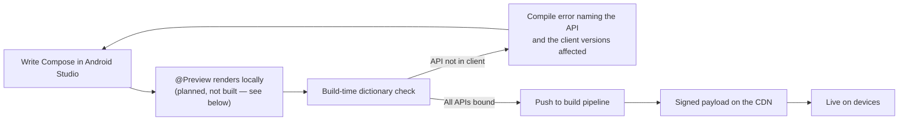

# Project Dogwood: The Developer Experience

**Audience:** Mobile engineers who will author Server-Driven Experiences (SDE), and the platform team supporting them.
**Companion documents:** [Technical Specification v4.0](high-level-tech-spec-final.md) and the layer specifications under [`specs/`](specs/).

---

## 1. The Promise, Stated Plainly

You write ordinary Jetpack Compose. You push it. It appears on phones — without an app release.

The host application does not learn about your new screen, and it does not need to. What it was built knowing is a **vocabulary**, and this paragraph used to overstate it: it said the host knew "about two-thirds of the widget surface" of Compose. That is the measured *ceiling* of a generator that reads the androidx sources — generator v2 in the [roadmap](roadmap.md), which is not built. What is built, and what a payload can call today, is the vocabulary in the table below. Everything you compose *out of* that vocabulary — screens, flows, your own composables, your own component library written in the payload — needs no release. Corrected 2026-09-13, after a production review found the claim by reading the stubs rather than this sentence.

| Tier | What a payload can call today |
|---|---|
| Layout primitives (segment 0) | `Text`, `Column`, `Row`, `Box`, `Spacer`, with arrangement and alignment on the containers and font weight, text alignment, overflow, size, decoration and line height on text; `VerticalList`, `HorizontalList`, `Pager` |
| Modifiers (segment 0) | 27: padding (uniform, per side, symmetric), size, width, height, `widthIn`/`heightIn`, `defaultMinSize`, `fillMaxWidth`/`Height`/`Size`, `wrapContentWidth`/`Height`, `aspectRatio`, weight and align (in scope), offset, alpha, rotate, scale, `clip`, `background`, `border`, `shadow`, **`clickable` on any node**, `contentDescription`, `testTag`; most numeric ones accept an animated target |
| Dogwood's catalogue (segment 1) | 21 components: button, image, card, badge, divider, chip, price, star rating, section header, icon, text input, presence, scroll area, snackbar area, dialog, sheet, menu and menu item, date and time pickers |
| Yours (segment 2 and up) | whatever your surface declares — see §4b |

**What still requires a host release:** a new *kind* of widget — anything whose implementation must run natively — and ordinary bug fixes. Adding a modifier or a property to the primitive tier is also a release, which is why that tier was grown deliberately ([ADR-069](adrs/layer-5/ADR-069-the-primitive-tier-is-the-lever.md)): the practical test of "no release for a new component" is whether your design system's *compositional* components can be authored in the payload from these primitives, and that is what the tier is now sized for.

---

## 2. What You Actually Write

A Dogwood experience is a normal Kotlin module with normal Compose code:

```kotlin
package com.example.checkout

import androidx.compose.runtime.Composable
import androidx.compose.runtime.getValue
import androidx.compose.runtime.setValue
import androidx.compose.runtime.mutableStateOf
import androidx.compose.runtime.remember
import com.example.dogwood.compose.*      // generated stubs: Column, Text, Button, Modifier...

@Composable
// How the host launches this screen and passes `cart` is the entry-point contract
// (Layer 4 ADR-004 §2.5): serializable launch parameters, a named entry point in the
// manifest. The `onConfirm` outcome reaches the host as a host-service call, not a
// host-supplied lambda — Phase 1 does not support host-directed lambdas.
fun CheckoutScreen(cart: Cart, onConfirm: (Order) -> Unit) {
  // Text input is a bespoke subsystem: fields take a state object with an edit
  // counter (mirroring Compose's TextFieldState shape), never value + onValueChange.
  // The mirror the guest reads is debounced, not per-keystroke. See section 5, rule 1.
  val promo = rememberTextFieldState()
  var applying by remember { mutableStateOf(false) }

  Column(modifier = Modifier.padding(16.dp).fillMaxWidth()) {
    Text(
      text = "Your order",
      style = MaterialTheme.typography.headlineSmall,
    )

    cart.lines.forEach { line ->
      Row(modifier = Modifier.fillMaxWidth().padding(vertical = 8.dp)) {
        Text(text = line.name, modifier = Modifier.weight(1f))
        Text(text = line.price.format())
      }
    }

    OutlinedTextField(
      state = promo,
      label = { Text("Promo code") },
      enabled = !applying,
    )

    Button(
      onClick = {
        applying = true
        onConfirm(cart.toOrder(promo.text.toString()))
      },
      enabled = cart.isNotEmpty && !applying,
      modifier = Modifier.fillMaxWidth(),
    ) {
      Text(if (applying) "Working…" else "Place order")
    }
  }
}
```

There is no schema file. No JavaScript Object Notation (JSON) contract. No component registry entry. No `when` branch to add. **This is the entire point of the project.**

`remember`, `mutableStateOf`, `LaunchedEffect`, `derivedStateOf`, and `CompositionLocal` all work, because the genuine Compose runtime executes your code on the device. Your state lives with your logic.

---

## 3. Dogwood's Compose, Not androidx's

You import `com.example.dogwood.compose.*` instead of `androidx.compose.material3.*`.

That package is **generated** — function names, parameter names, ordering, and defaults all mirror the real Compose surface, so autocomplete, type checking, and parameter hints behave normally, and a developer who knows Compose does not learn a new vocabulary.

**The types, however, are Dogwood's own.** Google publishes a Kotlin/JavaScript artifact for `androidx.compose.runtime` and nothing else, so `Dp`, `Color`, `Modifier`, `TextStyle`, and every other type in a signature is re-declared by Dogwood. The chain syntax you know is preserved — `Modifier.padding(16.dp).background(Red)` works — but it is not the androidx `Modifier`.

The practical consequence: **moving a screen between the dynamic and static worlds is a port, not a re-import.** Most of the body carries over unchanged; modifiers and any bespoke component (see below) need adjustment. Plan for it rather than discovering it.

### Your Own Composables Need Nothing — the Week-One Question, Answered

The composables *you* define are just Compose. When your team writes a reusable `OrderSummaryCard` wrapping five components, that wrapper executes in the sandbox and only the leaf components it calls cross to the screen. It needs **no registration, no dictionary entry, and no host release** — it ships in your payload, updates when you push, keeps its own `remember` state, and recomposes minimally like any Compose function. Build entire screen libraries this way; share them across experiences as ordinary modules (they're fetched and cached once, not duplicated per payload).

A host release enters the picture in exactly two cases: your payload uses a *registered or generated component* the installed client doesn't have yet (the build-time dictionary check catches this), or your platform team is adding a **new registered component** — something whose implementation must run natively: video, maps, charts, a component that owns real animation, anything touching platform Application Programming Interfaces (APIs). The rule of thumb: **if you could write it by composing existing pieces, it's yours and it's free; if it needs native powers, it's registered and rides a release.**

**Design systems plug in, plural.** Registered components live in namespaced dictionary segments — your company's design system is one segment, and when another team's design system appears it registers with the same one-line build declaration, versioned independently, with no possibility of colliding with the first. Guests import whichever segments the target client ships.

---

## 4. Your Development Loop



**`@Preview` does not work today, and this paragraph used to say it did.** The design is that your module compiles twice from one source set — to JavaScript for deployment, and locally for previews, where the stubs translate to real Compose — and it remains the plan ([Layer 1](specs/layer-1-authoring.md) Milestone 3). It is not built: `dogwood-compose` declares `js(IR)` and no other target, so a guest screen cannot compile for the Java Virtual Machine and no preview pane can render one. Corrected 2026-09-09, found by an independent grading run reading the build file rather than this sentence.

What the inner loop is *instead*, and it is better than it sounds: `--continuous` on the development webpack task rebuilds the payload on every save, every shell host polls the manifest every five seconds, and the swap carries `rememberSaveable` state across — so the production code-update machinery doubles as hot reload on a real device. Screen tests need no harness the engine does not already export ([`docs/authoring.md`](docs/authoring.md) §8).

When the preview does land it will show the **intended layout** only: one Compose runtime, no protocol, no batching, no thread hop — so it could never show the two failure modes that matter most, degraded rendering under version skew and input latency. Those need a device.

**Most mistakes are compile errors, not blank screens — and the reason is simpler than this section originally claimed.** It described a build step comparing the Compose APIs you called against each target client's dictionary. **No such step exists.** What does exist is stronger for the common case and weaker for the specific one: guest code can only call the *generated stubs*, so calling something no client binds is not a check that fails, it is a function that does not exist. There is nothing to compare because there is nothing to call.

What that does **not** give you is version targeting. Whether the client on a given device is new enough for a component you used is a runtime question, answered by branching on `LocalSegmentVersions`, and a payload that assumes too much degrades per the skew rules rather than failing to build. A build-time check across a *range* of client versions is not built.

---

## 4b. Adding Your Own Components

Dogwood's design system is twenty-one components and is not yours. A product registers its own, and
the whole of what it writes is three things ([ADR-046](adrs/layer-5/ADR-046-a-product-registers-its-own-segment.md);
`engine/samples/product-design-system` is a working example you can copy).

**One — a surface.** Ordinary Compose signatures with empty bodies. This file is never compiled; the
generator reads it as source.

```kotlin
package dev.acme.surface

@Composable
fun AcmeAction(
  label: TextValue,
  modifier: Modifier = Modifier,
  @Affordance enabled: Boolean = true,
  onClick: () -> Unit,
) {}
```

**What a surface may declare, and nothing else.** A parameter is one of `String`, `Int`, `Long`,
`Float`, `Double`, `Boolean`; a host-resolved `TextValue`, `Color` or `Shape`; `Modifier`; a
`@Composable` content slot; a Unit-returning event lambda whose arguments are those same value
types; a `@Holder` type with a registered shape; or **an enumeration declared on the same surface**:

```kotlin
enum class AcmeTone { Neutral, Positive, Negative }

@Composable
fun AcmeTag(label: String, tone: AcmeTone = AcmeTone.Neutral, onToneChange: (AcmeTone) -> Unit = {}) {}
```

Both ends get the enumeration; the entry *name* crosses, so reordering the declaration breaks
nothing and an old client meeting a name it does not carry renders the default and reports it. If
your design system already owns the type, `@Implementation("com.yourco.ds.Tone")` on the
enumeration makes the binding decode into yours. **Anything outside that list fails the build**,
naming the parameter and what would have been accepted — it used to drop the component silently
with the build green, which is how one of Umbra's components went unbindable for as long as it
existed ([ADR-068](adrs/layer-5/ADR-068-the-generator-refuses-what-it-cannot-bind.md)). A `List`,
a data class, a `TextStyle` or a `Painter` is a wrapper's job: take the pieces the wire can carry
and assemble the object on the host.

`@Affordance` marks a parameter whose absence changes what a user is *allowed to do* rather than how
something looks. A widget carrying one is **withheld** — replaced by an inert placeholder — if a
payload says something about it this client cannot read, rather than drawn with an affordance it may
have got wrong. `@Range(min, max)` marks a numeric bound Compose enforces by throwing; the generator
emits a clamp, because a throw inside composition takes the screen down on every client that
received the payload at once.

**Two — one implementation per component.** Ordinary Compose, ordinary types. Nothing here imports
anything about the protocol.

```kotlin
@Composable
fun AcmeActionImpl(label: String, enabled: Boolean, modifier: Modifier, onClick: () -> Unit) {
  Button(onClick, modifier, enabled, colors = acmeColors()) { Text(label) }
}
```

**Three — a build file, whose only real decision is a segment identifier.**

```kotlin
plugins { id("dev.dogwood.codegen") version "0.1.0" }

val dogwoodGenerator by configurations.creating
dependencies {
  dogwoodGenerator("dev.dogwood:dogwood-codegen:0.1.0")
  implementation("dev.dogwood:dogwood-host:0.1.0")
}

dogwood {
  segment("acmeDesignSystem") {          // names your Kotlin declarations
    wireName.set("acme.designsystem")    // what a guest sees in LocalSegmentVersions
    segmentId.set(2)                     // 0 and 1 are Dogwood's. Yours, forever.
    version.set(1)
    guestPackage.set("dev.acme.guest")
    hostPackage.set("dev.acme.design")
  }
}
```

Output paths, the dictionary and the lock — beside your surface, committed — are derived. The
generated **host bindings** are added to your compilations automatically; the **guest stubs** are
not, because they belong to a different artifact: a Kotlin/JavaScript library your guest depends on,
which is a module only you can name.

`samples-standalone/umbra` in this repository is a build with no path into it at all — it resolves
the plugin, the generator and the runtime from a repository, which is the only arrangement that
proves any of this is consumable ([ADR-047](adrs/layer-5/ADR-047-the-generator-ships-as-a-plugin.md)).

Then the host registers it once, at application start:

```kotlin
class AcmeApplication : Application() {
  override fun onCreate() {
    super.onCreate()
    DogwoodRegistry.register(AcmeDesignSystemBinding)
  }
}
```

**`Application.onCreate`, not an activity's**, and this is the one mistake worth naming in advance:
register in one activity of three and the other two render your components as empty boxes — no
error, no crash, a screen merely missing something. That is exactly what happened the first time
this was wired in the sample.

**What you never write:** dispatch, property decoding, tag arithmetic, skew handling, the affordance
guard, or the version vector. Those are generated from your surface by the same code that generates
Dogwood's own, which is the claim the sample exists to test — a mechanism with one caller is not a
mechanism.

**Your tags are as permanent as Dogwood's.** Your lock file is committed beside your surface and the
build fails if a tag moves, because a client one release behind resolves tags rather than names: a
renumbered tag does not fail to render, it renders the wrong widget. Append to a surface; do not
reorder it.

**Where the artifacts come from is still a decision nobody has taken.** They publish under
`dev.dogwood` at `0.1.0`, and `publishToMavenLocal` is what the standalone sample consumes. Pointing
a real deployment at a real repository is in
[`DECISIONS-FOR-THE-OWNER.md`](DECISIONS-FOR-THE-OWNER.md).

---

## 4c. The Check That Says No

Two families of Compose API are **rejected at build time**, and the reason is that neither of them
fails on its own.

```
Dogwood: 1 forbidden call(s) in guest code.

These compile and run. That is the problem: the guest has a working frame clock, so
they would tick the boundary every frame and the screen would look correct.

  src/…/FeedScreen.kt:60  animateFloatAsState — per-frame state in the guest: it ticks
      the boundary every frame it animates
      instead: Modifier.alpha(animate(target, spec)) — declare a target, the host runs the frames
```

**Animation state** — `animateFloatAsState`, `Animatable`, `updateTransition`,
`rememberInfiniteTransition`, `withFrameNanos` and relatives. The guest *has* a working frame clock,
so these compile, run, animate, and cross the boundary sixty times a second for as long as they are
on screen. The screen looks right; the bill arrives months later as a battery complaint about a
screen nobody changed. **The rejection is permanent**, and [ADR-020](adrs/layer-5/ADR-020-animation.md)
is what makes that acceptable: declare a target and the host runs the frames, so a whole animation
costs one crossing whatever its duration.

**Resource loaders** — `painterResource`, `stringResource` and relatives. There is no file system in
the sandbox, no stable host resource identifiers, and the payload ships months apart from the host.
Name an image by URL and a string from a payload-carried table instead ([ADR-017](adrs/layer-5/ADR-017-resources-and-assets.md)).

Apply it with `plugins { id("dev.dogwood.guest") }` on your guest module; it joins `check`.

**It is best-effort and says so.** A call assembled at runtime or hidden behind an alias is
invisible to it. It catches a directly-named API, which is the case that actually happens, and it is
not a guarantee. It also does not fire on comments, strings, or your own similarly-named helper —
half its tests are about that, because a check that rejects the comment explaining its own rule is a
check that gets suppressed.

---

## 5. Rules You Have to Follow

Honest constraints, not fine print.

**1. Some of Compose is unavailable, and some arrives later than the rest.** Measured across ten modules and 445 widget-shaped composables ([`tools/measure-compose-surface.py`](tools/measure-compose-surface.py), corrected in [ADR-005](adrs/layer-5/ADR-005-corrected-coverage-and-bespoke-subsystem-list.md)):

- **7.2% are structurally unreachable.** Anything whose lambda the rendering engine invokes inside a frame — `Canvas`, `Modifier.drawBehind`, `Modifier.pointerInput` — plus custom `Layout` and `SubcomposeLayout`. **This means no custom charts, sparklines, drawing, or signature capture** — a material limitation if your product is data-heavy. Charting arrives only if the host registers its own chart component (section 5, rule 7).
- **25.2% need a hand-written protocol** because they take a live state holder you read or call (`LazyListState`, `SnackbarHostState`, `DatePickerState`, `SliderState`), an object carrying host-invoked callbacks (`KeyboardActions`, `VisualTransformation`), or an asset (`Painter`). These arrive one subsystem at a time.
- **`LazyColumn`, text fields, images, and animation are in those groups.** All are planned as bespoke subsystems with Dogwood-specific shapes — a lazy list takes a `placeholder` that Compose's has no equivalent for, a text field takes a state object rather than a plain `String`, an image takes a Uniform Resource Locator (URL) the host loads, and `animate*AsState` is replaced by declarative host-run animation.
- **67.6% are generable** by a generator that reads the androidx sources — and that generator (v2) is **not built**. The generated tier today is the primitive vocabulary in §1 plus whatever a surface declares; the `Modifier` subsystem and the deferred-expression grammar that the 67.6% depend on are built and are what the primitive tier is made of. This line said "are generated" until 2026-09-13.

Note that function coverage overstates parameter coverage: a composable may be available while one of its parameters — commonly `interactionSource` or `visualTransformation` — is not yet passable.

**2. You cannot compute from the theme.** `MaterialTheme.colorScheme.primary` lives host-side, so you can *name* it and let the host resolve it, but `MaterialTheme.colorScheme.primary.copy(alpha = 0.5f)` has no representation. The build rejects it. Your own `CompositionLocal`s work normally.

**3. Animation, scroll, gesture, and typing state live on the host.** You declare intent — "animate alpha to 1.0 over 300 ms" — and receive semantic events back, not per-frame values. This is not a limitation to work around; it is what keeps the UI responsive, because a round trip to your code takes at least two frames. Three consequences stated plainly:

- **`animateFloatAsState`, `Animatable`, `updateTransition`, and friends do not exist here.** They are per-frame guest state. The declarative replacement is the animation subsystem ([ADR-005](adrs/layer-5/ADR-005-corrected-coverage-and-bespoke-subsystem-list.md)), and until it ships the build rejects animation APIs — shimmer skeletons, Lottie, and bespoke transitions are not expressible on day one.
- **Scroll-linked and drag-linked effects are forbidden.** Parallax headers, custom collapsing toolbars driven by scroll offset, progress bars tied to drag position — anything whose per-frame value derives from scroll or drag has no representation. Pre-built Material patterns whose linkage runs entirely host-side (`TopAppBarScrollBehavior` collapsing a `TopAppBar`) are the planned exception, via the live-state subsystem.
- **Per-keystroke derived UI lags.** Debounced validation reads fine; a live character counter or as-you-type card-number formatting needs host-computed support in the text-input subsystem, not guest logic.

**4. No platform APIs.** Your code runs in a sandbox with no filesystem, no network, and no Android or iOS APIs. Anything the experience needs from the device must be exposed deliberately by the host as a service you call. This is a security property, not an oversight — it is what makes shipping code over the air defensible.

**5. Avoid heavy string building on hot paths.** The embedded interpreter is pinned to a QuickJS version without rope strings, which makes `StringBuilder`-heavy code quadratic. Build strings once, not per frame.

**6. Images, icons, fonts, and localized strings go through the host.** Your sandbox has no resources and no image loader. Images are named by Uniform Resource Locator (URL) and loaded by the host with placeholder and error slots; icons come from a generated icon dictionary; strings you localize server-side or ship in the payload. `painterResource` and `stringResource` do not exist here. (Resources subsystem — see [ADR-005](adrs/layer-5/ADR-005-corrected-coverage-and-bespoke-subsystem-list.md).)

**7. Your design systems — plural — register in one line each.** The generator runs over your own component modules (`AcmeButton`, a video player, a map, a chart) and merges each into the dictionary as its own namespaced, independently-versioned segment, so guests aren't limited to raw Material 3 and multiple design systems coexist without collisions ([ADR-006](adrs/layer-5/ADR-006-guest-composed-vs-host-registered-and-multi-design-system.md)). Adding a registered component requires a host release, like any dictionary change; composing existing components never does.

**8. Target the oldest client you support.** Adoption curves are long. The dictionary check enforces this, but design for it — capability branching is available when you need it, **per dictionary segment** (each design system versions independently — see rule 7):

```kotlin
if (DogwoodSegments["acme.designsystem"] >= 3) {
  ModernThing()
} else {
  FallbackThing()
}
```

---

## 6. What Happens on Device

You do not need this to write a screen, but you should understand it before debugging one.

```mermaid
sequenceDiagram
    participant U as User
    participant H as Host app (native Compose)
    participant G as Your code (in the sandbox)

    H->>G: Load payload, provide capability version
    G->>G: Compose runs — your @Composable executes
    G->>H: One batched message: "make these nodes"
    H->>U: Native Compose renders
    U->>H: Taps "Place order"
    H->>G: Event: button 42 clicked
    G->>G: applying = true; Compose recomposes
    G->>H: One batched message: only what changed
    H->>U: Button label updates
```

Two things follow from this that matter to you:

- **Your logic and state stay yours.** They run in the sandbox, next to your composables. There is no serialization boundary inside your own code — but there is one between your code and the screen, and it costs at least a frame each way. That is why per-frame state lives on the host.
- **Rendering runs at native speed in real Compose Multiplatform.** Layout, drawing, animation, scrolling, VoiceOver, TalkBack, and the keyboard are all real Compose Multiplatform. On Android that is literally the same widget tree a statically compiled screen produces. On iOS it is Compose's mature Skia-over-Metal rendering with platform accessibility and text-input integration — native performance and integration, though not `UIKit` widgets ([Layer 5 ADR-004](adrs/layer-5/ADR-004-compose-multiplatform-sole-host-target.md) records the nuance). Accessibility works without you doing anything either way.

---

## 7. One Screen, Three Platforms

You write a screen once. It runs everywhere the host renders with Compose Multiplatform. Delivery order is Android first, Web second (Compose Multiplatform for Web is currently Beta, and the Web profile — browser guest loading, web delivery — is designed in its own phase), and iOS after that, with its long-lead-time risk items started on day one; see the [roadmap's platform order](roadmap.md).

This is not a small detail — it is why the generated-binding approach is affordable at all. A system that mapped your `Button` onto a native `UIButton` and a native `android.widget.Button` would need those mappings hand-written per platform, which is exactly what constrained the closest prior art to a small catalog of widgets.

The trade-off is real and worth stating: **the host application has to be a Compose Multiplatform application.** Dogwood cannot drive a SwiftUI or UIKit screen.

And it is proven from outside, per platform, rather than claimed: `samples-standalone/umbra` compiles one design system for Android, iOS and the web, resolves the web host artifact, builds the same screen as a Web Worker payload with the transport from a library, and links an iOS framework — all against published artifacts ([ADR-070](adrs/layer-5/ADR-070-every-shipping-platform-is-consumable.md)). Until 2026-09-13 only the desktop and Android halves of that sentence were true.

## 8. How This Compares

| | Traditional Server-Driven UI | Dogwood |
|---|---|---|
| New component available to you | After a client release | Immediately, if you can compose it from the primitive tier and the registered components the client has; after a client release if it needs native powers |
| What you write | JSON or a schema | Compose |
| Where logic lives | Split: server rules plus client handlers | With your UI, in one place |
| Local preview | Rarely | `@Preview`, real rendering — **planned, not built** |
| Type safety | At the schema edge | End to end, in Kotlin |
| Registry to maintain | Yes, by hand, forever | Generated |
| Accessibility | Per component, by hand | Inherited from Compose |

---

## 9. Current Status — Read This Before Planning Work

**This section said "Dogwood is a specification, not a working system. Nothing described here has been built yet" until 2026-09-06. That was true when it was written and is now wrong by seven phases**, which is worth saying plainly because it is the first thing a reader planning work would have believed.

**The engine is built and runs on four hosts** — Android, iOS, web and a desktop development loop — from one shared core. 600 tests pass; every conformance claim this machine can grade is met (`plans/conformance.md`). The five items this section listed as unproven are all measured now:

1. ~~Compose composition inside QuickJS has never been measured.~~ **Measured.** Phase 0's harness ran it; the results are in `tools/phase0/results/` and the gate's remaining shortfall is one device nobody bought ([Layer 4 ADR-008](adrs/layer-4/ADR-008-gate-device-not-available.md)).
2. ~~Boundary cost per frame is unmeasured.~~ **Measured**, on device and in the browser. On web the transport is 0.02% of a frame and *decoding* is the larger half ([ADR-032](adrs/layer-5/ADR-032-the-web-profile.md)).
3. ~~Payload size with the Compose runtime linked is unmeasured.~~ **Measured**, repeatedly, and it is the web profile's governing constraint: 3.77 MB brotli, roughly seven tenths of it Skiko, with every lever measured rather than estimated ([ADR-045](adrs/layer-5/ADR-045-web-page-weight-where-the-levers-are.md)). It grows with the catalogue, by decision rather than by drift — components cost every client globally, the way they already do on mobile, and each raise of the ceiling must arrive with an attribution ([ADR-066](adrs/layer-5/ADR-066-the-pickers-cost-half-a-second.md)).
4. **The closest prior art, Cash App's Redwood, is no longer under active development.** Unchanged, and still true: its maintainer has publicly said the decision "wasn't technical" ([Layer 4 ADR-003](adrs/layer-4/ADR-003-treehouse-precedent-and-evidence-refresh.md)). The organisational-adoption lesson applies here in full.
5. **The bespoke subsystems were the larger half of the work, and that was right.** All nine are delivered; live-state holders now have **eight** proven shapes — a target-and-report list, a target-only focus requester, a continuous scroll offset, a request that answers, a sheet, a pager, and both pickers — each arriving with its widget as ADR-043 said they would ([ADR-043](adrs/layer-5/ADR-043-holders-are-declared-on-the-surface.md)).

**What is genuinely not ready is a different list**, and it is kept in one place rather than here: [`plans/production-readiness.md`](plans/production-readiness.md). The short version, because it changes what you should plan:

- ~~**A product cannot register its own components yet.**~~ **Closed.** The generator runs over any
  surface, a product claims its own dictionary segment, and a host binds it with one line —
  `DogwoodRegistry.register(AcmeDesignSystemBinding)`. [`samples/product-design-system`](engine/samples/product-design-system)
  is a worked example that lives outside the engine's own surface, because a mechanism with one
  caller is not a mechanism.
- ~~**The real guest has never run on the web.**~~ **Closed.** [`samples/web-guest`](engine/samples/web-guest)
  compiles the same Kotlin/Compose screens the mobile payload runs and executes them in a Web
  Worker; the web conformance drill grades against that guest, not the hand-written one. The
  hand-written JavaScript guest stays, because it is what proves the protocol is an interface rather
  than an artefact of having Kotlin on both ends.
- ~~**There is no server.**~~ **Closed.** [`tools/reference-server/`](tools/reference-server) publishes,
  stages a rollout by cohort, serves with the cache split a payload needs, and rolls back with
  `resume`. It is a reference rather than infrastructure — one file, holding no opinion about yours —
  and its behaviours are checked by observing responses rather than by reading the code.

What *is* still open is smaller and is kept in [`plans/production-readiness.md`](plans/production-readiness.md)
and [`plans/adoption-audit.md`](plans/adoption-audit.md), which is the unflattering list and the one
worth reading before adopting.

Everything blocked on a person rather than on work — the Apple ruling among them — is in [`DECISIONS-FOR-THE-OWNER.md`](DECISIONS-FOR-THE-OWNER.md).

The full risk register is section 7 of the [technical specification](high-level-tech-spec-final.md); every architectural decision and its evidence is recorded in [`adrs/`](adrs/).
