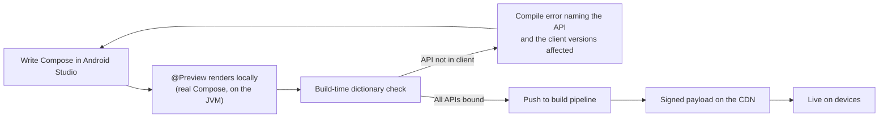

# Project Dogwood: The Developer Experience

**Audience:** Mobile engineers who will author Server-Driven Experiences (SDE), and the platform team supporting them.
**Companion documents:** [Technical Specification v4.0](high-level-tech-spec-final.md) and the layer specifications under [`specs/`](specs/).

---

## 1. The Promise, Stated Plainly

You write ordinary Jetpack Compose. You push it. It appears on phones — without an app release.

The host application does not learn about your new screen, and it does not need to. It was built already knowing the generated majority of the Compose Application Programming Interface (API) — about two-thirds of the widget surface, plus the defaults and expression surface — so most of what you assemble out of Compose is something it can already draw. The exceptions are enumerated in section 5, and they include some everyday things (animation, images, text fields) that arrive as hand-built subsystems rather than on day one.

**What still requires a host release:** using an API from a *newer Compose version* than the shipped client was built against, and ordinary bug fixes. Both are periodic and predictable. Neither is triggered by what you decide to build.

---

## 2. What You Actually Write

A Dogwood experience is a normal Kotlin module with normal Compose code:

```kotlin
package com.example.checkout

import androidx.compose.runtime.Composable
import androidx.compose.runtime.getValue
import androidx.compose.runtime.setValue
import androidx.compose.runtime.mutableStateOf
import androidx.compose.runtime.remember
import com.example.dogwood.compose.*      // generated stubs: Column, Text, Button, Modifier...

@Composable
// How the host launches this screen and passes `cart` is the entry-point contract
// (Layer 4 ADR-004 §2.5): serializable launch parameters, a named entry point in the
// manifest. The `onConfirm` outcome reaches the host as a host-service call, not a
// host-supplied lambda — Phase 1 does not support host-directed lambdas.
fun CheckoutScreen(cart: Cart, onConfirm: (Order) -> Unit) {
  // Text input is a bespoke subsystem: fields take a state object with an edit
  // counter (mirroring Compose's TextFieldState shape), never value + onValueChange.
  // The mirror the guest reads is debounced, not per-keystroke. See section 5, rule 1.
  val promo = rememberTextFieldState()
  var applying by remember { mutableStateOf(false) }

  Column(modifier = Modifier.padding(16.dp).fillMaxWidth()) {
    Text(
      text = "Your order",
      style = MaterialTheme.typography.headlineSmall,
    )

    cart.lines.forEach { line ->
      Row(modifier = Modifier.fillMaxWidth().padding(vertical = 8.dp)) {
        Text(text = line.name, modifier = Modifier.weight(1f))
        Text(text = line.price.format())
      }
    }

    OutlinedTextField(
      state = promo,
      label = { Text("Promo code") },
      enabled = !applying,
    )

    Button(
      onClick = {
        applying = true
        onConfirm(cart.toOrder(promo.text.toString()))
      },
      enabled = cart.isNotEmpty && !applying,
      modifier = Modifier.fillMaxWidth(),
    ) {
      Text(if (applying) "Working…" else "Place order")
    }
  }
}
```

There is no schema file. No JavaScript Object Notation (JSON) contract. No component registry entry. No `when` branch to add. **This is the entire point of the project.**

`remember`, `mutableStateOf`, `LaunchedEffect`, `derivedStateOf`, and `CompositionLocal` all work, because the genuine Compose runtime executes your code on the device. Your state lives with your logic.

---

## 3. Dogwood's Compose, Not androidx's

You import `com.example.dogwood.compose.*` instead of `androidx.compose.material3.*`.

That package is **generated** — function names, parameter names, ordering, and defaults all mirror the real Compose surface, so autocomplete, type checking, and parameter hints behave normally, and a developer who knows Compose does not learn a new vocabulary.

**The types, however, are Dogwood's own.** Google publishes a Kotlin/JavaScript artifact for `androidx.compose.runtime` and nothing else, so `Dp`, `Color`, `Modifier`, `TextStyle`, and every other type in a signature is re-declared by Dogwood. The chain syntax you know is preserved — `Modifier.padding(16.dp).background(Red)` works — but it is not the androidx `Modifier`.

The practical consequence: **moving a screen between the dynamic and static worlds is a port, not a re-import.** Most of the body carries over unchanged; modifiers and any bespoke component (see below) need adjustment. Plan for it rather than discovering it.

### Your Own Composables Need Nothing — the Week-One Question, Answered

The composables *you* define are just Compose. When your team writes a reusable `OrderSummaryCard` wrapping five components, that wrapper executes in the sandbox and only the leaf components it calls cross to the screen. It needs **no registration, no dictionary entry, and no host release** — it ships in your payload, updates when you push, keeps its own `remember` state, and recomposes minimally like any Compose function. Build entire screen libraries this way; share them across experiences as ordinary modules (they're fetched and cached once, not duplicated per payload).

A host release enters the picture in exactly two cases: your payload uses a *registered or generated component* the installed client doesn't have yet (the build-time dictionary check catches this), or your platform team is adding a **new registered component** — something whose implementation must run natively: video, maps, charts, a component that owns real animation, anything touching platform Application Programming Interfaces (APIs). The rule of thumb: **if you could write it by composing existing pieces, it's yours and it's free; if it needs native powers, it's registered and rides a release.**

**Design systems plug in, plural.** Registered components live in namespaced dictionary segments — your company's design system is one segment, and when another team's design system appears it registers with the same one-line build declaration, versioned independently, with no possibility of colliding with the first. Guests import whichever segments the target client ships.

---

## 4. Your Development Loop



**`@Preview` works, with a caveat.** Your module compiles twice from one source set: to JavaScript for deployment, and locally for previews, where the stubs translate to real Compose. The preview shows the **intended layout** — it runs one Compose runtime with no protocol, no batching, and no thread hop, so it cannot show you the two failure modes that matter most: degraded rendering under version skew, and input latency. A separate device-parity harness covers those. (Which preview mechanism is used — an Android target driving the standard Android Studio pane, or the Compose Multiplatform desktop preview — is still being decided; see [Layer 1](specs/layer-1-authoring.md) Milestone 3.)

**Most mistakes are compile errors, not blank screens.** Before publishing, the build compares the Compose APIs you called against the *binding dictionary* of each client version you target, and fails with a message naming the API, the versions that lack it, and the earliest version that has it. It is best-effort: a modifier chain assembled at runtime cannot be resolved statically. It catches the common case, and it is not a guarantee.

---

## 5. Rules You Have to Follow

Honest constraints, not fine print.

**1. Some of Compose is unavailable, and some arrives later than the rest.** Measured across ten modules and 445 widget-shaped composables ([`tools/measure-compose-surface.py`](tools/measure-compose-surface.py), corrected in [ADR-005](adrs/layer-5/ADR-005-corrected-coverage-and-bespoke-subsystem-list.md)):

- **7.2% are structurally unreachable.** Anything whose lambda the rendering engine invokes inside a frame — `Canvas`, `Modifier.drawBehind`, `Modifier.pointerInput` — plus custom `Layout` and `SubcomposeLayout`. **This means no custom charts, sparklines, drawing, or signature capture** — a material limitation if your product is data-heavy. Charting arrives only if the host registers its own chart component (section 5, rule 7).
- **25.2% need a hand-written protocol** because they take a live state holder you read or call (`LazyListState`, `SnackbarHostState`, `DatePickerState`, `SliderState`), an object carrying host-invoked callbacks (`KeyboardActions`, `VisualTransformation`), or an asset (`Painter`). These arrive one subsystem at a time.
- **`LazyColumn`, text fields, images, and animation are in those groups.** All are planned as bespoke subsystems with Dogwood-specific shapes — a lazy list takes a `placeholder` that Compose's has no equivalent for, a text field takes a state object rather than a plain `String`, an image takes a Uniform Resource Locator (URL) the host loads, and `animate*AsState` is replaced by declarative host-run animation.
- **67.6% are generated**, once the `Modifier` subsystem lands — and most of those fully once the deferred-expression protocol lands with it.

Note that function coverage overstates parameter coverage: a composable may be available while one of its parameters — commonly `interactionSource` or `visualTransformation` — is not yet passable.

**2. You cannot compute from the theme.** `MaterialTheme.colorScheme.primary` lives host-side, so you can *name* it and let the host resolve it, but `MaterialTheme.colorScheme.primary.copy(alpha = 0.5f)` has no representation. The build rejects it. Your own `CompositionLocal`s work normally.

**3. Animation, scroll, gesture, and typing state live on the host.** You declare intent — "animate alpha to 1.0 over 300 ms" — and receive semantic events back, not per-frame values. This is not a limitation to work around; it is what keeps the UI responsive, because a round trip to your code takes at least two frames. Three consequences stated plainly:

- **`animateFloatAsState`, `Animatable`, `updateTransition`, and friends do not exist here.** They are per-frame guest state. The declarative replacement is the animation subsystem ([ADR-005](adrs/layer-5/ADR-005-corrected-coverage-and-bespoke-subsystem-list.md)), and until it ships the build rejects animation APIs — shimmer skeletons, Lottie, and bespoke transitions are not expressible on day one.
- **Scroll-linked and drag-linked effects are forbidden.** Parallax headers, custom collapsing toolbars driven by scroll offset, progress bars tied to drag position — anything whose per-frame value derives from scroll or drag has no representation. Pre-built Material patterns whose linkage runs entirely host-side (`TopAppBarScrollBehavior` collapsing a `TopAppBar`) are the planned exception, via the live-state subsystem.
- **Per-keystroke derived UI lags.** Debounced validation reads fine; a live character counter or as-you-type card-number formatting needs host-computed support in the text-input subsystem, not guest logic.

**4. No platform APIs.** Your code runs in a sandbox with no filesystem, no network, and no Android or iOS APIs. Anything the experience needs from the device must be exposed deliberately by the host as a service you call. This is a security property, not an oversight — it is what makes shipping code over the air defensible.

**5. Avoid heavy string building on hot paths.** The embedded interpreter is pinned to a QuickJS version without rope strings, which makes `StringBuilder`-heavy code quadratic. Build strings once, not per frame.

**6. Images, icons, fonts, and localized strings go through the host.** Your sandbox has no resources and no image loader. Images are named by Uniform Resource Locator (URL) and loaded by the host with placeholder and error slots; icons come from a generated icon dictionary; strings you localize server-side or ship in the payload. `painterResource` and `stringResource` do not exist here. (Resources subsystem — see [ADR-005](adrs/layer-5/ADR-005-corrected-coverage-and-bespoke-subsystem-list.md).)

**7. Your design systems — plural — register in one line each.** The generator runs over your own component modules (`AcmeButton`, a video player, a map, a chart) and merges each into the dictionary as its own namespaced, independently-versioned segment, so guests aren't limited to raw Material 3 and multiple design systems coexist without collisions ([ADR-006](adrs/layer-5/ADR-006-guest-composed-vs-host-registered-and-multi-design-system.md)). Adding a registered component requires a host release, like any dictionary change; composing existing components never does.

**8. Target the oldest client you support.** Adoption curves are long. The dictionary check enforces this, but design for it — capability branching is available when you need it, **per dictionary segment** (each design system versions independently — see rule 7):

```kotlin
if (DogwoodSegments["acme.designsystem"] >= 3) {
  ModernThing()
} else {
  FallbackThing()
}
```

---

## 6. What Happens on Device

You do not need this to write a screen, but you should understand it before debugging one.

```mermaid
sequenceDiagram
    participant U as User
    participant H as Host app (native Compose)
    participant G as Your code (in the sandbox)

    H->>G: Load payload, provide capability version
    G->>G: Compose runs — your @Composable executes
    G->>H: One batched message: "make these nodes"
    H->>U: Native Compose renders
    U->>H: Taps "Place order"
    H->>G: Event: button 42 clicked
    G->>G: applying = true; Compose recomposes
    G->>H: One batched message: only what changed
    H->>U: Button label updates
```

Two things follow from this that matter to you:

- **Your logic and state stay yours.** They run in the sandbox, next to your composables. There is no serialization boundary inside your own code — but there is one between your code and the screen, and it costs at least a frame each way. That is why per-frame state lives on the host.
- **Rendering runs at native speed in real Compose Multiplatform.** Layout, drawing, animation, scrolling, VoiceOver, TalkBack, and the keyboard are all real Compose Multiplatform. On Android that is literally the same widget tree a statically compiled screen produces. On iOS it is Compose's mature Skia-over-Metal rendering with platform accessibility and text-input integration — native performance and integration, though not `UIKit` widgets ([Layer 5 ADR-004](adrs/layer-5/ADR-004-compose-multiplatform-sole-host-target.md) records the nuance). Accessibility works without you doing anything either way.

---

## 7. One Screen, Three Platforms

You write a screen once. It runs everywhere the host renders with Compose Multiplatform. Delivery order is Android first, Web second (Compose Multiplatform for Web is currently Beta, and the Web profile — browser guest loading, web delivery — is designed in its own phase), and iOS after that, with its long-lead-time risk items started on day one; see the [roadmap's platform order](roadmap.md).

This is not a small detail — it is why the generated-binding approach is affordable at all. A system that mapped your `Button` onto a native `UIButton` and a native `android.widget.Button` would need those mappings hand-written per platform, which is exactly what constrained the closest prior art to a small catalog of widgets.

The trade-off is real and worth stating: **the host application has to be a Compose Multiplatform application.** Dogwood cannot drive a SwiftUI or UIKit screen.

## 8. How This Compares

| | Traditional Server-Driven UI | Dogwood |
|---|---|---|
| New component available to you | After a client release | Immediately, if it is in the generated tier of the client's dictionary |
| What you write | JSON or a schema | Compose |
| Where logic lives | Split: server rules plus client handlers | With your UI, in one place |
| Local preview | Rarely | `@Preview`, real rendering |
| Type safety | At the schema edge | End to end, in Kotlin |
| Registry to maintain | Yes, by hand, forever | Generated |
| Accessibility | Per component, by hand | Inherited from Compose |

---

## 9. Current Status — Read This Before Planning Work

**Dogwood is a specification, not a working system.** Nothing described here has been built yet, and several load-bearing assumptions are unproven. The most important open items:

1. **Compose composition inside QuickJS has never been measured.** Layer 4, Milestone 1 exists to establish it. If the interpreter cannot run composition inside a frame budget, the architecture changes.
2. **Boundary cost per frame is unmeasured.** Batching is the mitigation, but the number is not known.
3. **Payload size with the Compose runtime linked is unmeasured.** Earlier size targets in this project's history predate this design and should not be quoted.
4. **The closest prior art, Cash App's Redwood, is no longer under active development.** Its maintainer has publicly said the decision "wasn't technical" ([Layer 4 ADR-003](adrs/layer-4/ADR-003-treehouse-precedent-and-evidence-refresh.md)); the organisational-adoption lesson it carries still applies here in full.
5. **The bespoke subsystems are the larger half of the work — nine of them, not six.** Adversarial review added animation, resources, and host services to the list ([ADR-005](adrs/layer-5/ADR-005-corrected-coverage-and-bespoke-subsystem-list.md)). Redwood needed ten modules for lazy lists alone. The generated bindings are the part that scales; the hand-written subsystems are the part that takes the time.

The full risk register is section 7 of the [technical specification](high-level-tech-spec-final.md); every architectural decision and its evidence is recorded in [`adrs/`](adrs/).
