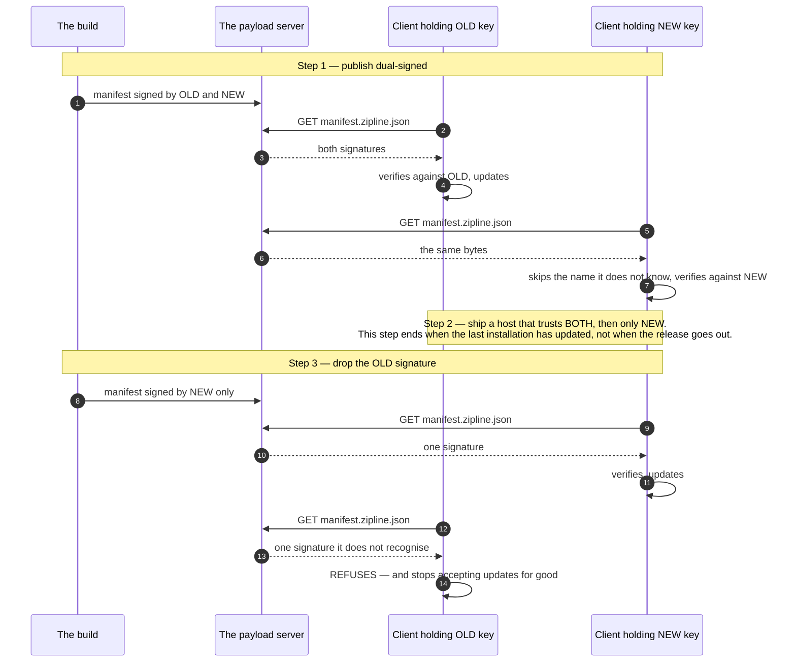

# The signing keys: making them, holding them, rotating them, and what revocation means

Project Dogwood ships code over the air. The only thing standing between "this application can be
updated without a store review" and "anyone who can answer a Hypertext Transfer Protocol (HTTP)
request can run arbitrary code inside this application" is a signature check, and that check is
only as good as the key behind it. This document is the runbook for that key.

It is written to be run, not read. Every procedure here has a command beside it, and
[`tools/reference-server/rotation-drill.sh`](../tools/reference-server/rotation-drill.sh) executes
the whole rotation — including the step nobody had ever run — against a real server with a real
client on each side of it.

**What this document cannot do is hold a key or name a person.** Both are
[`OPEN-DECISIONS.md`](../OPEN-DECISIONS.md) §6 and both are the owner's: where a production key
lives is a question about who can be trusted with it, and who owns it is a question about who is
awake when it leaks. The mechanism is finished; those two lines are not, and §6 says so.

---

## 1. Two keys, two jobs

They are confused constantly, so they are separated first.

| | **The payload key** | **The publisher key** |
|---|---|---|
| Algorithm | Ed25519, raw 32 bytes, hexadecimal | Pretty Good Privacy (PGP), typically RSA |
| What it says | "this payload may run on a device" | "these bytes came from this publisher" |
| Who checks it | every Dogwood host, before a byte of guest code executes | Maven Central, once, at upload |
| Where it is used | the Zipline build's `signingKeys { }` block | Gradle's `signing` plugin, `DOGWOOD_GPG_KEY` |
| If it leaks | an attacker can run code inside every installed application | an attacker can publish a library under your coordinates |
| Rotating it | §3 of this document — roll-forward, and it takes a release cycle | generate a new one, upload it to a keyserver, publish with it |

**This document is about the payload key.** The publisher key is one paragraph, §5, because Central
already documents it and because nothing about it is specific to this architecture.

---

## 2. Generating a payload key, and proving the pair

```
tools/reference-server/new-payload-key.sh --prove
```

It prints two hexadecimal strings — a raw Ed25519 private key and its public half — in exactly the
form the two sides want:

- the **private** key goes to the build, and nowhere else:
  `./gradlew :samples:slice-guest:jsBrowserProductionWebpackZipline -PdogwoodSigningKey=<hex>`;
- the **public** key is compiled into every host, as an entry in the map `DogwoodDelivery` takes as
  `trustedPublicKeys`. In this repository that map is
  [`DogwoodTrust`](../engine/dogwood-wire/src/commonMain/kotlin/dev/dogwood/protocol/Trust.kt),
  declared once because three hand-typed copies of a security-relevant map is three chances to
  rotate two of them.

**`--prove` is the part that earns the word "generated".** A key pair is two hexadecimal strings,
and a transposed one is invisible: a private key in the build and a *different* public key in the
host produce artifacts that look correct and a fleet that silently refuses every update until
somebody notices the release stopped moving. So `--prove` builds the sample payload signed by the
generated private key, serves it through the reference server, and points a client holding **only**
the derived public key at it. The script fails if that client refuses. "OpenSSL printed two
strings" and "Zipline's own verifier accepts this pair" are different claims, and only the second
one is worth writing down.

**The keys in this repository are throwaway development keys, committed on purpose** so the samples
build for anyone who clones it, and labelled as such where they sit. They sign nothing anyone
should trust.

### Where it lives, and who owns it

Engineering cannot decide either, and pretending otherwise would be the most dangerous sentence in
this file. What engineering can say is what the answer has to satisfy:

- **One person is named**, in `OPEN-DECISIONS.md` §6, and that person is who a leak is reported to.
  A key owned by a team is a key owned by nobody at three in the morning.
- **The private key never reaches a repository, a build log, or a laptop that is not the
  publisher's.** In continuous integration it is a secret injected as an environment variable and
  passed as `-PdogwoodSigningKey`; the workflow at
  [`.github/workflows/publish-payload.yml`](../.github/workflows/publish-payload.yml) does exactly
  that and falls back to the committed throwaway keys **only** on a dry run, saying so loudly in
  the job summary.
- **At least two people can reach it**, because the failure mode of perfect key hygiene is a key
  nobody can use when the person who held it is unavailable — and the recovery from *that* is the
  rotation in §3, run under time pressure.

---

## 3. Rotating a key: roll forward, and finish the second step

Rotation is not "replace the key". It is **three steps in one direction**, and the middle one takes
as long as a fleet takes to update.



**Every actor in that diagram, named.**

- **The build** is the Gradle build that produces the payload. It holds the private keys, and it is
  the only thing that does. A manifest carries a signature per entry in the Zipline plugin's
  `signingKeys { }` block, so "publish dual-signed" is two entries in one build file.
- **The payload server** is whatever serves `manifest.zipline.json` — in this repository,
  [`tools/reference-server/server.py`](../tools/reference-server/server.py). **It never holds a
  key.** Signing belongs to the build, where the key is, rather than to the server, where it would
  have to live on a machine that answers requests from the internet.
- **The client holding the old key** is an installation shipped before the rotation began. It is
  the reason the rotation has three steps rather than one: it is out there, it will not update its
  *host* on your schedule, and step 3 is the moment it stops.
- **The client holding the new key** is an installation that has taken the host release from step
  2. During the window, both clients are served byte-identical manifests; nothing about the
  artifact is conditional on which client asks.

**The mechanism underneath**, from
[`specs/layer-3-delivery.md`](../specs/layer-3-delivery.md): Zipline's verifier walks the
manifest's signatures, **skips key names it does not recognise**, and requires the **first name it
does recognise** to verify. Two consequences, both load-bearing:

- **Signature order decides which key a client trusting both actually uses.** "We trust the new
  key" is not "we use the new key", and a team that assumed otherwise would not find out until step
  3. [`KeyRotationTest`](../engine/dogwood-host/src/jvmTest/kotlin/dev/dogwood/host/KeyRotationTest.kt)
  pins the order against the manifest the build really produces.
- **A recognised key name that fails verification rejects**, rather than falling through to a later
  signature. Otherwise an attacker who can add a signature would simply add a good one under a name
  you trust.

### The three steps, as commands

**Step 1 — publish dual-signed.** Add the new key beside the old one in the build's `signingKeys`
block, keeping the old one **first** so clients trusting both keep verifying against the key they
have always used. Publish. Every client, on either side of the rotation, now updates.

**Step 2 — roll the fleet forward.** Ship a host release whose `trustedPublicKeys` map contains
both keys, then — a release later — one that contains only the new key. This is the step that takes
weeks, and it is the step to **finish**: what ends it is the last installation updating, not the
release going out. Two things make it measurable rather than hopeful:

- your application's own version telemetry, which is the only thing that knows how many
  installations are still on a host that predates the new key;
- the rollout controls in [`docs/operating.md`](operating.md) §5 — a cohort range in `cohorts.json`
  lets step 3 be tried on ten buckets before it is tried on a hundred, which turns an irreversible
  step into a reversible one for ninety percent of the fleet.

**Step 3 — drop the old signature.** Remove the old entry from `signingKeys` and publish.
**Dropping a signature is a publish, not a rebuild**: Zipline signs the manifest with its `unsigned`
object — which is where the signatures live — excluded from the signed bytes, so removing one
signature leaves the others valid, byte for byte. The rotation drill asserts exactly that (`R3`),
because if it were not true, step 3 would mean re-signing and re-publishing every artifact and this
runbook would be a different document.

At that instant, every client still holding only the old key stops accepting updates. It does not
crash and it does not tell the user anything: it keeps running the payload it already has, and its
update poll fails from then on. **That is why step 3 is the step to finish rather than the step to
start.**

### The drill

```
export JAVA_HOME=/opt/homebrew/opt/openjdk@21
tools/reference-server/rotation-drill.sh
```

It builds two real payloads, publishes them through the reference server, and points two clients at
them — one holding only the old key, one holding only the new. It grades seven claims:

| Claim | What it observes |
|---|---|
| `R1` | a client that has **not** rolled forward updates on the dual-signed release |
| `R2` | a client that **has** rolled forward updates on the *same artifact* |
| `R-control` | a client holding neither key refuses — without this, a client that verifies nothing looks identical |
| `R3` | dropping the old signature leaves the new one byte-identical to the build's |
| `R4` | after the drop, the rolled-forward client goes on updating |
| `R5` | the client holding only the old key stops **at exactly that moment**, and not before |
| `R5-reachable` | …and it refused a release it had *fetched*, rather than failing to reach the server |

`R1` and `R5` are the same client under the same procedure, one release apart. That pairing is the
whole claim; either alone is satisfied by a client that was broken all along.

**Watched to fail.** `tools/reference-server/rotation-drill.sh --dual-at-step-3` publishes the
second release *without* dropping the old signature — the mistake of starting step 3 and not
finishing it. `R5` goes red and everything else stays green, which is what a drill that can tell
the difference looks like.

**The two clients are not the sample hosts, and that is forced.** Every host in this repository
compiles in `DogwoodTrust.DEVELOPMENT_KEYS`, which holds *both* keys, so no sample can stand on
either side of a rotation — a drill run against one would pass every step without testing the step
that matters. [`rotation-client/`](../tools/reference-server/rotation-client/) is the delivery
path's decision with the key set as an argument, built on Zipline's own `ManifestVerifier`: the
same class `DogwoodDelivery` constructs, at the same pinned version, rather than a reimplementation
of its rules. It does not run the guest, because running the guest is not part of the decision
under test; the drills that *are* about running it —
[`check.sh`](../tools/reference-server/check.sh) and
[`quarantine-drill.sh`](../tools/reference-server/quarantine-drill.sh) — drive real hosts.

---

## 4. Revocation, and the honest answer

**There is no revocation list, and there will not be one.** A client's trust is a map compiled into
its binary. Nothing can reach in and remove an entry, because a mechanism that could remove one
could add one — and a remotely mutable trust anchor is not a trust anchor.

So "revoke a key" decomposes into three different actions, and the useful thing is knowing which
one you need.

**If the key leaked and you must stop the attacker from publishing:** you cannot. An attacker
holding the private key can sign a manifest that every installed client accepts, and the only thing
between them and your users is their ability to answer the manifest request — which is your
server's address, your Domain Name System (DNS) record, and your Transport Layer Security (TLS)
certificate. **Harden the path, not the key**: the practical defence is that the attacker must also
control the response, and Transport Layer Security plus a server you control is what stops that.
Write this down before you need it, because the instinct in the moment is to rotate, and rotation
does not help against an attacker who can already sign.

**If the key leaked and you must stop *your own* clients running a bad payload:** that is the kill
switch, not revocation. `dogwood.disabled` rides the manifest's **signed** metadata, and setting it
stops devices running a release without waiting for them to discover it is broken — see
[`docs/operating.md`](operating.md) §3. It works because it travels the same authenticated channel;
an unsigned field would let the attacker disable your application instead.

**If the key leaked and you must stop it being trusted *in future*:** that is §3's rotation, run
urgently, and it is a host release — which means a store review, which means days. There is no
faster path, and the reason there is no faster path is the same reason the mechanism is worth
having. **Plan for the rotation to take a release cycle and use the kill switch to cover the
interval.**

**One thing worth doing before any of it happens:** ship hosts that trust *two* keys from the
beginning, with the second one held somewhere the first is not. That collapses step 2 of an
emergency rotation — the weeks-long one — to zero, because the fleet already trusts the key you are
about to move to. The samples in this repository sit mid-rotation deliberately for exactly this
reason, and it is the one piece of key hygiene that costs nothing until the day it saves the
release cycle.

---

## 5. The publisher key, for Maven Central

Separate key, separate job, one paragraph. Maven Central requires every artifact to be signed with
a Pretty Good Privacy (PGP) key whose public half is on a keyserver. This build signs from the
environment and nothing else: with `DOGWOOD_GPG_KEY` and `DOGWOOD_GPG_PASSPHRASE` set, every
publication is signed and a missing passphrase is a failure rather than a silently unsigned
artifact; without them, `publishToMavenLocal` works exactly as it always has. The bundle the Portal
validates can be assembled and graded with no account and no network —
`./gradlew assembleMavenCentralBundle` then
`python3 tools/reference-server/portal-bundle-check.py` — and `OPEN-DECISIONS.md` §5 lists what
remains, which is an account and two secrets.

Rotating the publisher key has none of §3's difficulty: nothing verifies it after upload, so a new
key is generated, published to a keyserver, and used for the next release. The old artifacts keep
their old signatures and stay valid.

---

## 6. What is mechanised, and what is not

| | Mechanised | Still the owner's |
|---|---|---|
| Generating a payload key | `new-payload-key.sh --prove`, which proves the pair in Zipline's verifier | — |
| Holding it | — | a password manager, a token, or a key-management service; `OPEN-DECISIONS.md` §6 |
| Naming an owner | — | one person, written into §6 |
| The rotation procedure | this document, §3 | — |
| Proving the rotation | `rotation-drill.sh`, seven claims, watched to fail | — |
| Revocation | §4: the honest answer, and the kill switch that covers the interval | — |
| Signing in continuous integration | `.github/workflows/publish-payload.yml` | putting the real key in the repository's secrets |
