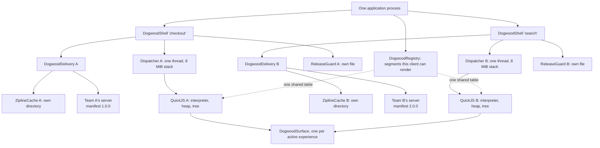

# Two teams, one surface, two payloads

What an organization hits that a single team does not, answered with things that were actually run
rather than with advice. Two questions:

1. **Two teams appending to one design-system surface at the same time.** The lock's append-only
   discipline makes tags permanent — so what happens when two branches each append a component, and
   what is the safe way out?
2. **Two teams shipping payloads independently.** `DogwoodShell` takes a single `manifestUrl`, so
   independent shipping means two shells. What does the second one actually cost?

The audit recorded both as unexamined ([`plans/adoption-audit.md`](../plans/adoption-audit.md) B3).
Neither turned out to need new engine machinery, which is why this is a document rather than an
architecture decision record — but the reasons are measurements and transcripts, not assurances.

---

## 1. Two branches, one surface

### What happens

Two teams branch from the same commit. Checkout appends `PaymentRow`; Search appends `FilterChip`.
Each runs the generator, so each branch's lock file has its new component at **local tag 24** and
each bumps the dictionary to **version 15**. Merging produces three conflicts:

```
$ git merge exp/team-search
Auto-merging docs/api/dogwood.designsystem.md
CONFLICT (content): Merge conflict in docs/api/dogwood.designsystem.md
Auto-merging engine/surface/dev/dogwood/surface/DesignSystemSurface.kt
CONFLICT (content): Merge conflict in engine/surface/dev/dogwood/surface/DesignSystemSurface.kt
Auto-merging engine/surface/dogwood.designsystem.lock.json
CONFLICT (content): Merge conflict in engine/surface/dogwood.designsystem.lock.json
```

The lock's conflict is the one that matters, and it is precise about what went wrong:

```json
        {
<<<<<<< HEAD
            "name": "PaymentRow",
            "localTag": 24,
...
=======
            "name": "FilterChip",
            "localTag": 24,
...
>>>>>>> exp/team-search
        }
```

Both teams claimed tag 24. A tag is permanent and is what a payload puts on the wire, so exactly one
of them can keep it.

### The safe resolution

**Three steps, and the second is the one people get wrong.**

1. **Resolve the surface by keeping both**, in whatever order the team agrees on. Order decides which
   component gets which tag from here on, and nothing else depends on it.

2. **Reset the lock to the *merge base*, not to either side.** The merge base is the last lock both
   branches agreed on; resetting to it means both additions are appended fresh, in surface order.

   ```
   git show "$(git merge-base HEAD exp/team-search):engine/surface/dogwood.designsystem.lock.json" \
     > engine/surface/dogwood.designsystem.lock.json
   ```

   Never hand-edit the conflicted lock. It is generated, and hand-merging generated JavaScript Object
   Notation (JSON) is how a tag ends up describing a component that no longer has it.

3. **Regenerate.** The generator appends both, in surface order:

   ```
   dogwood-codegen: dictionary lock updated, added [PaymentRow, FilterChip]
   dogwood-codegen: 22 composables, 22 bound, 0 rejected
   ```

   ```
   version 15
   [('TimePickerArea', 23), ('PaymentRow', 24), ('FilterChip', 25)]
   ```

### What happens if you get it wrong

Resolving the lock by taking one side wholesale — `git checkout --theirs` — leaves `FilterChip`
pinned at 24 while the surface lists `PaymentRow` first. **The generator refuses, by name:**

```
> Task :dogwood-codegen:generateDesignSystem FAILED
Exception in thread "main" java.lang.IllegalStateException: dictionary lock violated; tags are permanent:
  - FilterChip moved from tag 24 to 25
```

This is the lock earning its keep. The failure mode it prevents is a payload published against a
dictionary in which tag 24 means `PaymentRow`, meeting a client in which tag 24 means `FilterChip`
— which does not crash. It renders the wrong component, silently, wherever that tag appears.

### The hazard the lock does *not* catch, and what to do about it

**The version number merged cleanly, and it should not have.** Both branches set the dictionary to
15, so git took 15, and for a moment two different dictionaries — one with `PaymentRow` at 24, one
with `FilterChip` at 24 — both called themselves version 15.

Once merged this resolves itself: tags become 24 and 25, and version 15 describes the merged surface
consistently. The danger is entirely in the window before the merge. **A payload published from an
unmerged surface branch declares a version number that will mean something different once the branch
lands**, and the mobile pre-flight check
([ADR-061](../adrs/layer-3/ADR-061-a-payload-declares-the-dictionary-it-needs.md)) will happily
accept it, because the numbers match.

The rule that follows is short and is not enforced by any tool:

> **Publish payloads from the integration branch, never from a surface branch.** A branch that
> touches the surface or the lock is not a branch anything ships from.

It is written here rather than built into the engine because the enforcement point is a deployment
pipeline, which is a thing every organization already has and no two of which look alike. A team
that wants it mechanical can compare the payload's `dogwood.segments` against the lock on the
integration branch as a publish-time gate.

---

## 2. Two payloads, two shells

[`engine/samples/two-payloads`](../engine/samples/two-payloads) is one desktop application hosting
two independently built, independently signed, independently versioned payloads —
[`slice-guest`](../engine/samples/slice-guest) at `2.0.0`-era version `1.0.0` and
[`second-guest`](../engine/samples/second-guest) at `2.0.0` — each fetched from its own server.
`tools/two-payloads/measure.sh` runs it and prints the numbers.

### What a second shell is



#### Diagram node definitions

- **One application process.** Everything below is inside a single binary the user installed. Two
  payloads is not two applications; it is one application that fetches code from two places.
- **`DogwoodRegistry`.** The one thing that is *not* per team and cannot be: it is the table of
  segments this client can render, and it is a property of the binary rather than of a payload. Both
  teams' payloads are checked against it, which is why the pre-flight dictionary check refused the
  checkout payload the first time this sample ran without Acme registered.
- **`DogwoodShell`.** One per team. It owns the warm pool for that team's entry points and nothing
  else; there is no pool spanning both, and none is proposed.
- **`DogwoodDelivery`.** One per team: it holds the cache and the trusted keys and performs the
  fetch, verify and pre-flight checks for that team's manifest.
- **Dispatcher, one thread, 8 MiB stack.** One per team. Guest work is serialized per interpreter,
  so sharing a thread would put each team's composition in a queue behind the other's. The stack
  size is not a tuning choice: QuickJS composition is deeply recursive and interpreted frames are
  heavy.
- **`ReleaseGuard`, own file.** One per team. A quarantine is per release identity, and one team's
  bad publish must not refuse the other team's good release.
- **`ZiplineCache`, own directory.** One per team. The cache is keyed by module hash; two shells on
  one directory means each team's modules evict the other's, which presents as an unexplained slow
  cold start and is in fact a collision.
- **Team's server.** Two servers, publishing on two schedules, with two version numbers. This is
  what "shipping independently" means and it is the whole reason for everything above it.
- **QuickJS: interpreter, heap, tree.** The isolation boundary. Each guest numbers its own nodes
  from one, which is what the `M-isolated` assertion reads.
- **`DogwoodSurface`.** The host composable that renders one experience's tree. Two of them, one per
  active experience, in the same window.

`DogwoodShell` takes one `manifestUrl`. Its "several experiences" are entry points **inside one
payload**, sharing that payload's cache, guard, dispatcher and warm pool. Independent shipping does
not fit inside that, so it is a second shell, and a second shell is four separate things:

| | Why separate |
|---|---|
| `ZiplineCache`, own **directory** | The cache is keyed by module hash. Two shells on one directory means each team's modules evict the other's — which looks like an unexplained slow cold start and is a collision. |
| `ReleaseGuard`, own **file** | A quarantine is per release identity. One team's bad publish must not refuse the other team's good one. |
| Single-threaded dispatcher, own **thread** | Guest work is serialized per interpreter. Sharing one thread puts each team's composition in a queue behind the other's. The eight-megabyte stack is not optional either: QuickJS composition is deeply recursive. |
| QuickJS interpreter and heap | The isolation boundary itself. |

**There is no shared warm pool, and none is proposed.** Each shell keeps its own experiences warm. A
pool spanning both would have to choose between two teams' screens on a signal neither team can see,
and the audit's rule applies: no new machinery until a need is demonstrated.

### The demonstration is not "a screen appeared"

With two live guests in one process, "a screen appeared" does not say *which* payload produced it.
Each payload draws its own marker and the host asserts on the render transcript:

```
CONF M-checkout PASS -- checkout's own payload composed (marker Diagnostics)
CONF M-search   PASS -- search's own payload composed (marker SECOND-PAYLOAD)
CONF M-independent PASS -- both shells reached a first tree
```

### What it found on the first run

The first run of this sample **refused one of its two payloads**, before rendering anything:

```
[checkout/about] refused: the payload needs a dictionary this client does not have;
unknown segments: [acme.designsystem]
```

The host had not registered Acme's binding. That is a real configuration mistake in a real host, and
it is worth recording because of *how* it surfaced: the mobile pre-flight dictionary check
([ADR-061](../adrs/layer-3/ADR-061-a-payload-declares-the-dictionary-it-needs.md)) named the missing
segment and refused. Before that check existed the same mistake would have produced a screen quietly
missing three components — the failure mode the check was built for, caught the week it landed, in a
host written after it.

The fix is the one line every Dogwood host writes:

```kotlin
DogwoodRegistry.register(AcmeDesignSystemBinding)
```

### The demonstration is structural, not textual

Two live guests in one process each number their own nodes from one, so the transcript carries two
`#1` roots — and the host tells the trees apart because each belongs to its own experience, not
because the identifiers are unique. That is the isolation, visible:

```
TWO Column#1 Column                       <- the search team's payload
TWO Text#2 "The second team's screen"
TWO Text#3 "SECOND-PAYLOAD"
TWO VerticalList#1 VerticalList           <- the checkout team's payload, numbering from one again
TWO SectionHeader#2 SectionHeader
...
```

```
CONF M-isolated PASS -- each payload numbers its own nodes from one: 2 root nodes at #1
```

The first version of these assertions looked for the checkout screen's heading, `Diagnostics`, and
failed against a payload that had rendered perfectly: a transcript line is `Name#id`, refined with
the string only for a `Text`, and `Diagnostics` is drawn by a `SectionHeader`. Worth recording
because it is the same shape of mistake the desktop skew drill made — asserting on evidence the
instrument does not carry — and it is the one this project keeps having to catch.

### The measured costs

MacBook Pro development host, cold caches, `tools/two-payloads/measure.sh`. A development machine
rather than a device, which is fine here in a way it is not for the Phase 0 budgets, because the
question is a **ratio between one shell and two on the same machine**:

| | checkout (`slice-guest`) | search (`second-guest`) |
|---|---|---|
| disk cache after first load | 1,381,245 bytes | 1,150,555 bytes |
| time to first tree | 871 ms | 351 ms |

```
MEASURE heapUsedBytes 14755936
MEASURE liveShells 2
```

**What the numbers say.**

*Disk is per payload and does not amortise.* 1.15 MB for a payload that draws three nodes is almost
all Compose runtime and Kotlin standard library — the second team pays the framework's bytes again,
because the two payloads are separate Zipline containers with separate module hashes and nothing is
shared between them. **This is the real cost of a second payload**, and it is a disk cost rather
than a memory or latency one. A product with five teams should expect roughly five times this, not
five times the *interesting* part of it.

*Time to first tree is dominated by payload size, not by shell count.* 351 ms for the small payload
against 871 ms for the large one, both on cold caches, both starting at once. The second shell did
not queue behind the first — they have separate dispatchers, which is the point of giving them
separate dispatchers.

*Heap is not where the cost is.* About 14.8 MB used with two live interpreters and two compositions,
on a development host. That is not a number to plan a fleet around, but it does settle the shape:
the second shell is not doubling anything expensive in memory.

**The conclusion for a product:** the price of independent shipping is a second copy of the runtime
on disk per payload. If that is unacceptable, the answer is fewer payloads and more entry points —
which is exactly what `DogwoodShell`'s single `manifestUrl` already gives, and why it takes one.

### The conclusion

No new engine machinery. Two shells is the honest shape of two teams shipping independently, the
per-shell cost is a cache directory and an interpreter, and the things that must not be shared are
things the constructor already takes as parameters. What was missing was not a feature but a
**sample and a written-down cost**, which is what this is.

The one thing a team must add for themselves is the publishing rule from §1: payloads are published
from the integration branch, never from a surface branch.

