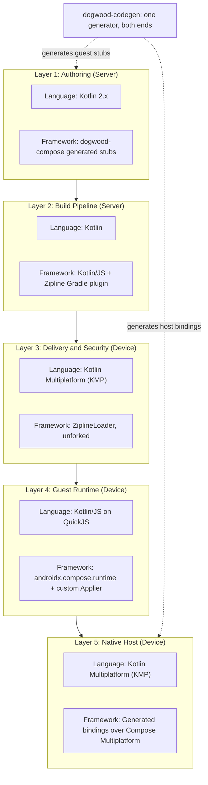
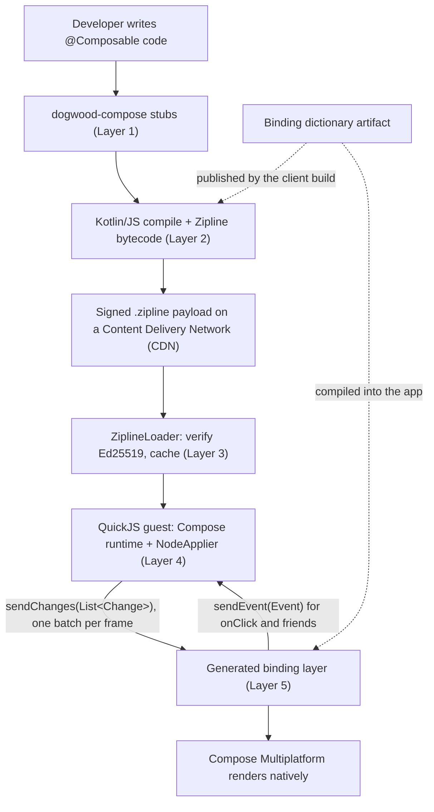

# Technical Specification (v4.0): Server-Driven Compose via a Generated Full-Surface Binding

**Document Version:** 4.0 (Substrate corrected; architecture grounded in verified prior art)
**Supersedes:** v3.0, archived at [`archive/high-level-tech-spec-wasm-v3.md`](archive/high-level-tech-spec-wasm-v3.md)
**Target Platforms:** Android (Application Programming Interface (API) 26+) & iOS (iOS 15+)

**Core Thesis:** Developers write ordinary Jetpack Compose code. It is compiled on a build server, delivered Over-The-Air (OTA), and executed on-device inside a sandboxed interpreter that runs the **real Compose runtime**. Composition produces a stream of tree changes that a **generated, whole-API-surface binding layer** replays against native Compose Multiplatform. The host application does not need a release when a developer uses a new component — only when the underlying Compose version changes.

---

## 1. Executive Summary & Strategic Motivation

### The Problem: The Component Mapper Treadmill

Traditional Server-Driven User Interface (SDUI) architectures map a JavaScript Object Notation (JSON) or Protobuf schema onto a hand-written registry of native components — in practice a large `when` statement translating serialized names into `Column`, `Text`, or `Button`. This produces three compounding costs:

1. **Every new capability requires a client release.** Adding one Modifier, one layout, or one animation curve means editing the schema, the serialization protocol, and two native renderers, then shipping and waiting for adoption.
2. **Feature lag and divergence.** Dynamic screens are permanently restricted to a small, hand-curated subset of what Compose offers, and the two platforms drift apart.
3. **The registry is unbounded work.** It grows forever, and it is maintained by hand.

### The Objective: Delete the Hand-Written Registry, Not the Bridge

An earlier version of this specification (v3.0) pursued a "zero-bridge" design in which WebAssembly (Wasm) modules would dynamically link against the on-device Compose engine. That approach was investigated in depth and refuted; see [`adrs/README.md`](adrs/README.md) for the full record, in particular [Layer 4 ADR-001](adrs/layer-4/ADR-001-reject-dylink-dynamic-linking.md), [Layer 2 ADR-001](adrs/layer-2/ADR-001-kotlin-wasm-requires-wasmgc.md), and [Layer 2 ADR-002](adrs/layer-2/ADR-002-generated-stub-api-replaces-ir-interception.md).

**A bridge is required. The insight is that most of the bridge does not have to be written by hand.**

Dogwood generates the *declarative* portion of the binding layer mechanically from the Compose Application Programming Interface (API) surface, for both server and client, from one source of truth. That is the portion that grows without bound as Compose grows, and it is the portion that makes a hand-written registry unmaintainable.

**It is not the whole bridge, and this specification does not claim otherwise.** Adversarial review established that a fixed set of subsystems cannot be derived from a Compose function signature and must be designed and hand-written once. Cash App's Redwood, which shipped this architecture, needed six of them. Dogwood needs at least the same six:

| Hand-written subsystem | Why generation cannot produce it |
|---|---|
| `Modifier` representation | Compose's `Modifier.Element` implementations are `internal`; a guest cannot name or serialize them |
| Lazy layouts (`LazyColumn` and relatives) | Item content is invoked by the host per visible index during layout; requires guest-side windowing and placeholders |
| Text input | A controlled `TextField` round-trips its value across a latent boundary; requires a version vector and optimistic host state |
| Focus, scroll, and other live state holders | `LazyListState`, `FocusRequester`, `SnackbarHostState` expose members the guest must read and call |
| Host environment | `LocalDensity`, `LocalLayoutDirection`, `MaterialTheme` live in Compose UI, not the runtime, so they must be mirrored as protocol |
| Node identity and reuse | Positional identity and list recycling require explicit keying |

**One rendering target is what makes generation worth doing.** Dogwood renders exclusively through Compose Multiplatform, so there is exactly one host binding implementation and it reaches Android, iOS, and Web. The contrast with the closest prior art is a multiplier, not a constant: Cash App's Redwood renders into each platform's native widget system, and ships **four** host implementations per widget set — `composeui`, `dom`, `uiview`, and `view` — so every widget costs four hand-written bindings with four sets of layout semantics to reconcile. That cost is why its supported catalog stayed small.

| | Cost per widget | Platforms reached |
|---|---|---|
| Native-widget mapping (Redwood) | 1 schema declaration + **4 hand-written bindings** | Android Views, UIKit, Compose UI, DOM |
| Compose Multiplatform (Dogwood) | **1 generated binding** | Android, iOS, Web |

Under a per-platform model, generation would have to emit four divergent implementations and reconcile them — multiplying the maintenance surface rather than reducing it. Under a single target, the generated binding is a direct call to the function the guest named. See [Layer 5 ADR-004](adrs/layer-5/ADR-004-compose-multiplatform-sole-host-target.md), which also records the constraint this creates: **the host application must itself be a Compose Multiplatform application.**

**The honest promise, then:** the unbounded, ever-growing part of the registry is generated; a bounded, enumerable set of hard subsystems is engineered once. The registry stops being a treadmill. It does not stop existing.

### What This Buys, Stated Precisely

| Change a developer makes | Host release required? |
|---|---|
| New screen, new layout, restructured UI | **No** |
| New business logic, state, navigation | **No** |
| Any combination of already-bound Compose APIs | **No** |
| Animation | **No**, but the animation *target* is declared and run host-side (section 7) |
| Uses an API added in a *newer Compose version* than the client was built against | **Yes** — periodic, tied to Compose releases |
| Uses a composable requiring a bespoke subsystem not yet built | **Yes** — bounded and enumerable, not open-ended |
| Bug fixes to the host, runtime, or bindings | **Yes** — periodic |

**Skew is handled primarily at build time, not by host-side degradation.** The server compiles against the dictionary of the client it is targeting, so a well-configured deployment never sends a tag the client does not know. Host-side skipping exists to prevent crashes when that guarantee fails; it is a safety net with real user-visible costs, not a feature. See section 6.

---

## 2. System Layering & Technology Map

The system is five layers, built almost entirely in Kotlin.



### Layer Responsibilities

* **[Layer 1: Developer Authoring Tier](specs/layer-1-authoring.md)** — Developers write `@Composable` functions against `dogwood-compose`, a generated library that mirrors the Compose API. Local `@Preview` renders against real Compose on the Java Virtual Machine (JVM).
* **[Layer 2: The Server Build Pipeline](specs/layer-2-compiler.md)** — Compiles the authored code to Kotlin/JS, then to QuickJS bytecode, and signs the manifest. No custom compiler backend is required.
* **[Layer 3: Over-The-Air Delivery & Security](specs/layer-3-delivery.md)** — Downloads, verifies (Ed25519), and caches the payload using Cash App's `zipline-loader` as designed.
* **[Layer 4: The Guest Runtime](specs/layer-4-sandbox.md)** — Runs the payload inside QuickJS. Hosts the **real Compose runtime**, executes composition and recomposition, and emits batched tree changes through a custom `Applier`.
* **[Layer 5: The Native Host & Binding Layer](specs/layer-5-host.md)** — Replays those changes against native Compose Multiplatform using generated bindings, and routes events back to the guest.

**`dogwood-codegen`** is not a layer; it is the build-time tool that generates Layer 1's stubs and Layer 5's bindings from one parsed description of the Compose API surface. It is specified in [Layer 5](specs/layer-5-host.md).

---

## 3. How the Layers Connect



### Diagram Node Definitions

* **Developer writes `@Composable` code:** An engineer authoring a Server-Driven Experience (SDE) in Android Studio or IntelliJ IDEA.
* **`dogwood-compose` stubs:** A generated Kotlin Multiplatform library whose function signatures mirror the supported Compose surface. Calling `Text("Hi")` records a node rather than drawing text. See [Layer 1](specs/layer-1-authoring.md).
* **Kotlin/JS compile + Zipline bytecode:** The standard Kotlin/JS backend followed by Zipline's Gradle plugin, which converts JavaScript to QuickJS bytecode so the device does not pay a parse cost. See [Layer 2](specs/layer-2-compiler.md).
* **Signed `.zipline` payload on a CDN:** The deliverable artifact plus a JSON manifest carrying SHA-256 module hashes and Ed25519 signatures.
* **ZiplineLoader:** Cash App's loader, used unmodified. Verifies the manifest signature against a public key compiled into the app, then caches to SQLDelight and Okio. See [Layer 3](specs/layer-3-delivery.md).
* **QuickJS guest:** The sandboxed interpreter. Inside it run the developer's code, the `dogwood-compose` stubs, and `androidx.compose.runtime`. See [Layer 4](specs/layer-4-sandbox.md).
* **`sendChanges(List<Change>)`:** The single batched boundary crossing per frame, carrying a list of tree mutations. Batching is what makes the substrate choice performance-neutral; see [Layer 4 ADR-002](adrs/layer-4/ADR-002-adopt-zipline-quickjs-substrate.md).
* **Generated binding layer:** Host-side Kotlin that maps integer widget tags to real `@Composable` calls. See [Layer 5](specs/layer-5-host.md).
* **Compose Multiplatform renders natively:** Layout, measure, draw, Skia, accessibility, and text input all run natively at full speed. See [Layer 5 ADR-001](adrs/layer-5/ADR-001-host-native-compose-owns-semantics-and-input.md).
* **`sendEvent(Event)`:** The return path. A tap on a host-rendered button becomes an `Event(id, tag, args)` delivered to the guest, which mutates state and triggers recomposition.
* **Binding dictionary artifact:** A versioned description of exactly which Compose APIs a given client build understands, published by the client build and consumed by the server compiler. See [Layer 5 ADR-003](adrs/layer-5/ADR-003-opaque-handle-binding-surface.md).

---

## 4. User Execution Flow

```mermaid
sequenceDiagram
    participant S as Server / CDN
    participant L as Delivery (Layer 3)
    participant G as Guest Runtime (Layer 4)
    participant H as Native Host (Layer 5)
    participant U as User

    S->>L: 1. Serve manifest and .zipline payload
    L->>L: 2. Verify Ed25519 signature; cache to disk
    L->>G: 3. Load bytecode into QuickJS
    H->>G: 4. Provide host capability version
    G->>G: 5. Run composition (real Compose runtime)
    G->>H: 6. sendChanges: one batched Change list
    H->>H: 7. Replay changes onto native Compose widgets
    H->>U: 8. Compose Multiplatform renders natively
    U->>H: 9. User taps a button
    H->>G: 10. sendEvent(Event(id, tag, args))
    G->>G: 11. State mutates; Compose recomposes
    G->>H: 12. sendChanges: only the diff
```

Steps 9 through 12 are the steady-state loop. Only changed nodes cross the boundary.

---

## 5. Deep Dive: The Generated Binding

### The Problem This Solves

Compose has hundreds of public composables and many overloads. Measured across five modules (`foundation`, `material3`, `ui`, `runtime`, `animation`) there are **381 public `@Composable` User Interface (UI) functions**, of which **89 of 247 distinct names carry more than one overload**, up to seven for `AnimatedVisibility`. A hand-written registry for this is not maintainable, which is the entire motivation for Dogwood.

### The Solution: One Generator, Two Outputs

`dogwood-codegen` parses the Compose API surface once and emits both sides:

1. **Guest stubs** (Layer 1) — functions the developer calls, which record nodes.
2. **Host bindings** (Layer 5) — functions that receive a widget tag and invoke the real composable.

Both come from one tool and one parsed surface, so a given dictionary version's two halves cannot disagree. Redwood uses the same pattern — `protocolGuestGeneration.kt` and `protocolHostGeneration.kt` sit in one module generating from one schema.

**But client and server do not build together.** The client ships months before the server compiles a payload for it, so co-generation alone guarantees nothing across time. Agreement is carried by the **published dictionary artifact**: the client build emits it, and the server resolves against it. This is a build-order dependency that flows *backwards* against the layer numbering — Layer 5 produces what Layers 1 and 2 consume — and it means a client-side Compose upgrade invalidates every server payload built against the previous dictionary.

### Argument Marshalling

Values cross the boundary as `JsonElement` inside `PropertyChange`. Types are handled in three classes, established by measurement in [Layer 5 ADR-003](adrs/layer-5/ADR-003-opaque-handle-binding-surface.md):

1. **By value** — primitives, `String`, and Kotlin inline value classes over primitives (`Dp`, `Color`, `TextUnit`, `IntSize`). Roughly 37% of all parameters.
2. **By handle** — every other object type (`Shape`, `PaddingValues`, `ButtonColors`, `TextStyle`, `WindowInsets`). The guest holds an opaque identifier it never inspects, obtained from a generated factory binding. This covers **76.6% of composables** and **186 distinct types**.
3. **By slot** — lambdas. `content` blocks become child nodes in the tree; event lambdas such as `onClick` become an `EventTag`, invoked by an inbound `Event`.

**Nulls** are `JsonNull`. **Defaults** are resolved by the Kotlin compiler in the guest before the value is recorded, so the host never guesses.

---

## 6. Deep Dive: Version Skew & Forward Compatibility

The client and server will fall out of step. Skew is prevented at build time and only *contained* at runtime. Both halves matter, and they are not interchangeable.

### Primary mechanism: the guest is compiled against a known dictionary

The client build publishes its binding dictionary as a versioned artifact. The server compiles the experience against the dictionary of the client it is serving, and [Layer 1](specs/layer-1-authoring.md)'s build-time check fails the build if a developer uses an API that dictionary lacks. Guest code may additionally branch on capability at runtime through a `CompositionLocal` carrying the dictionary version — Redwood's proven equivalent is `LocalWidgetVersion`.

**In a correctly configured deployment the host never receives a tag it does not know.** The manifest carries the dictionary version inside its signed body, and [Layer 3](specs/layer-3-delivery.md) rejects a payload whose dictionary the client does not implement, so a signed-but-mismatched payload is caught before it executes.

### Secondary mechanism: host-side containment, with honest costs

When that guarantee fails anyway, the host must not crash. It skips what it does not recognise and reports through a mismatch handler. **This prevents a crash. It does not preserve a correct user interface,** and the specification states the costs plainly rather than describing them as graceful:

| Unrecognised element | What the user sees |
|---|---|
| Widget | The whole subtree disappears. Skipping a `Column` removes everything inside it. |
| Property on a *known* widget | **The widget renders in the wrong state.** This is worse than absence: `Button(enabled = false)` with an unknown `enabled` renders an enabled button, and tapping it fires the guest's handler. |
| Modifier | The chain still applies, but ordering-sensitive meaning changes; a dropped `clickable` yields a control that does nothing. |
| Children slot | The parent renders empty. |

Three requirements follow, and they are binding on [Layer 5](specs/layer-5-host.md):

1. An unrecognised `Create` **must** insert a placeholder node, so that subsequent `Add`, `Remove`, and `Move` index arithmetic in the same batch stays consistent. Skipping the create outright leaves later changes referencing a node that does not exist. Redwood's `HostProtocolAdapter` reaches `checkNotNull(nodes[id.value])` and throws in exactly this case.
2. An unrecognised property on a known widget **must** fall back to that parameter's documented default, never to an arbitrary value.
3. Parameters whose absence changes safety or affordance — `enabled`, `checked`, `readOnly`, `selected` — **must** be marked in the dictionary so that a widget with an unknown one is replaced by a declared fallback rather than rendered wrong.

**The client stays dumb.** It does not negotiate semantics or reason about Compose versions. It applies what it knows, substitutes documented defaults, and reports everything else.

---

## 7. Critical Technical Challenges & Open Risks

Every item is either tracked by an Architecture Decision Record (ADR) or explicitly unresolved. Nothing here is asserted as solved. Items 1 to 4 emerged from adversarial review and are architectural.

### Architectural

1. **No per-frame state may live in the guest.** *Status: design invariant, ADR required.* The boundary is asynchronous and cross-thread in both directions — the host's UI thread cannot call the guest during a frame traversal. Measured against Redwood's dispatchers, the round trip is at minimum two vertical sync intervals with an unbounded tail. That is acceptable for a tap and unacceptable for drag, fling, scroll, and typing. Therefore: **animation targets, scroll offset, gesture recognition, and text-field edit state live host-side.** The guest declares intent ("animate alpha to 1.0 over 300 ms") and receives throttled semantic events (`onViewportChanged(first, last)`, `dragEnded(velocity)`), never per-pixel or per-keystroke updates. This is the same conclusion React Native reached when it moved animation onto the UI thread.

2. **Coverage has been re-measured, and the earlier figure was wrong.** *Status: resolved; classifier committed.* An initial measurement concluded ~1.3% of Compose was unbindable. It omitted `foundation-layout` — so `Column`, `Row`, `Box`, and `padding` were never counted — classified by parameter type rather than bindability, and shipped no reproducible script. The corrected measurement, over ten modules pinned to a commit hash with the classifier committed at [`tools/measure-compose-surface.py`](tools/measure-compose-surface.py): of **450** composables in scope, **81.1% are generable once the `Modifier` subsystem exists**, **12.9%** require a per-holder live-state protocol, and **6.0%** are structurally unreachable (in-frame lambdas such as `LazyColumn` and `Canvas`, layout-engine types, and generics). Note that function coverage overstates parameter coverage.

3. **Live state holders are read by guest logic and cannot be opaque.** *Status: open, ADR required.* The most frequent non-primitive parameter type across the measured surface is `MutableInteractionSource` (126 occurrences), which exists solely to be observed. `LazyListState.firstVisibleItemIndex`, `SnackbarHostState.showSnackbar()`, `FocusRequester.requestFocus()`, and `PagerState.currentPage` are all read or called by ordinary application code. An opaque identifier the guest never inspects cannot serve them. These require a mirrored-state protocol with a stated conflict rule, hand-written per holder.

4. **Deferred constructor expressions cannot be evaluated where [Layer 5](specs/layer-5-host.md) evaluates them.** *Status: design defect, ADR required before implementation.* `ButtonDefaults.buttonColors()` is `@Composable`; `MaterialTheme.colorScheme.primary` is `@Composable @ReadOnlyComposable`. Evaluation must move *inside* the host composition, and the memo cache must be keyed on the composition-local snapshot rather than the expression alone — otherwise a dark-mode toggle never re-evaluates. Guest code also cannot compute from theme values, so mixed guest/host expressions are unsupported by construction. Relatedly, the claim that Kotlin resolves defaults in the guest is **false for the majority case**, because those defaults *are* composable calls; unset parameters must travel as an explicit "use host default" sentinel.

### Unmeasured, and cheap to settle

5. **Payload size and module-load time with the Compose runtime linked.** *Status: open, highest falsification value.* `androidx.compose.runtime:runtime-js` is 1,777,599 bytes of klib before coroutines and serialization. Only `runtime` and `runtime-saveable` publish JavaScript artifacts from Google; the Compose value types (`Dp`, `Color`, `TextStyle`) do not, so `dogwood-codegen` must also generate guest-side stand-ins. Cash App's published baseline for a real Kotlin/JS application is 360 ms of QuickJS module loading. See [Layer 2](specs/layer-2-compiler.md) Milestone 1 — roughly one day of work, and it can falsify the architecture.

6. **Protocol marshalling cost per frame.** *Status: open, blocking.* Every crossing is `CallChannel.call(callJson: String): String` — five passes over the payload. A 150-node screen plausibly produces a six-figure byte count of JSON. The cost that matters is per byte, and it is unmeasured.

7. **Compose composition performance inside QuickJS.** *Status: open, blocking.* Never measured by anyone. Layout, measure, and draw run natively, so only composition pays the interpreter tax.

8. **QuickJS runtime configuration.** *Status: open.* Zipline sets `gcThreshold` to 256 KiB with `memoryLimit = -1` and a 512 KiB stack. Stop-the-world collections scale with the live set — which here is the Compose slot table — and nothing bounds guest heap growth. Redwood found 8 MB of stack necessary for its guest programs.

9. **QuickJS lacks rope strings.** *Status: known defect.* Zipline pins QuickJS at `2021-03-27`, making `StringBuilder` quadratic ([zipline#1654](https://github.com/cashapp/zipline/issues/1654)). The exposure is developer-authored formatting on the recomposition path, not generated code.

### External and process

10. **Redwood is discontinued and the reason is unknown.** *Status: open, material.* The closest prior art is no longer developed, with no published rationale. Given how much of this design rests on it, understanding why is the single highest-value open action, and it requires a conversation rather than a search.

11. **Apple App Store Guideline 2.5.2.** *Status: open.* Guideline 2.5.2 and the Developer Program License Agreement §3.3.1(B) conflict. Zipline's JavaScript precedent is strong — it ships to millions of iOS users — but a written Apple ruling should be obtained before [Layer 3](specs/layer-3-delivery.md) is built.

12. **Guest state is lost on code update, backgrounding, and process death.** *Status: open.* `ZiplineLoader.load()` returns a `Flow`, so updates while a screen is live are the normal case. Redwood solved this with `SaveableStateRegistry` plus a host-side state store; Dogwood has no `rememberSaveable` story yet.

13. **Accessibility is genuinely inherited; text input is not.** *Status: partially resolved.* Because Compose runs natively on the host and builds a real layout tree, screen readers work with no Dogwood-specific work. [ADR-001](adrs/layer-5/ADR-001-host-native-compose-owns-semantics-and-input.md) overreached in extending that conclusion to text input, and is being corrected — see item 1.
