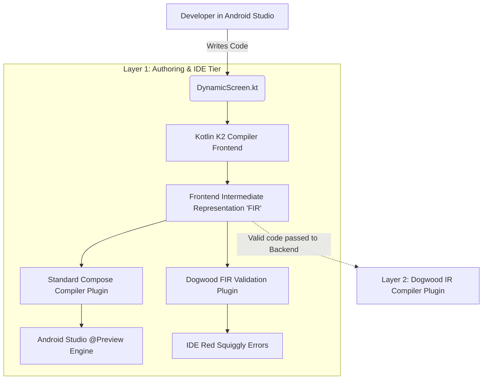

# Layer 1: Developer Authoring Tier (Android Studio / Server Experience)

## 1. Responsibilities & Scope
The Developer Authoring Tier is the environment where engineers write the dynamic Server-Driven Experience (SDE) code. Although we call this the "Server" code because the compiled artifact lives on the server, the actual code is written in a standard Integrated Development Environment (IDE) like Android Studio or IntelliJ IDEA.

**What it does:**
- Provides an idiomatic Jetpack Compose development experience using Android Studio.
- Allows the use of `@Preview` annotations so developers can visually see the User Interface (UI) they are building before it is deployed to the server.
- Provides real-time syntax validation and custom error checking (e.g., preventing the use of native Android views) using a custom Kotlin compiler plugin.

**What it does NOT do:**
- It does **not** handle the final compilation to WebAssembly (Wasm). That is the responsibility of Layer 2.
- It does **not** execute on the end-user's phone.

## 2. Technical Stack & Dependencies
- **Language:** Pure Kotlin (Version 2.0+)
- **IDE Environment:** Android Studio (provides real-time `@Preview` support).
- **Primary Framework:** [Jetpack Compose](https://github.com/androidx/androidx/tree/androidx-main/compose) 
- **Compiler API:** [Kotlin Compiler FIR APIs](https://github.com/JetBrains/kotlin/tree/master/compiler/fir) (specifically `FirAdditionalCheckersExtension` for custom IDE errors).

## 3. Internal Architecture & Data Flow

To provide both visual `@Preview` support and strict enforcement of our WebAssembly (Wasm) architecture, we must split the authoring environment into two distinct workflows.

### Detailed Diagram Node Breakdown
* **Developer in Android Studio:** The human writing `@Composable` Kotlin code.
* **DynamicScreen.kt:** The source file containing the Server-Driven Experience (SDE).
* **Kotlin K2 Compiler Frontend:** The first stage of the Kotlin 2.0 compiler. It parses the raw text into a structured tree.
* **Frontend Intermediate Representation (FIR):** A semantically aware, high-level data structure of the code. The FIR has resolved all types and function names but has not yet generated any bytecode or machine code.
* **Standard Compose Compiler Plugin:** The official JetBrains/Google plugin. We *must* run this plugin on the developer's machine solely so that the `@Preview` window can render the UI locally on their JVM.
* **Android Studio @Preview Engine:** The local visual renderer inside the IDE.
* **Dogwood FIR Validation Plugin:** Our custom Kotlin compiler plugin hook. Because we are targeting WebAssembly (Wasm) without bundling the Compose runtime, developers are forbidden from using certain functions (like `AndroidView` or `UIKitView`). This plugin inspects the FIR tree in real-time.
* **IDE Red Squiggly Errors:** If the Dogwood FIR Validation Plugin detects an unsupported Compose function in the FIR tree, it uses the `FirAdditionalCheckersExtension` Application Programming Interface (API) to instantly throw a compiler error, highlighting the code red in Android Studio before the developer even tries to compile.
* **Layer 2 (Dogwood IR Compiler Plugin):** Once the code passes FIR validation, it is lowered into the compiler backend where our second plugin (the Intermediate Representation plugin) will actually transform it into WebAssembly (Wasm).

## 4. Interfaces & Foreign Function Interface (FFI) Boundary
This layer does not possess a true Foreign Function Interface (FFI) boundary, as it operates entirely within the host's build machine and IDE.

- **Inputs:** Raw `.kt` source code files.
- **Outputs:** A validated Frontend Intermediate Representation (FIR) tree.
- **Memory Ownership:** Managed by the local Java Virtual Machine (JVM) running the Gradle daemon and Android Studio.

## 5. Implementation Roadmap
1. **Milestone 1: Multi-Target Project Setup:** Create a Kotlin Multiplatform project where the `desktop` or `jvm` source set is used for local `@Preview` rendering, but the `wasmJs` source set is used for the actual server deployment.
2. **Milestone 2: The FIR Checker Plugin:** Write a custom Kotlin K2 Compiler Plugin implementing `FirAdditionalCheckersExtension`. 
3. **Milestone 3: The Restricted Dictionary:** Populate the FIR Checker Plugin with a strict dictionary of allowed standard Jetpack Compose functions. Any function call found in the FIR tree that is not in this dictionary must trigger a `DiagnosticReporter.reportOn()` call to fail the build and highlight the error in the IDE.
