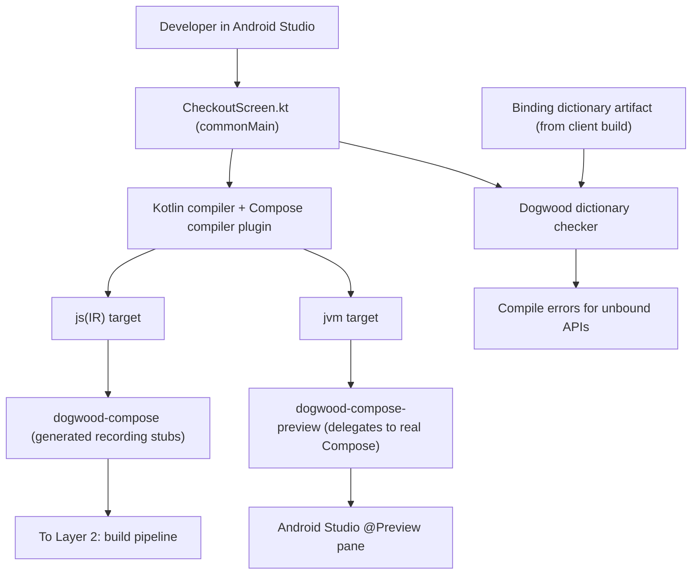

# Layer 1: Developer Authoring Tier

## 1. Responsibilities & Scope

Layer 1 is the environment in which engineers write the dynamic Server-Driven Experience (SDE). Although the compiled artifact is served from a server, the code itself is authored in a normal Kotlin Integrated Development Environment (IDE) — Android Studio or IntelliJ IDEA — in a normal Gradle module.

**What it does:**
- Provides an authoring experience that looks and feels like ordinary Jetpack Compose. Developers write `@Composable` functions, use `remember` and `mutableStateOf`, and apply `Modifier` chains.
- Supplies `dogwood-compose`, a **generated** Kotlin Multiplatform (KMP) library whose declarations mirror the supported Compose Application Programming Interface (API) surface.
- Renders `@Preview` locally on the Java Virtual Machine (JVM) against **real** Compose, so a developer sees the actual User Interface (UI) before deploying.
- Reports, at compile time, any use of a Compose API that the target client's binding dictionary does not contain.

**What it does NOT do:**
- It does **not** compile to the deliverable artifact. That is [Layer 2](layer-2-compiler.md).
- It does **not** render on the device. Nothing in `dogwood-compose` draws anything; the stubs only record intent.
- It does **not** define the supported API surface. That is generated by `dogwood-codegen`, specified in [Layer 5](layer-5-host.md).

## 2. Technical Stack & Dependencies

- **Language:** Kotlin 2.x, targeting `js(IR)` for deployment and `jvm` for previews.
- **Compose runtime:** [`androidx.compose.runtime:runtime`](https://developer.android.com/jetpack/androidx/releases/compose-runtime). `runtime-js` has existed on Google Maven only since 1.9.0-beta01 (mid-2025) — it is a young artifact. This is a Kotlin Multiplatform artifact and is the same runtime Cash App's Redwood uses on its JavaScript guest — verified in [`redwood-compose/build.gradle`](https://github.com/cashapp/redwood/blob/trunk/redwood-compose/build.gradle), which declares `api libs.androidx.compose.runtime` (resolving to `androidx.compose.runtime:runtime:1.9.4`) with JavaScript in its target set.
- **Compose compiler:** the [`org.jetbrains.kotlin.plugin.compose`](https://kotlinlang.org/docs/compose-compiler-migration-guide.html) Gradle plugin, applied to a Kotlin/JS target. Redwood applies exactly this plugin in the same build file.
- **Stub library:** `dogwood-compose`, generated. Not a third-party dependency.
- **Preview backing:** real Compose Multiplatform on the JVM desktop target.

## 3. Internal Architecture

The authoring module is compiled twice from one source set. The deployment path targets JavaScript and links the recording stubs; the preview path targets the JVM and links real Compose. This is what allows a developer to see genuine output locally while shipping something that only records.

### Diagram Node Definitions

* **Developer in Android Studio:** The engineer authoring the experience. They require no knowledge of JavaScript, QuickJS, or the wire protocol.
* **`CheckoutScreen.kt` (commonMain):** The source file. It lives in a common source set so that one body of code feeds both the JavaScript and JVM compilations.
* **Kotlin compiler + Compose compiler plugin:** The standard toolchain. The Compose plugin performs its usual transformation — adding the synthetic `Composer` parameter, `$changed` bitmasks, and group calls. Dogwood adds no compiler backend of its own at this layer.
* **`js(IR)` target:** The deployment compilation. Its output is JavaScript, consumed by Layer 2.
* **`jvm` target:** The preview compilation. Its output is never deployed; it exists solely so the IDE can render. **See the note below — a `jvm` target alone does not drive the Android Studio preview pane.**
* **`dogwood-compose` (generated recording stubs):** The library linked on the JavaScript path. Each function mirrors a real Compose signature, but its body records a node into the composition through Layer 4's `Applier` rather than drawing. `Text(text: String, modifier: Modifier, ...)` records a `Text` node with its properties; it does not lay out glyphs.

  **Defaults are not all guest-resolvable.** Most Material3 defaults are `@Composable` expressions reading the theme — `colors: ButtonColors = ButtonDefaults.buttonColors()`, where `buttonColors()` is itself `@Composable` and returns `MaterialTheme.colorScheme.defaultButtonColors`. The guest has no `MaterialTheme`, so it cannot evaluate them. The generated stub therefore records an explicit **"use host default" sentinel** for any parameter whose default is a composable expression, and the host resolves it inside its own composition. The dictionary must record, per parameter, whether its default is guest-resolvable (a compile-time constant) or host-resolvable.
* **`dogwood-compose-preview` (delegates to real Compose):** The `actual` implementation linked on the JVM path. Each function forwards to the genuine `androidx.compose` function of the same signature, so `@Preview` shows exactly what the device will show.
* **Preview renderer:** Android Studio's Compose Preview renders through **Layoutlib and requires an Android module**, so a `js` + `jvm` module will not drive it. Two options, and Milestone 3 must pick one: add an `androidTarget()` to the authoring module so the standard pane works, or use the Compose Multiplatform desktop preview, which requires the JetBrains Compose Multiplatform IDE Support plugin. Either way the earlier claim that this needs no plugin and uses the standard Android Studio pane was wrong. Whichever is chosen, it shows the **intended layout**, not a faithful device simulation: previews run one Compose runtime with no protocol, no batching, no thread hop, and no skew, so they cannot surface the two failure modes that matter most — degraded rendering under version skew, and input latency. A separate device-parity harness is needed for those; Redwood ships `redwood-testing` and `redwood-snapshot-testing` for exactly this purpose.
* **Binding dictionary artifact:** A versioned, machine-readable list of every Compose API a given client build understands, published by the client build. Specified in [Layer 5](layer-5-host.md).
* **Dogwood dictionary checker:** A build step that compares the APIs a developer called against the dictionary for the targeted client versions and fails the build with a readable error when a call would be skipped on-device. It is **best-effort by construction**: a modifier chain assembled at runtime (`Modifier.then(computedChain)`) or a widget chosen by a runtime branch cannot be resolved statically. It catches the common case — a directly-named unbound API — and must not be described as a guarantee.
* **Compile errors for unbound APIs:** The developer-facing result. The intent is that a developer learns at build time, not from a blank region on a phone.

### How Closely the Stubs Mirror Compose

The stubs are generated to match the Compose functions they mirror as closely as the boundary allows: same function names, same parameter names, same ordering, same defaults where those defaults are expressible. Autocomplete, type checking, and parameter hints all behave normally, and a developer who knows Compose does not have to learn a new vocabulary.

**They are not identical, and this specification does not claim they are.** Two deliberate divergences:

1. **Every type in every signature is Dogwood's own.** Google publishes a Kotlin/JavaScript artifact for `androidx.compose.runtime` only — `androidx.compose.ui`, `androidx.compose.foundation`, and `androidx.compose.material3` publish **none**. The guest therefore cannot link `Dp`, `Color`, `TextUnit`, `Shape`, `PaddingValues`, `TextStyle`, `Alignment`, `RowScope`, or `MutableInteractionSource`. `dogwood-compose` must re-declare and maintain a parallel value-type surface, exactly as Redwood declares its own `app.cash.redwood.ui.Dp` rather than reusing Compose's. Signatures are structurally similar, not type-identical.
2. **`Modifier` is Dogwood's own type.** Compose's `Modifier.Element` implementations are `internal` — `PaddingElement` and its siblings appear in no public signature dump — so a guest holding a real `Modifier` chain would receive objects it cannot name or serialize. Dogwood defines a tagged, serializable `Modifier` instead, as Redwood did. Chain syntax (`Modifier.padding(16.dp).background(Red)`) is preserved; the type is not the androidx one.
3. **Bespoke subsystems have their own shapes.** `LazyColumn`, `TextField`, and the other components listed in [Layer 5](layer-5-host.md) take hand-designed signatures — a lazy list requires a `placeholder` parameter that Compose's `LazyColumn` has no equivalent for, and a text field takes a state object carrying an edit counter rather than a plain `String`.

The practical consequence is that **moving a screen between the dynamic and static worlds is a port, not a re-import.** Most of the body carries over unchanged; modifiers and any bespoke component need adjustment. That is a real cost and it should be planned for, not discovered.

### Developer-Defined Composables Are Just Compose — No Registration

A `@Composable` a developer writes is a plain function. It executes inside the guest composition; only the leaf stub calls it makes (generated-tier or registered design-system components) emit protocol nodes. A feature team's reusable `OrderSummaryCard` that wraps five components therefore needs **no dictionary entry, no tag, and no host release**: it ships inside the payload, updates Over-The-Air (OTA), gets full Compose semantics — parameters, `remember` state, its own recomposition scope — and has no version-skew surface, because it versions atomically with the payload. The line between "bridged" and "just Compose" is specified in [Layer 5](layer-5-host.md), "What Deserves a Dictionary Entry," and [ADR-006](../adrs/layer-5/ADR-006-guest-composed-vs-host-registered-and-multi-design-system.md).

Shared guest component libraries (a `feature-common` module used by several experiences) compile as ordinary Kotlin Multiplatform modules against the Dogwood stubs, and ride [Layer 2](layer-2-compiler.md)'s multi-module manifest so unchanged shared modules are cached once across experiences rather than duplicated per payload.

### Some Compose Values Are Not Readable in the Guest

`MaterialTheme.colorScheme.primary`, `LocalDensity.current`, and the other Compose-provided composition locals live in Compose UI, which does not run in the guest. A developer may *name* a theme value so the host resolves it, but cannot compute from it — `MaterialTheme.colorScheme.primary.copy(alpha = 0.5f)` has no representation. The dictionary checker rejects these at build time.

The checker carries two further **hard rejection obligations**, added after adversarial review ([Layer 5 ADR-005](../adrs/layer-5/ADR-005-corrected-coverage-and-bespoke-subsystem-list.md)):

- **Animation-state APIs** (`animateFloatAsState`, `Animatable`, `updateTransition`, `rememberInfiniteTransition`, and relatives) until the host-side animation subsystem ships. The failure mode of *not* rejecting them is the dangerous one: the guest has a working frame clock, so these APIs would compile and run — silently ticking the boundary every frame, which is exactly what the Layer 4 invariant forbids.
- **Resource-loader APIs** (`painterResource`, `stringResource`, `imageResource`, and relatives), which have no meaning in a sandbox with no resources; images are named by Uniform Resource Locator (URL) through the resources subsystem instead.

Developer-declared `CompositionLocal`s, by contrast, work normally, because they live entirely in the guest's own composition.

## 4. Interfaces & Boundary

This layer has no Foreign Function Interface (FFI) boundary. It runs entirely on the developer's machine and on the build server.

- **Inputs:** Kotlin source files, plus the binding dictionary artifact for each targeted client version.
- **Outputs:** Compiled Kotlin/JS intermediate output, passed to [Layer 2](layer-2-compiler.md). Separately, JVM classes used only for previews.
- **Memory ownership:** Managed by the JVM running Gradle and the IDE. Nothing is shared across a process boundary.

## 5. Implementation Roadmap

1. **Milestone 1 — Multiplatform module skeleton.** Create a KMP module with `js(IR)` and `jvm` targets sharing one `commonMain`, with the Compose compiler plugin applied. Prove that a trivial `@Composable` compiles for both.
2. **Milestone 2 — Hand-written stub vertical slice.** Before any generator exists, hand-write stubs for the roadmap Phase 1 slice — five layout primitives (`Text`, `Column`, `Row`, `Box`, `Spacer`) plus five registered design-system components, with a few value-class modifiers — matching the segment/tag assignments in [Layer 4 ADR-004](../adrs/layer-4/ADR-004-change-event-protocol-v0.md) §2.1. This de-risks the recording mechanism against Layer 4 without waiting on `dogwood-codegen`.
3. **Milestone 3 — Preview path decision and implementation.** Choose between an `androidTarget()` driving the standard Android Studio pane and the Compose Multiplatform desktop preview. Implement the preview `actual`s for the same ten composables. Note this is **not** a straight delegation: because Dogwood declares its own value types and `Modifier`, the preview path needs a type-conversion layer between Dogwood types and androidx types. Budget for it as a third generated surface. Registered design-system components preview by delegating to the real design-system module — which the host build already depends on — so their preview `actual`s are generated alongside the stubs from the same registration.
4. **Milestone 4 — Generated stubs.** Replace the hand-written slice with `dogwood-compose` emitted by `dogwood-codegen`, and confirm the vertical slice still behaves identically.
5. **Milestone 5 — Dictionary checker.** Implement the best-effort build-time check, with error messages naming the API, the client versions that lack it, and the earliest version that has it. Document explicitly what it cannot see.
6. **Milestone 6 — Build ordering.** The dictionary flows *backwards* from Layer 5 to Layers 1 and 2. Establish the publish ordering: the client build must complete and publish its dictionary before any server build can resolve against it, and a client-side Compose upgrade invalidates every server payload built against the previous dictionary.
