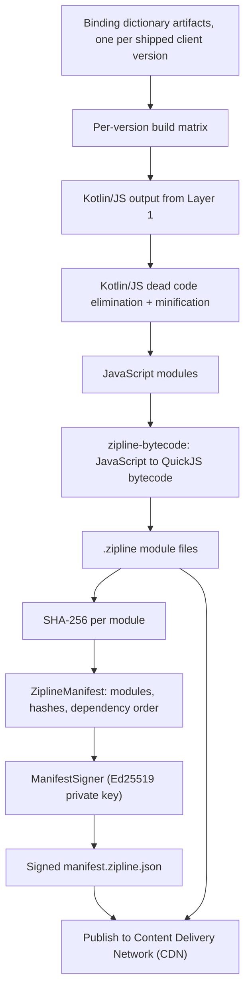

# Layer 2: The Server Build Pipeline

## 1. Responsibilities & Scope

Layer 2 turns the authored Kotlin from [Layer 1](layer-1-authoring.md) into a signed, deliverable artifact. It is a build pipeline, not a compiler backend. Dogwood writes no custom Kotlin compiler plugin at this layer — this is a deliberate reversal of the v3.0 design, recorded in [Layer 2 ADR-002](../adrs/layer-2/ADR-002-generated-stub-api-replaces-ir-interception.md) and [Layer 4 ADR-002](../adrs/layer-4/ADR-002-adopt-zipline-quickjs-substrate.md).

**What it does:**
- Compiles the authored Kotlin to JavaScript using the standard Kotlin/JS backend.
- Converts that JavaScript to **QuickJS bytecode**, so devices never pay a JavaScript parse cost.
- Produces a manifest listing each module, its SHA-256 hash, and its dependencies.
- Signs the manifest with an Ed25519 private key held by the build system.
- Maintains one built artifact per supported client **dictionary state** — which, under [ADR-006](../adrs/layer-5/ADR-006-guest-composed-vs-host-registered-and-multi-design-system.md), is a *vector of per-segment versions* (the generated tier plus each registered design system), not a scalar. The build matrix, artifact naming, and cache keys all key on that vector.

**What it does NOT do:**
- It does **not** transform Compose calls. The Compose compiler plugin does its normal work in Layer 1; Dogwood does not intercept it.
- It does **not** define or generate the binding surface. That is `dogwood-codegen`, specified in [Layer 5](layer-5-host.md).
- It does **not** deliver anything. That is [Layer 3](layer-3-delivery.md).

## 2. Technical Stack & Dependencies

- **Language:** Kotlin.
- **Compilation target:** Kotlin/JS with the IR backend (`js(IR)`), Stable since Kotlin 1.8. This choice, and the rejection of Kotlin/Wasm, is recorded in [Layer 4 ADR-002](../adrs/layer-4/ADR-002-adopt-zipline-quickjs-substrate.md).
- **Packaging and signing:** [`zipline-gradle-plugin`](https://github.com/cashapp/zipline/tree/trunk/zipline-gradle-plugin) and [`zipline-cli`](https://github.com/cashapp/zipline/tree/trunk/zipline-cli), from Cash App Zipline (Apache 2.0). Current release 1.27.0.
- **Bytecode conversion:** [`zipline-bytecode`](https://github.com/cashapp/zipline/tree/trunk/zipline-bytecode), which compiles JavaScript to QuickJS bytecode ahead of time.
- **Signing:** Ed25519 via Zipline's `ManifestSigner`. The algorithm set is fixed to `Ed25519` and `EcdsaP256` by [`SignatureAlgorithmId.kt`](https://github.com/cashapp/zipline/blob/trunk/zipline-loader/src/commonMain/kotlin/app/cash/zipline/loader/SignatureAlgorithmId.kt); Ed25519 is chosen because its Kotlin implementation supports signing and verification on every target.

## 3. Internal Architecture

### Diagram Node Definitions

* **Kotlin/JS output from Layer 1:** The JavaScript emitted by the standard Kotlin/JS IR backend for the authored experience, including the linked `dogwood-compose` stubs and `androidx.compose.runtime`.
* **Kotlin/JS dead code elimination + minification:** The standard production Kotlin/JS pipeline. This matters for payload size: a measured realistic module (data class, collections, `sortedBy`, `HashMap`) produces 14,718 bytes gzipped for Kotlin/JS against 16,448 for Kotlin/Wasm. **Neither number is a payload floor for Dogwood** — that module links no Compose runtime, no coroutines, and no serialization, and dead-code elimination removes everything it does not use. The real floor is unmeasured and is the subject of Milestone 1.
* **JavaScript modules:** One JavaScript file per Kotlin module, retaining module structure so the loader can cache and reuse unchanged modules across releases. This is also how **shared guest component libraries** avoid payload duplication ([ADR-006](../adrs/layer-5/ADR-006-guest-composed-vs-host-registered-and-multi-design-system.md)): a `feature-common` module used by several experiences ships as its own manifest module, is fetched once, and is cache-hit by every experience that depends on it — the manifest's `modules` map already carries dependencies in topological order.
* **`zipline-bytecode`:** Converts JavaScript to QuickJS bytecode ahead of time. This is a substantial startup win, and it is why Zipline uses QuickJS rather than iOS's built-in JavaScriptCore: JavaScriptCore's public API exposes no bytecode-caching mechanism, so a JavaScriptCore host would pay a full parse on every launch. *The specific parse-versus-load ratio quoted in earlier drafts is not independently sourced and has been removed; Milestone 5 measures it directly.*
* **`.zipline` module files:** The container format. It is a magic prefix, a version, then length-prefixed sections; unknown sections are skipped, so the framing is extensible.
* **SHA-256 per module:** The integrity hash for each module. SHA-256 is hard-coded in Zipline in several places with no algorithm agility; this is accepted rather than changed.
* **`ZiplineManifest`:** A `@Serializable` JSON structure carrying `modules` (a topologically sorted map of module identifier to URL, hash, and dependencies), `mainModuleId`, `mainFunction`, `version`, and `metadata`.
* **`ManifestSigner` (Ed25519 private key):** Signs the manifest. Signing operates on the manifest JSON with the `unsigned` property stripped, so any field added to the manifest is automatically covered by the signature. Named keys are supported, and `sign()` signs with every held private key, which is what makes key rotation possible.
* **Signed `manifest.zipline.json`:** The file the device fetches first. The filename is a Zipline constant.
* **Binding dictionary artifacts:** One per shipped client version, published by the client build; each is the segmented artifact defined in [Layer 5](layer-5-host.md) (per-segment names, identifiers, and versions). These are inputs, not outputs, of this layer.
* **Per-version build matrix:** The mechanism implementing section 6 of the [overview](../high-level-tech-spec-final.md). Because a client can only render what its dictionary contains, the server compiles the experience once per supported client dictionary and serves the matching artifact.
* **Publish to CDN:** Upload of the signed manifest and module files.

### On the Absence of a Custom Compiler Plugin

The v3.0 design placed a Kotlin Intermediate Representation (IR) plugin here to rewrite `androidx.compose` calls into WebAssembly imports. That is refuted: `@Composable` and `external` are mutually exclusive, and the core layout composables are `inline` and therefore already gone by the time an IR plugin runs. Under the current architecture the generated stubs *are* the interception point, and they are ordinary Kotlin. See [Layer 2 ADR-002](../adrs/layer-2/ADR-002-generated-stub-api-replaces-ir-interception.md).

## 4. Interfaces & Boundary

This layer crosses no Foreign Function Interface (FFI) boundary; it runs entirely on the build server.

- **Inputs:** Compiled Kotlin/JS output from Layer 1; binding dictionary artifacts for each supported client version; the Ed25519 private key.
- **Outputs:** A set of `.zipline` bytecode modules and one signed `manifest.zipline.json` per client version, published to a CDN.
- **Memory ownership:** Entirely build-server JVM heap and filesystem. No shared or long-lived memory.

## 5. Implementation Roadmap

1. **Milestone 1 — Kotlin/JS baseline. Blocking; do this first.** Compile the Layer 1 vertical slice to Kotlin/JS in production configuration with `androidx.compose.runtime:runtime-js`, `runtime-saveable-js`, `kotlinx-coroutines-core-js`, and `kotlinx-serialization-json-js` all linked, and report five numbers: minified JavaScript bytes, gzipped bytes, `.zipline` bytecode bytes, QuickJS module-load wall time on a mid-range Android device and an iPhone SE, and `QuickJs.memoryUsage` immediately after load. `runtime-js` alone is 1,777,599 bytes of klib. **This is roughly one day of work and is the cheapest experiment in the project that can falsify the architecture.**
2. **Milestone 2 — Zipline packaging.** Apply `zipline-gradle-plugin`, produce `.zipline` bytecode modules and a manifest, and confirm the artifact loads in a Zipline host on the desktop.
3. **Milestone 3 — Signing and key management.** Generate Ed25519 key pairs, sign the manifest in continuous integration, and embed the public key in a test client. Ensure the development bypass (`ManifestVerifier.NO_SIGNATURE_CHECKS`) cannot reach a release build.
4. **Milestone 4 — Per-version build matrix.** Take two synthetic dictionary states that differ **only in one segment's version** (same generated tier, bumped design-system segment) and prove the pipeline emits a correct, distinct artifact for each, keyed on the full segment-version vector.
5. **Milestone 5 — Size and startup budget.** Establish measured budgets for gzipped payload size and on-device module load time, and enforce them as build checks. The reference point is Cash App's published breakdown for a real Kotlin/JS application in [How We Sped Up Zipline Hot Reload](https://code.cash.app/how-we-sped-up-zipline-hot-reload): manifest 20 ms, fetch 60 ms, SHA-256 30 ms, **QuickJS module loading 360 ms**, application start 30 ms.
