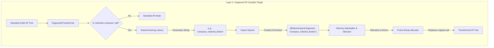

# Layer 2: The Server Compiler (Kotlin IR Plugin)

## 1. Responsibilities & Scope
Layer 2 is the heart of the "Zero-Bridge" compilation strategy. It is a custom Kotlin compiler plugin that runs during the build pipeline when the developer compiles their Server-Driven Experience (SDE) for WebAssembly (Wasm).

**What it does:**
- Operates on the Kotlin Intermediate Representation (IR) tree (the compiler backend).
- Intercepts all function calls directed at the `androidx.compose.*` packages.
- Strips out the actual Compose Runtime, preventing it from being bundled into the `.wasm` binary (which keeps the payload under 50 KB).
- Replaces high-level Compose function calls with low-level WebAssembly (Wasm) `import` statements using the `@WasmImport` annotation.
- Injects memory marshalling code to serialize complex types (Strings, Modifiers) into a linear memory **Arena/Bump Allocator**.

**What it does NOT do:**
- It does **not** validate syntax (that is Layer 1's job).
- It does **not** execute the resulting WebAssembly code.

## 2. Technical Stack & Dependencies
- **Language:** Pure Kotlin.
- **Framework:** [Kotlin K2 Compiler APIs](https://github.com/JetBrains/kotlin/tree/master/compiler/ir/ir.tree).
- **Target Architecture (CRITICAL):** `wasmWasi`
  - *Research Backing:* We MUST use the [`wasm-wasi` target](https://github.com/Kotlin/kotlin-wasm-wasi-template), not `wasm-js`. The `wasm-js` target generates massive JavaScript glue-code files and expects a V8 browser environment. The `wasm-wasi` target emits pure WebAssembly `(import)` instructions designed for embedded, standalone engines (like Wasm3 on iOS/Android) without requiring any Javascript interoperability.
- **Key Compiler Hooks:** `IrGenerationExtension` and `IrElementTransformerVoid`.

## 3. Internal Architecture & Data Flow

To achieve dynamic linking without a massive Javascript bridge, we must transform the code at the compiler level and aggressively manage memory lifecycles.

### Detailed Diagram Node Breakdown
* **Standard Kotlin IR Tree:** The Abstract Syntax Tree passed down from the compiler frontend. It contains standard `IrCall` nodes pointing to the real Jetpack Compose library.
* **DogwoodIrTransformer:** A custom class extending `IrElementTransformerVoid`. It visits every single function call in the codebase during compilation.
* **Matcher (Is 'androidx.compose' call?):** The logic that checks if the current `IrCall` targets a Compose library. Standard Kotlin logic (e.g., `Math.max`) is ignored and passed through.
* **Shared Naming Library:** A standalone Kotlin Multiplatform library shared between the Server Compiler and the Native Client. It guarantees both sides agree on the name of the function.
* **StringDef:** The deterministic string generated by the naming library to handle overloads (e.g., generating `compose_material_Button_modifier`).
* **Import Injector:** Logic that creates a brand new `IrFunction` annotated with `@WasmImport(module = "dogwood", name = "[StringDef]")`. 
* **WasmImportNode:** The actual AST node representing the external import.
* **Memory Marshaller & Allocator:** Because `@WasmImport` functions can only accept raw numbers (`Int`, `Float`), the marshaller injects extra Kotlin code to translate complex objects (like Strings and Modifiers).
* **Frame Bump Allocator (Arena):** 
  - *Research Backing:* To maintain 120 Frames Per Second (FPS) without garbage collection pauses, high-performance Wasm UIs use a [Bump/Arena Allocator](https://github.com/fitzgen/bumpalo). Instead of tracking individual lifetimes of Strings/Modifiers, the IR plugin injects code to allocate them sequentially into a contiguous block of Wasm linear memory by simply incrementing a pointer. At the end of the UI frame, the native host instantly resets the pointer to `0`, freeing all memory in O(1) time and eliminating fragmentation.
* **Transformed IR Tree:** The final output of the plugin. The original Compose calls are gone, replaced entirely by calls to the generated `@WasmImport` functions.

## 4. Interfaces & Foreign Function Interface (FFI) Boundary
This layer sets up the data structures required for the Foreign Function Interface (FFI). 

- **Inputs:** A standard Kotlin Intermediate Representation (IR) tree.
- **Outputs:** A mutated IR tree optimized for WebAssembly (Wasm) dynamic linking.
- **Data Marshalling at the Boundary (Modifiers):** 
  - *Research Backing:* Passing a deeply nested `Modifier` object (e.g., `Modifier.padding(16).background(Red)`) across an FFI is non-trivial. Taking inspiration from Cash App's [Redwood](https://github.com/cashapp/redwood) (which built an entire serialization bridge for Modifiers to jump between Zipline JS and the native host), our IR Plugin will intercept the creation of Modifiers, flatten the modifier chain into a dense, intermediate byte buffer, and allocate that buffer into the Bump Arena. It then passes the `Int` offset and `Int` length of that buffer to the native wrapper.

## 5. Implementation Roadmap
1. **Milestone 1: IR Extension Setup:** Register a basic `IrGenerationExtension` in the custom Gradle plugin targeting `wasmWasi`.
2. **Milestone 2: The Transformer:** Implement `IrElementTransformerVoid` to successfully locate all `IrCall` nodes targeting `androidx.compose`.
3. **Milestone 3: The WasmImport Generator:** Write the IR builder logic to programmatically generate an `IrFunction` with the `@WasmImport` annotation, using the `dogwood-symbol-naming` library.
4. **Milestone 4: Bump Allocator & Serialization:** Implement the complex IR manipulation to inject the O(1) Arena bump allocator. Write the logic to flatten Modifiers and Strings into byte buffers, allocating them into the Arena before passing their integer offsets to the `WasmImport` function.
