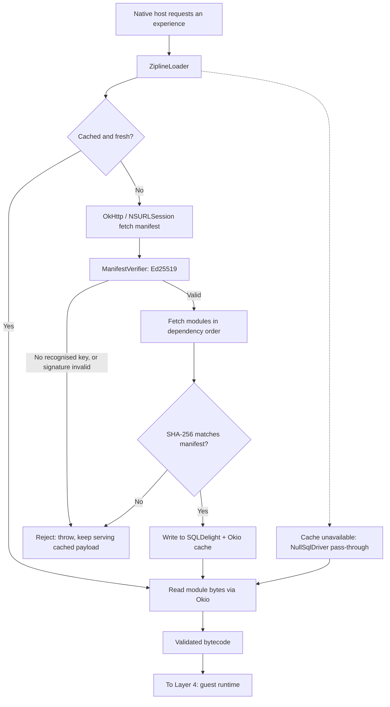

# Layer 3: Over-The-Air (OTA) Delivery & Security

## 1. Responsibilities & Scope

Layer 3 moves the compiled payload from the Content Delivery Network (CDN) to the device, proves it is authentic, and caches it for offline start. It treats the payload as opaque bytes.

**What it does:**
- Fetches the manifest and `.zipline` bytecode modules over HTTPS.
- Verifies the manifest's Ed25519 signature against a public key compiled into the application binary, rejecting anything unsigned or mis-signed.
- Verifies the SHA-256 hash of every module against the signed manifest.
- Caches validated modules to disk so the experience starts instantly and offline on later launches.
- Hands the validated payload to [Layer 4](layer-4-sandbox.md).

**What it does NOT do:**
- It does **not** interpret what the payload *means*. It has no knowledge of Compose, widgets, or the protocol.
- It does **not** apply on the Web. The web profile (roadmap Phase 5) delivers the guest as ordinary JavaScript over web deployment; this layer's loader, bytecode, and signature path are the Android/iOS mechanism, and the web profile's delivery/integrity design is that phase's Architecture Decision Record.

**A correction to an earlier draft:** this layer *does* instantiate the interpreter. `ZiplineLoader`'s public entry points — `load(...): Flow<LoadResult>` and `loadOnce(...): LoadResult` — construct the QuickJS instance, load each module into it, and run the manifest's `mainFunction`, returning a live `Zipline`. **No public API returns verified bytecode for someone else to execute.** A boundary that hands raw bytes to Layer 4 is therefore not implementable against the unmodified loader, and inventing one would mean the fork this architecture exists to avoid. Layer 3 owns fetch, verification, caching, **and instantiation**, and hands Layer 4 a live `Zipline` instance together with the taken service.
- It does **not** require a fork of Zipline. This is a change from v3.0 and is a direct consequence of [Layer 4 ADR-002](../adrs/layer-4/ADR-002-adopt-zipline-quickjs-substrate.md): because Dogwood now runs JavaScript in QuickJS, `zipline-loader` is used exactly as designed rather than being stripped of its execution path.

## 2. Technical Stack & Dependencies

- **Language:** Kotlin Multiplatform (KMP).
- **Delivery framework:** [`app.cash.zipline:zipline-loader`](https://github.com/cashapp/zipline/tree/trunk/zipline-loader), used unmodified. Apache 2.0. Current release 1.27.0 (2026-04-02); the project is actively maintained.
- **Networking:** [OkHttp](https://square.github.io/okhttp/) on Android and the JVM; `NSURLSession` on Apple targets, via Zipline's `URLSessionZiplineHttpClient`.
- **Caching:** [SQLDelight](https://cashapp.github.io/sqldelight/) for metadata and [Okio](https://square.github.io/okio/) for module bytes. Apple targets use `NativeSqliteDriver` over SQLiter.
- **Cryptography:** Ed25519, via `zipline-cryptography`. `ManifestVerifier` and `ManifestSigner` both support named keys.

Declared Apple targets in `zipline-loader/build.gradle.kts` include `iosArm64`, `iosX64`, and `iosSimulatorArm64`, so no platform work is required to reach iOS.

## 3. Internal Architecture

### Diagram Node Definitions

* **Native host requests an experience:** The application asks for a named module, for example `checkout_screen`.
* **`ZiplineLoader`:** Cash App's loader class, orchestrating cache lookup, fetch, verification, and hand-off.
* **Cached and fresh?:** A query against the local SQLDelight database, which tracks module hashes, freshness timestamps, and pin state.
* **Read module bytes via Okio:** Blob read from the Okio filesystem. SQLite holds metadata only; module bytes live in files named by identifier.
* **OkHttp / NSURLSession fetch manifest:** The network request for `manifest.zipline.json`. Platform-specific implementations are already provided by Zipline.
* **`ManifestVerifier`: Ed25519:** Signature verification against public keys compiled into the binary. **Important semantics:** the verifier iterates the manifest's signatures and *skips* key names it does not recognise; the first *recognised* key must verify or it throws, and if no key is recognised at all it throws. This is what makes key rotation work — a manifest may carry several signatures and older clients simply use the one they know.
* **Reject: throw, keep serving cached payload:** Failure is not silent, and it is not fatal to the application. A rejected update leaves the previously cached, previously validated payload in place.
* **Fetch modules in dependency order:** The manifest's `modules` map is required to be topologically sorted, so modules load in an order that satisfies dependencies.
* **SHA-256 matches manifest?:** Per-module integrity check. Because the manifest itself is signed, a matching hash transitively proves module authenticity.
* **Write to SQLDelight + Okio cache:** Persistence for offline start.
* **Cache unavailable: `NullSqlDriver` pass-through:** A degraded state that must be handled explicitly. If the database cannot be opened, Zipline falls back to a null driver and the cache degrades to a straight pass-through download rather than failing. The experience still works; it simply loses offline start and re-downloads each launch. This state must be observable in telemetry.
* **Validated bytecode:** The output — QuickJS bytecode whose provenance and integrity are proven.

### Security Properties

The trust anchor is the Ed25519 public key compiled into the application binary. A payload renders only if it was signed by a private key held by the build system. This is what makes remote code delivery defensible: the device will not execute code that Dogwood's build pipeline did not produce.

`ManifestVerifier.NO_SIGNATURE_CHECKS` exists for local development. **A build check must make it impossible for that constant to reach a release binary.**

## 4. Interfaces & Boundary

This layer crosses no Foreign Function Interface (FFI) boundary. It runs in the host application's normal Kotlin runtime.

- **Inputs:** A module name or Uniform Resource Locator (URL) supplied by the host; the embedded Ed25519 public keys.
- **Outputs:** A live `Zipline` instance with the guest's service taken, handed to Layer 4.
- **Memory ownership:** Module bytes live on the host heap and on disk until loaded. The `Zipline` instance owns the QuickJS runtime thereafter, and closing it reclaims the guest heap. Every Zipline service must be closed through a `ZiplineScope` or the guest-side proxy and its host reference both leak.

## 5. Implementation Roadmap

1. **Milestone 1 — Loader integration.** Add `zipline-loader` to the Android host application (and the desktop development host; iOS follows in roadmap Phase 6) and load a hand-built payload end to end. No fork is required; if forking appears necessary, revisit [Layer 4 ADR-002](../adrs/layer-4/ADR-002-adopt-zipline-quickjs-substrate.md) before proceeding.
2. **Milestone 2 — Key distribution.** Generate Ed25519 key pairs, embed public keys in both clients, and prove that a manifest signed with an unknown key is rejected and that a tampered module fails its hash check.
3. **Milestone 3 — Dictionary binding.** Record the client's **full segment-version vector** ([ADR-006](../adrs/layer-5/ADR-006-guest-composed-vs-host-registered-and-multi-design-system.md)) in `ZiplineManifest.metadata`, which sits inside the signed body because `ManifestSigner` strips only the `unsigned` property. Reject a manifest carrying any segment version the client does not implement, and include the vector in the cache key so a client upgrade of *any* segment invalidates stale entries. **Without this a signed, hash-valid, wrong-version payload renders a mostly-empty screen** — precisely the failure class signatures exist to prevent.
4. **Milestone 4 — Key rotation drill.** Ship a manifest carrying two signatures, confirm an old client validates against the old key and a new client against the new, then retire the old key. This must be exercised **before the first production payload ships** — under the design-system-first path that is during Phase 4, not deferred to the roadmap's Phase 5 hardening pass.
5. **Milestone 5 — Cache and offline behaviour.** Verify offline start from cache, cache eviction, pinning, and the `NullSqlDriver` degraded path. Add telemetry for the degraded state.
6. **Milestone 6 — Release-build safety check.** Add a build-time assertion that `NO_SIGNATURE_CHECKS` is absent from release binaries.
7. **Milestone 7 — Apple review position.** Before this layer ships, obtain a written Apple ruling on downloaded, signed, first-party interpreted payloads, framed around **Guideline 4.7** (which now governs downloaded scripting; the old Guideline 2.5.2 JavaScriptCore-exception sentence no longer appears in the current guidelines — see [Layer 4 ADR-003](../adrs/layer-4/ADR-003-treehouse-precedent-and-evidence-refresh.md)). See section 7 of the [overview](../high-level-tech-spec-final.md).
