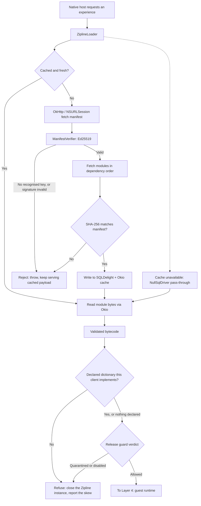

# Layer 3: Over-The-Air (OTA) Delivery & Security

## 1. Responsibilities & Scope

Layer 3 moves the compiled payload from the Content Delivery Network (CDN) to the device, proves it is authentic, and caches it for offline start. It treats the payload as opaque bytes.

**What it does:**
- Fetches the manifest and `.zipline` bytecode modules over HTTPS.
- Verifies the manifest's Ed25519 signature against a public key compiled into the application binary, rejecting anything unsigned or mis-signed.
- Verifies the SHA-256 hash of every module against the signed manifest.
- Caches validated modules to disk so the experience starts instantly and offline on later launches.
- Hands the validated payload to [Layer 4](layer-4-sandbox.md).

**What it does NOT do:**
- It does **not** interpret what the payload *means*. It has no knowledge of Compose, widgets, or the protocol.
- It does **not** apply on the Web. The web profile (roadmap Phase 5) delivers the guest as ordinary JavaScript over web deployment; this layer's loader, bytecode, and signature path are the Android/iOS mechanism, and the web profile's delivery/integrity design is that phase's Architecture Decision Record.

**A correction to an earlier draft:** this layer *does* instantiate the interpreter. `ZiplineLoader`'s public entry points — `load(...): Flow<LoadResult>` and `loadOnce(...): LoadResult` — construct the QuickJS instance, load each module into it, and run the manifest's `mainFunction`, returning a live `Zipline`. **No public API returns verified bytecode for someone else to execute.** A boundary that hands raw bytes to Layer 4 is therefore not implementable against the unmodified loader, and inventing one would mean the fork this architecture exists to avoid. Layer 3 owns fetch, verification, caching, **and instantiation**, and hands Layer 4 a live `Zipline` instance together with the taken service.
- It does **not** require a fork of Zipline. This is a change from v3.0 and is a direct consequence of [Layer 4 ADR-002](../adrs/layer-4/ADR-002-adopt-zipline-quickjs-substrate.md): because Dogwood now runs JavaScript in QuickJS, `zipline-loader` is used exactly as designed rather than being stripped of its execution path.

## 2. Technical Stack & Dependencies

- **Language:** Kotlin Multiplatform (KMP).
- **Delivery framework:** [`app.cash.zipline:zipline-loader`](https://github.com/cashapp/zipline/tree/trunk/zipline-loader), used unmodified. Apache 2.0. Current release 1.27.0 (2026-04-02); the project is actively maintained.
- **Networking:** [OkHttp](https://square.github.io/okhttp/) on Android and the JVM; `NSURLSession` on Apple targets, via Zipline's `URLSessionZiplineHttpClient`.
- **Caching:** [SQLDelight](https://cashapp.github.io/sqldelight/) for metadata and [Okio](https://square.github.io/okio/) for module bytes. Apple targets use `NativeSqliteDriver` over SQLiter.
- **Cryptography:** Ed25519, via `zipline-cryptography`. `ManifestVerifier` and `ManifestSigner` both support named keys.

Declared Apple targets in `zipline-loader/build.gradle.kts` include `iosArm64`, `iosX64`, and `iosSimulatorArm64`, so no platform work is required to reach iOS.

## 3. Internal Architecture

### Diagram Node Definitions

* **Native host requests an experience:** The application asks for a named module, for example `checkout_screen`.
* **`ZiplineLoader`:** Cash App's loader class, orchestrating cache lookup, fetch, verification, and hand-off.
* **Cached and fresh?:** A query against the local SQLDelight database, which tracks module hashes, freshness timestamps, and pin state.
* **Read module bytes via Okio:** Blob read from the Okio filesystem. SQLite holds metadata only; module bytes live in files named by identifier.
* **OkHttp / NSURLSession fetch manifest:** The network request for `manifest.zipline.json`. Platform-specific implementations are already provided by Zipline.
* **`ManifestVerifier`: Ed25519:** Signature verification against public keys compiled into the binary. **Important semantics:** the verifier iterates the manifest's signatures and *skips* key names it does not recognise; the first *recognised* key must verify or it throws, and if no key is recognised at all it throws. This is what makes key rotation work — a manifest may carry several signatures and older clients simply use the one they know.
* **Reject: throw, keep serving cached payload:** Failure is not silent, and it is not fatal to the application. A rejected update leaves the previously cached, previously validated payload in place.
* **Fetch modules in dependency order:** The manifest's `modules` map is required to be topologically sorted, so modules load in an order that satisfies dependencies.
* **SHA-256 matches manifest?:** Per-module integrity check. Because the manifest itself is signed, a matching hash transitively proves module authenticity.
* **Write to SQLDelight + Okio cache:** Persistence for offline start.
* **Cache unavailable: `NullSqlDriver` pass-through:** A degraded state that must be handled explicitly. If the database cannot be opened, Zipline falls back to a null driver and the cache degrades to a straight pass-through download rather than failing. The experience still works; it simply loses offline start and re-downloads each launch. This state must be observable in telemetry.
* **Validated bytecode:** The output — QuickJS bytecode whose provenance and integrity are proven.
* **Declared dictionary this client implements?:** The pre-flight check ([ADR-061](../adrs/layer-3/ADR-061-a-payload-declares-the-dictionary-it-needs.md)). The manifest's **signed** metadata carries `dogwood.segments`, a comma-separated list of `wireName:version` pairs naming the dictionary the payload was built against, and `checkDeclaredDictionary` compares it against what this client implements. Two things are refusals: a segment the client has never heard of, and a segment the client is behind on. A payload naming **fewer** segments than the client implements is not — a guest that uses no design-system component says nothing about that segment, and absence is not a claim. A payload declaring **nothing** is not either: that is the ordinary case for everything built before the field existed, and Layer 5's render-time containment is what protects those.
* **Refuse: close the Zipline instance, report the skew:** A refused guest is a live QuickJS runtime and an entire heap, so it is closed rather than left for the garbage collector. The host is told through `GuardedLoad.Refused` or `onRefused`, carrying the last known-good version when there is one. Naming a fallback is not running it: resuming a previous payload means fetching a manifest that still serves it, which is a server's job.
* **Release guard verdict:** The crash-loop quarantine and publisher kill switch, described in [Layer 5](layer-5-host.md) and [ADR-049](../adrs/layer-5/ADR-049-surviving-a-bad-publish.md). It runs **after** the dictionary check, because the dictionary check is the more specific answer: telling a host "quarantined" when the truth is "your client is a release behind" sends somebody to look at the wrong thing.
* **To Layer 4: guest runtime:** Reached only by a payload that passed both gates.

**Where this gate sits, precisely.** Zipline exposes no manifest-only fetch to a mobile client — `ZiplineLoader.loadOnce` fetches, verifies and evaluates the modules in one call, and `fetchManifestFromNetwork` and `LoadedManifest` are `internal` in `zipline-loader` 1.27.0 — so the check runs **after module evaluation and before `start`**: no entry point is called, no service is bound, nothing composes. The Web profile's equivalent check is one step stronger, because that host fetches its own manifest and can refuse before creating the Worker at all. The difference is real and is stated rather than blurred; both are graded as conformance claim `B3`, on Android and iOS by `tools/skew-drill/run-preflight.sh` and `run-preflight-ios.sh`, and on the Web by `tools/conformance/run-web.sh`.

### Security Properties

The trust anchor is the Ed25519 public key compiled into the application binary. A payload renders only if it was signed by a private key held by the build system. This is what makes remote code delivery defensible: the device will not execute code that Dogwood's build pipeline did not produce.

`ManifestVerifier.NO_SIGNATURE_CHECKS` exists for local development. **A build check must make it impossible for that constant to reach a release binary.**

## 4. Interfaces & Boundary

This layer crosses no Foreign Function Interface (FFI) boundary. It runs in the host application's normal Kotlin runtime.

- **Inputs:** A module name or Uniform Resource Locator (URL) supplied by the host; the embedded Ed25519 public keys.
- **Outputs:** A live `Zipline` instance with the guest's service taken, handed to Layer 4.
- **Memory ownership:** Module bytes live on the host heap and on disk until loaded. The `Zipline` instance owns the QuickJS runtime thereafter, and closing it reclaims the guest heap. Every Zipline service must be closed through a `ZiplineScope` or the guest-side proxy and its host reference both leak.

### The Web Delivery Path Is Not This One

Everything above describes an embedded interpreter fed by `ZiplineLoader`: a signed manifest, Ed25519
verification against keys compiled into the binary, per-module hashes, and a cache that survives
offline. **None of it applies on the Web**, where the guest is ordinary JavaScript the browser loads
over same-origin Hypertext Transfer Protocol Secure (HTTPS). Decision record:
[Layer 5 ADR-032](../adrs/layer-5/ADR-032-the-web-profile.md).

Two things still have to happen, and they move rather than disappear.

**The dictionary check runs before the guest executes**, in the host, on the main thread: fetch a
sidecar manifest from the guest script's origin, compare its segment-version vector against
`DogwoodDictionary.segmentVersions`, and refuse to create the Worker on a version this client does
not implement. Without it, a payload built against a dictionary the client lacks renders a
mostly-empty screen — the failure this check exists to prevent, and the reason it cannot be deferred
to render time.

**The sidecar is signed, and the guest script is not. That split is the honest statement of where
this profile stands.**

HTTPS gives transport integrity and authenticates the server. On its own it does **not** give what
manifest signing gives on mobile: that a compromised or substituted server cannot make a client run
code the signing key never approved.

Half of that is closed by [ADR-062](../adrs/layer-3/ADR-062-a-signed-web-sidecar.md). A **detached**
Ed25519 signature sits beside the sidecar as `<manifest>.json.sig`, holding `keyName hexSignature`
one line per key, and `WebDelivery` verifies it against keys the host passes in — over the bytes it
already fetched, **before the document is parsed**, so that no field of an unverified document is
ever read. Detached rather than embedded because a signature inside a document must exclude itself
from what it covers, which makes signer and verifier agree byte-for-byte on a subset of a JSON
document; that class of disagreement fails silently and late. The rotation rule is Zipline's,
mirrored: skip unrecognised key names, and let the first recognised name decide whether or not it
verifies — falling through would let an attacker who can add a signature simply add a good one for a
key they hold. A **missing** signature is a refusal, because an attacker who can replace the
manifest can delete the file beside it. `trustedPublicKeys` has no default, and `emptyMap()` is the
written way to keep the older, weaker posture.

Everything the sidecar *decides* is therefore as trustworthy as the signing key: the guest script's
address, the dictionary vector, the release identity, and the publisher's kill switch — which until
ADR-062 was only as trustworthy as its origin, and said so in its own comment.

The other half is not closed. **The guest script itself is still fetched without an integrity
check.** A signed sidecar naming a script does not stop a server from serving different bytes at
that address. Parity needs the host to fetch the script, verify a hash carried in the sidecar, and
construct the Worker from a blob — `new Worker(url)` accepts no Subresource Integrity attribute, so
the check has to be explicit. `DogwoodWebManifest.guestScriptSha256` exists so a deployment can
carry the hash today; it is read only to report that it was ignored. That is the remaining gap, and
signing the sidecar is what makes closing it worth doing: the hash will arrive on a document an
attacker cannot rewrite.

Graded on a real browser as conformance claims `B1` and `B2`, by `tools/conformance/web_services.py`
against fixtures the build itself signed.

## 5. Implementation Roadmap

1. **Milestone 1 — Loader integration.** Add `zipline-loader` to the Android host application (and the desktop development host; iOS follows in roadmap Phase 6) and load a hand-built payload end to end. No fork is required; if forking appears necessary, revisit [Layer 4 ADR-002](../adrs/layer-4/ADR-002-adopt-zipline-quickjs-substrate.md) before proceeding.
2. **Milestone 2 — Key distribution.** Generate Ed25519 key pairs, embed public keys in both clients, and prove that a manifest signed with an unknown key is rejected and that a tampered module fails its hash check.
3. **Milestone 3 — Dictionary binding.** Record the client's **full segment-version vector** ([ADR-006](../adrs/layer-5/ADR-006-guest-composed-vs-host-registered-and-multi-design-system.md)) in `ZiplineManifest.metadata`, which sits inside the signed body because `ManifestSigner` strips only the `unsigned` property. Reject a manifest carrying any segment version the client does not implement, and include the vector in the cache key so a client upgrade of *any* segment invalidates stale entries. **Without this a signed, hash-valid, wrong-version payload renders a mostly-empty screen** — precisely the failure class signatures exist to prevent.
4. **Milestone 4 — Key rotation drill.** ✅ **Done** — [ADR-001](../adrs/layer-3/ADR-001-key-rotation-rehearsed.md). The slice is signed by two keys and both sample hosts trust both, so the middle step of a rotation is exercised by every run of the sample rather than only by a test. `KeyRotationTest` covers all three steps against the manifest the build actually produces, including what retiring the old key does to a client that never rolled forward: it stops accepting updates, silently, falling back to its cached payload. Two properties of the verifier are now measured rather than quoted — **signature order decides which key a client trusting both actually uses** (so "we trust the new key" is not "we use the new key"), and **a recognised key name that fails verification rejects rather than falling through** to a later signature, which is what stops an attacker who can add a signature under a trusted name.
5. **Milestone 5 — Cache and offline behaviour.** Verify offline start from cache, cache eviction, pinning, and the `NullSqlDriver` degraded path. Add telemetry for the degraded state.
6. **Milestone 6 — Release-build safety check.** Add a build-time assertion that `NO_SIGNATURE_CHECKS` is absent from release binaries.
7. **Milestone 7 — Apple review position.** Before this layer ships, obtain a written Apple ruling on downloaded, signed, first-party interpreted payloads, framed around **Guideline 4.7** (which now governs downloaded scripting; the old Guideline 2.5.2 JavaScriptCore-exception sentence no longer appears in the current guidelines — see [Layer 4 ADR-003](../adrs/layer-4/ADR-003-treehouse-precedent-and-evidence-refresh.md)). See section 7 of the [overview](../high-level-tech-spec-final.md).
