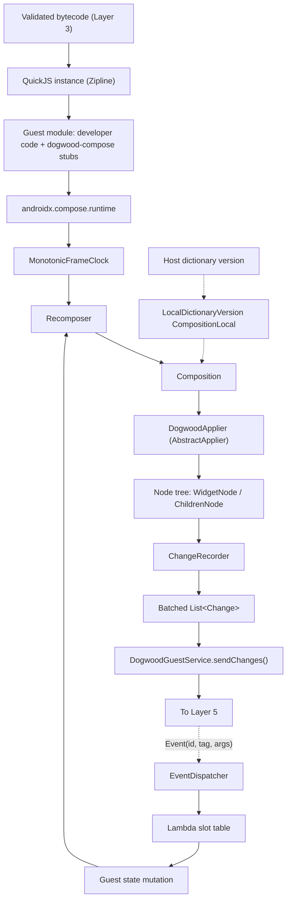

# Layer 4: The Guest Runtime

## 1. Responsibilities & Scope

Layer 4 is where the delivered code actually runs. It is a sandboxed QuickJS interpreter hosting the developer's compiled Kotlin **and the real Compose runtime**. It executes composition and recomposition, and emits the resulting tree changes to [Layer 5](layer-5-host.md) as batched messages.

This is the layer that makes the architecture work: because genuine `androidx.compose.runtime` runs inside the guest, `remember`, `mutableStateOf`, `derivedStateOf`, `LaunchedEffect`, `CompositionLocal`, and recomposition all behave exactly as a developer expects, with no Dogwood-specific protocol for them.

**What it does:**
- Instantiates a QuickJS interpreter per experience via Zipline, and loads the validated bytecode from [Layer 3](layer-3-delivery.md).
- Runs a Compose `Composition` whose `Applier` materialises protocol nodes rather than pixels.
- Assigns stable identifiers and integer tags to nodes, properties, children slots, and event handlers.
- Batches all changes produced by one composition pass into a single outbound message.
- Receives inbound events, dispatches them to the correct guest lambda, and lets Compose recompose.

**What it does NOT do:**
- It does **not** lay out, measure, or draw anything. There is no Skia and no Compose UI in the guest.
- It does **not** know about Android or iOS. It has no platform Application Programming Interfaces (APIs).
- It does **not** decide what a widget looks like. It names a widget by tag; [Layer 5](layer-5-host.md) decides what that tag means.

## 2. Technical Stack & Dependencies

- **Interpreter:** QuickJS, embedded via [Cash App Zipline](https://github.com/cashapp/zipline). Zipline vendors stock Bellard QuickJS pinned at version `2021-03-27` (verified at `zipline/native/quickjs/VERSION`).
- **Compose runtime:** [`androidx.compose.runtime:runtime`](https://developer.android.com/jetpack/androidx/releases/compose-runtime), Kotlin Multiplatform, compiled for `js(IR)`. Confirmed in production use on a JavaScript guest by Cash App's Redwood.
- **Applier base class:** [`androidx.compose.runtime.AbstractApplier`](https://developer.android.com/reference/kotlin/androidx/compose/runtime/AbstractApplier). Redwood's equivalent is `NodeApplier<W> : AbstractApplier<Node<W>>` in [`WidgetApplier.kt`](https://github.com/cashapp/redwood/blob/trunk/redwood-compose/src/commonMain/kotlin/app/cash/redwood/compose/WidgetApplier.kt).
- **Boundary transport:** Zipline services (`ZiplineService`), whose calls are serialized with `kotlinx.serialization`.
- **Coroutines:** `kotlinx-coroutines-core`, for the composition scope and the frame clock.

## 3. Internal Architecture



### Diagram Node Definitions

* **Validated bytecode (Layer 3):** QuickJS bytecode whose signature and hashes have been verified.
* **QuickJS instance (Zipline):** A sandboxed interpreter with no ambient access to the filesystem, the network, or platform APIs. Every capability it has is one the host explicitly exposed. This is the security boundary, and it is the reason Google Play's dynamic-code policy exception applies: the guest reaches platform APIs only indirectly, through the host.
* **Guest module:** The compiled experience — the developer's `@Composable` functions plus the linked `dogwood-compose` stubs from [Layer 1](layer-1-authoring.md).
* **`androidx.compose.runtime`:** The genuine Compose runtime, compiled to JavaScript. It provides the `Composer`, snapshot state system, and recomposition machinery.
* **`MonotonicFrameClock`:** Compose's frame timing abstraction. The host drives it, so guest recomposition is paced by the device's real display refresh rather than free-running.
* **`Recomposer`:** Compose's scheduler. When guest state changes, it marks affected scopes invalid and re-executes only those on the next frame. This is why steady-state traffic is a small diff rather than a whole tree.
* **`Composition`:** One composition instance per mounted experience.
* **`DogwoodApplier` (`AbstractApplier`):** The heart of the layer. Compose calls `insertTopDown`, `insertBottomUp`, `remove`, `move`, and `clear` on it as the tree changes. Instead of manipulating UI objects, it manipulates protocol nodes. Redwood demonstrates the exact pattern, including the subtlety that widgets are attached to their parent on the *bottom-up* pass so that a node's initial properties are set before it is attached.
* **Node tree (`WidgetNode` / `ChildrenNode`):** The guest's mirror of the tree the host will build. `WidgetNode` represents one bound Compose call; `ChildrenNode` represents one slot within it, such as a `Column`'s `content`.
* **`ChangeRecorder`:** Translates node-tree mutations into protocol `Change` values — node creation, property updates, children insertions and removals, and modifier updates.
* **Batched `List<Change>`:** All changes from one composition pass, accumulated and sent as one message. **Batching is architecturally load-bearing.** Per-crossing cost is only acceptable because there are very few crossings; a design that crossed per node would not meet frame budget. Every working comparable system — Redwood, Zellij, WASM-4 — converges on this shape.
* **`DogwoodGuestService.sendChanges()`:** A `ZiplineService` method — the single egress point.
* **`EventDispatcher`:** Receives an inbound `Event(id, tag, args)` and resolves it to a guest lambda.
* **Lambda slot table:** Maps an `(id, EventTag)` pair to the actual Kotlin lambda captured during composition. When a developer writes `Button(onClick = { count++ })`, the lambda is stored here and the protocol carries only its tag.
* **Guest state mutation:** The lambda runs, mutating snapshot state, which invalidates recomposition scopes.
* **Host dictionary version / `LocalDictionaryVersion`:** The host's binding-dictionary version, supplied into the composition as a `CompositionLocal` so guest code can branch on client capability. Redwood's `LocalWidgetVersion` is the proven equivalent.

### The Frame Loop

The loop is **asynchronous and crosses two threads**. It is not five synchronous steps inside one frame, and describing it that way conceals the design's central constraint.

1. The guest requests a frame via `requestFrame()`. The host schedules one `Choreographer` (Android) or `CADisplayLink` (iOS) callback.
2. On that callback the host posts `frame(timeNanos)` to the **Zipline dispatcher** — a dedicated single thread.
3. The `Recomposer` re-executes invalidated scopes on that thread.
4. `dogwood-compose` stubs mutate the node tree through `DogwoodApplier`; the `ChangeRecorder` accumulates.
5. One `sendChanges` call is posted back to the **UI dispatcher**.
6. The host applies the batch and renders on its next vertical sync.

**Earliest possible pixel change is two vertical syncs after the input that caused it**, and neither thread hop is bounded, so the tail is long. Redwood's `AndroidTreehouseDispatchers` demonstrates this shape directly — `ui = Dispatchers.Main`, `zipline = ` a single-thread executor, with `checkUi()` and `checkZipline()` assertions on every protocol entry point.

### Invariant: No Per-Frame State in the Guest

Because the host's UI thread cannot call the guest during a frame traversal, **no state that must update every frame may live in the guest.** This is a hard design invariant, not a performance guideline, and it determines which Compose APIs are bindable at all ([Layer 5](layer-5-host.md)).

| Concern | Where state lives | What crosses the boundary |
|---|---|---|
| Animation | Host | A declarative target: "animate `alpha` to 1.0 over 300 ms, `FastOutSlowIn`" |
| Scroll offset | Host | Throttled `onViewportChanged(firstIndex, lastIndex)` — never per-pixel |
| Gestures | Host | Discrete semantic events: click, long-press, `dragEnded(velocity)` |
| Text field edit buffer | Host | Debounced value changes; the guest may reset the value but never echoes per keystroke |
| Application state and logic | Guest | Nothing — it stays with the developer's code |

A consequence worth stating: **the guest frame rate should be capped** — 30 Hz or 60 Hz — regardless of display refresh. Once animation and gesture are host-owned, nothing in the guest needs 120 Hz, and the question closes by construction rather than by hope.

### Guest Memory Management

Zipline's QuickJS defaults are not tuned for a long-lived composition, and Layer 4 must set them deliberately. Measured from `QuickJs.kt`: `gcThreshold = 256 KiB`, `memoryLimit = -1` (unbounded), `maxStackSize = 512 KiB`.

- **`gcThreshold`.** QuickJS runs a full, non-generational, stop-the-world mark-and-sweep each time allocation grows by this much. Pause time scales with the *live* set, which here is the Compose slot table, every `MutableState`, the snapshot record chains, the node tree, and the lambda slot table. Raise it substantially (8–16 MB) and call `gc()` explicitly at idle and on memory-pressure callbacks.
- **`memoryLimit`.** Set a real limit with a defined recovery path — tear down and reload the experience — plus telemetry. Unbounded means any leak runs until the operating system kills the process.
- **`maxStackSize`.** Composition is deeply recursive, and interpreted frames are heavy. Redwood found **8 MB** necessary, noting it was "experimentally found that's sufficient for our guest programs." That is the only published datapoint for interpreted Compose composition depth and should be the starting value.

**Reclamation is not automatic.** `DogwoodApplier.remove()` and `clear()` must perform a depth-first purge of both the node map and the lambda slot table. Without it, a feed that creates and destroys ten thousand rows retains ten thousand closures, each capturing its row's data. Redwood does exactly this purge in `takeChanges()`.

## 4. Interfaces & Boundary

This is Dogwood's real cross-process boundary: a Zipline service boundary serialized with `kotlinx.serialization`. Services are named for the side that **implements** them.

**Implemented by the guest, called by the host:**
```kotlin
interface DogwoodGuestUi : ZiplineService {          // ZiplineService extends AutoCloseable
  fun start(host: DogwoodHost, configuration: DogwoodConfiguration)
  fun sendEvent(event: Event)
  fun frame(timeNanos: Long)
  fun snapshotState(): StateSnapshot
  override fun close()
}
```

**Implemented by the host, called by the guest:**
```kotlin
interface DogwoodHost : ZiplineService {
  fun sendChanges(changes: List<Change>)
  fun requestFrame()
  fun onUnknownEvent(widgetTag: WidgetTag, tag: EventTag)
  fun onUnknownEventNode(id: Id, tag: EventTag)
  fun handleUncaughtException(exception: Throwable)
  override fun close()
}
```

`requestFrame()` is essential and was absent from an earlier draft. Without it the host must tick every vertical sync, costing a boundary crossing and a QuickJS wake-up per frame even while idle — which would contradict this layer's own batching argument. Redwood drives its frame clock this way: a `BroadcastFrameClock` whose `onNewAwaiters` callback calls `host.requestFrame()`.

**Threading contract.** `frame`, `sendEvent`, and all guest work run on the Zipline dispatcher; `sendChanges` is delivered to the UI dispatcher. Both sides should assert with check functions rather than rely on convention.

**Lifecycle.** Every service is closed through a `ZiplineScope`; teardown order is guest services first, then the `Zipline` instance. Zipline services that are not closed leak the guest-side proxy and its host reference.

**Configuration is a flow, not a one-shot value.** Density, layout direction, dark mode, safe-area insets, and viewport size all change at runtime, so `DogwoodConfiguration` is delivered as a `StateFlow` and exposed to guest code as a `CompositionLocal`. The dictionary version, by contrast, is fixed for a composition's lifetime and is passed at construction as a `staticCompositionLocalOf`.

**Protocol value types.** Every tag is an `Int`-backed value class and every dynamic value is a `JsonElement`:

| Type | Meaning |
|---|---|
| `Id(Int)` | A node instance. `Id(0)` is the root. **Monotonic; never reused within a composition.** |
| `WidgetTag(Int)` | Which bound Compose function a node represents. |
| `PropertyTag(Int)` | Which parameter is being set. |
| `ChildrenTag(Int)` | Which content slot children belong to. |
| `EventTag(Int)` | Which lambda parameter an event targets. |
| `ModifierTag(Int)` | Which modifier is applied. Scope-aware. |

**Stale events are expected and must be handled.** The user can tap a node that the guest removed on a frame the host has not yet rendered. The guest must route unresolved events to `onUnknownEventNode` telemetry rather than crashing or silently ignoring them, and each `Event` should carry the change-batch sequence number it was rendered against so the guest can drop stale ones — a double-tapped "Pay" button across a frame boundary is a correctness problem, not a cosmetic one. Redwood handles the unknown-node case but has no sequence number; this is an opportunity to improve on the prior art.

**Lifecycle events with no design yet.** Code update while a screen is live is the *normal* case, since `ZiplineLoader.load()` returns a `Flow`. Backgrounding, process death, and memory pressure are equally unaddressed. Guest state must survive these through `SaveableStateRegistry` plus a host-side state store, as Redwood does with `snapshotState()`/`StateStore`. **Until that exists, any code update loses scroll position, expanded rows, and half-typed text.**

- **Inputs:** A live `Zipline` instance from Layer 3; `Event` values; frame signals; a configuration flow.
- **Outputs:** Batched `List<Change>`; `requestFrame()` calls; telemetry.
- **Memory ownership:** The guest owns its heap inside QuickJS; the host cannot reach into it. Protocol messages are serialized copies. Closing the `Zipline` instance reclaims the guest heap.

## 5. Implementation Roadmap

1. **Milestone 1 — Compose runtime in QuickJS.** Prove that `androidx.compose.runtime` compiled to Kotlin/JS runs inside Zipline's QuickJS at all, by driving a trivial composition that mutates a counter and observing recomposition. **This is the single highest-risk unknown in the layer and must be done first.**
2. **Milestone 2 — Applier and node tree.** Implement `DogwoodApplier` over `AbstractApplier`, with `WidgetNode` and `ChildrenNode`. Validate insert, remove, move, and clear against the hand-written stub slice from Layer 1.
3. **Milestone 3 — Change recording and batching.** Emit `Change` values, batch per composition pass, and assert that an idle composition produces no traffic.
4. **Milestone 4 — Event round trip.** Implement the lambda slot table and inbound `Event` dispatch. Prove an `onClick` mutates guest state and produces a minimal diff.
5. **Milestone 5 — Frame clock integration.** Drive the guest `MonotonicFrameClock` from the host's display link or `Choreographer`.
6. **Milestone 6 — Performance measurement.** Measure, on-device: per-crossing `sendChanges` latency for realistic batch sizes, composition and recomposition cost inside QuickJS, and total frame cost against budget. **These numbers are currently unproven and are the gating evidence for the whole architecture.** Explicitly probe the QuickJS rope-string defect by confirming generated guest code performs no `StringBuilder`-heavy work on the hot path.
