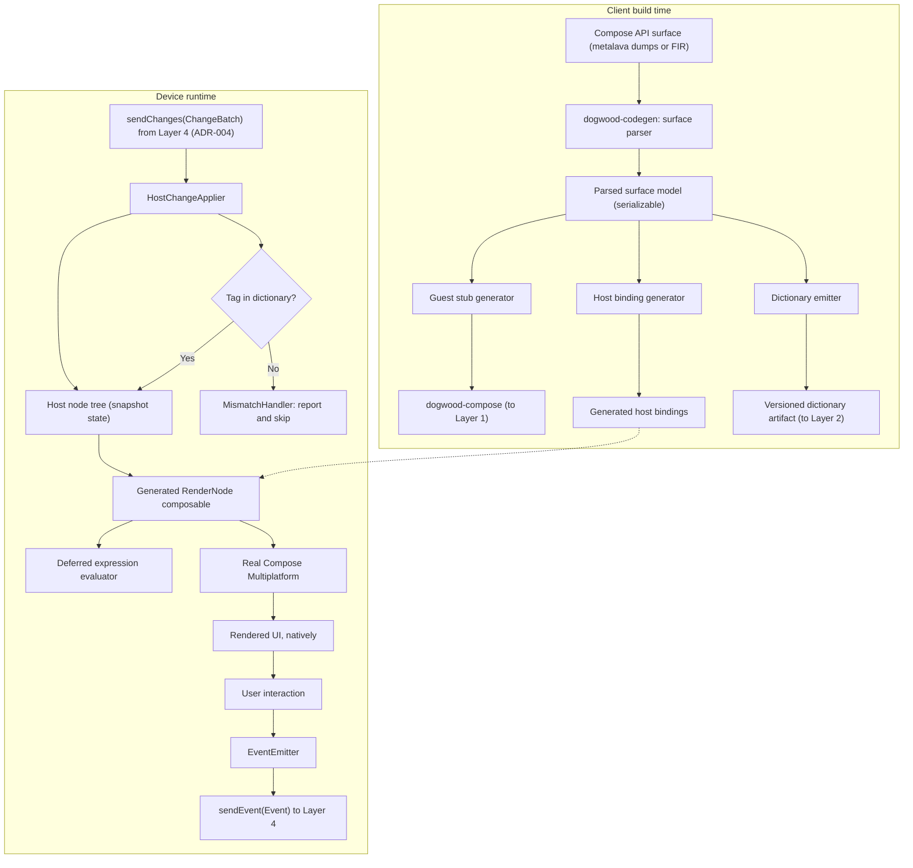
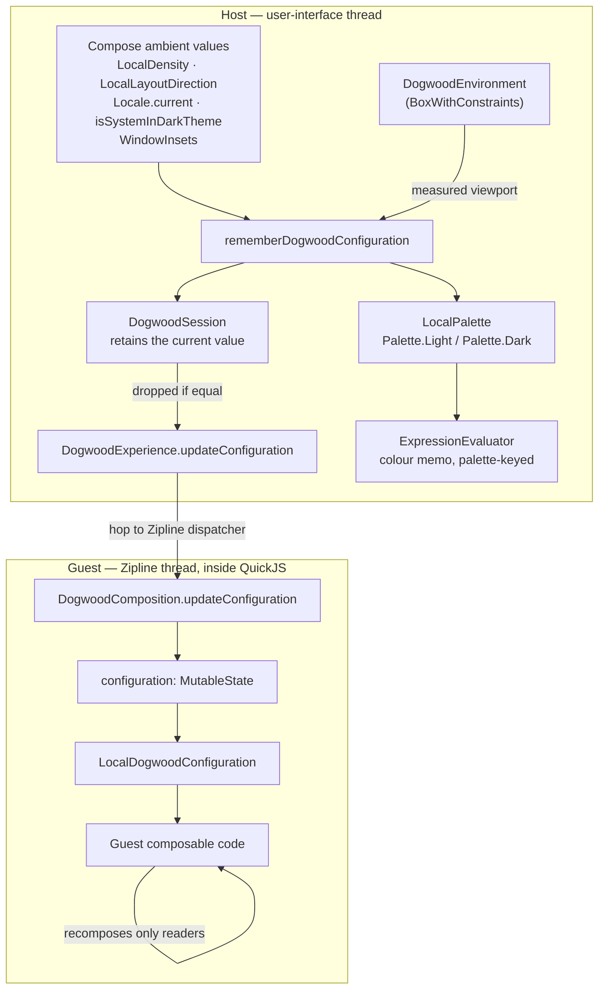
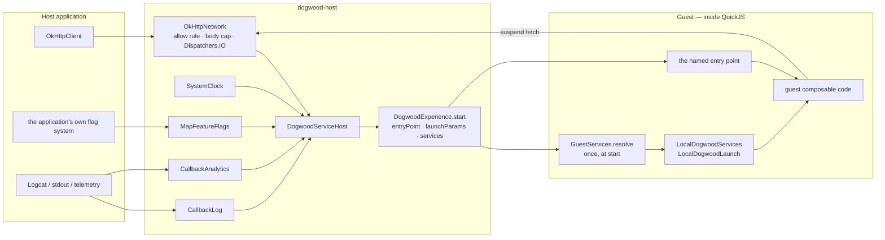
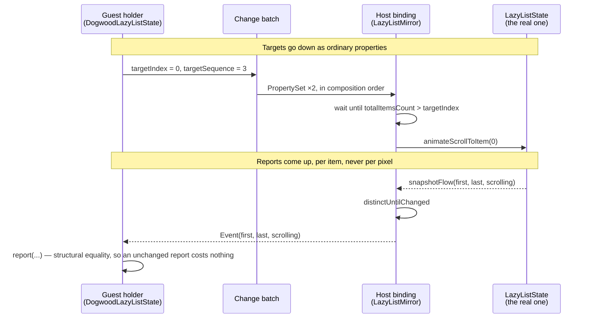

# Layer 5: The Native Host & Generated Binding Layer

## 1. Responsibilities & Scope

Layer 5 is the client-side half of the bridge and the home of `dogwood-codegen`, the tool that generates both halves. It receives batched changes from [Layer 4](layer-4-sandbox.md), maintains a mirror of the node tree, renders that tree with **real Compose Multiplatform**, and routes user events back to the guest.

This layer is what makes the product promise true: because its bindings are generated across the Compose surface rather than hand-written per component, the host already knows the generated majority of what a developer might call — about two-thirds of the widget surface, with the enumerated bespoke subsystems below covering most of the rest ([ADR-005](../adrs/layer-5/ADR-005-corrected-coverage-and-bespoke-subsystem-list.md)).

**What it does:**
- Generates, at client build time, the host binding layer, the guest stub library, and the binding dictionary — all from one parsed description of the Compose Application Programming Interface (API) surface.
- Applies inbound `Change` batches to a host-side node tree.
- Renders that tree by dispatching each node's `WidgetTag` to the real Compose function it names.
- Evaluates deferred constructor expressions for non-primitive parameter types.
- Emits `Event` values back to the guest when the user interacts.
- Handles unknown tags by skipping and reporting, never by crashing.

**What it does NOT do:**
- It does **not** hold application state or logic. All of that lives in the guest.
- It does **not** interpret intent. It applies tags mechanically.
- It does **not** implement accessibility. That is inherited from Compose Multiplatform ([ADR-001](../adrs/layer-5/ADR-001-host-native-compose-owns-semantics-and-input.md)). **Text input is not inherited** — ADR-001's own correction withdrew that half of its conclusion; text input is bespoke subsystem 3 below.

## 2. Technical Stack & Dependencies

- **Language:** Kotlin Multiplatform (KMP), Android and iOS.
- **Rendering:** [Compose Multiplatform](https://github.com/JetBrains/compose-multiplatform), running natively. On iOS this is Skiko over Metal; accessibility has been on by default since Compose Multiplatform 1.8.0.
- **Code generation:** KotlinPoet, driven by a standalone tool. **Not Kotlin Symbol Processing (KSP)** — see [ADR-002](../adrs/layer-5/ADR-002-standalone-codegen-tool-not-ksp.md).
- **API surface source:** **The embedded Kotlin frontend, not metalava dumps alone.** Metalava signature files are useful for enumerating the surface but **cannot supply default values** — the format emits only the keyword `optional`, with no expression, and 73.9% of parameters across the measured surface are optional. Since the generator must reproduce defaults, it needs a source that carries them: the Kotlin frontend over Compose sources or klibs. Redwood uses `kotlin-compiler-embeddable` with a `schemaParserFir.kt` for exactly this reason. Milestone 1 confirms the approach; it no longer chooses between two equals.
- **Transport:** Zipline services, as defined in [Layer 4](layer-4-sandbox.md).

## 3. Internal Architecture

### Diagram Node Definitions

* **Compose API surface:** The machine-readable description of what Compose offers. androidx publishes metalava signature dumps at `<module>/api/current.txt`; these parse cleanly and were used to produce the coverage measurements in [ADR-003](../adrs/layer-5/ADR-003-opaque-handle-binding-surface.md).
* **`dogwood-codegen`: surface parser:** Reads that surface and produces a normalised model — every bindable function, its parameters, their types, defaults, and its overload group.
* **Parsed surface model:** A serializable intermediate representation. Making it serializable matters: it is the single source of truth from which all three outputs are generated, and it can be diffed between Compose versions to see exactly what changed.
* **Guest stub generator:** Emits `dogwood-compose` — recording functions with signatures identical to the real ones.
* **Host binding generator:** Emits the host dispatch layer that maps a `WidgetTag` to a real Compose call.
* **Dictionary emitter:** Emits the versioned artifact naming every API this client build understands, consumed by [Layer 2](layer-2-compiler.md) and by Layer 1's checker. **Format (v0):** one JSON file per client build containing `formatVersion`; a `segments` list — each with `name` (`dogwood.core`, `acme.designsystem`), `segmentId` (the 8-bit tag prefix from [Layer 4 ADR-004](../adrs/layer-4/ADR-004-change-event-protocol-v0.md) §2.1), and `version`; and per segment its `widgets` — each with `localTag`, fully-qualified `name`, overload discriminator, and `params`, where every parameter carries `propertyTag` (or `childrenTag`/`eventTag`/`modifier` role), type class (value / deferred-expression / slot / event), `optional`, `defaultResolution` (`guest-const` or `host` — the sentinel rule from overview §7 item 4), and `safetyRelevant` (the overview §6 flag: `enabled`, `checked`, and relatives). This is the minimum field set three layers already depend on; the schema gets its own Architecture Decision Record when the generator lands, but Phase 1's hand-written dictionary uses exactly these fields.
* **`HostChangeApplier`:** Applies an inbound batch to the mirror tree. Creates nodes, sets properties, inserts and removes children, updates modifiers.
* **Host node tree (snapshot state):** The mirror of the guest's tree, held in Compose snapshot state so that mutating it triggers host-side recomposition naturally.
* **Tag in dictionary? / `MismatchHandler`:** The containment gate, not a feature. Its contract is specified in section 6 of the [overview](../high-level-tech-spec-final.md) and is binding here.

  Two corrections to an earlier draft. First, **skipping an unrecognised `Create` is not safe**: Redwood's `HostProtocolAdapter` does `protocol.widget(change.tag) ?: continue`, which registers no node, so any later change on that identifier reaches `checkNotNull(nodes[id.value])` and throws — Redwood's own tests assert this. Dogwood must insert a **placeholder node** instead, so index arithmetic in the rest of the batch stays consistent. Second, `ProtocolMismatchHandler.Throwing` is not test-only in Redwood; it is the **default parameter value** of `HostProtocol.Factory.create`. Dogwood must supply a reporting handler explicitly.
* **Generated `RenderNode` composable:** A generated `@Composable` that dispatches on `WidgetTag` to the real Compose function, recursing into children slots. This is, structurally, the large dispatch table the project set out to eliminate — the point is that **no human writes or maintains it**.
* **Deferred expression evaluator:** Resolves non-primitive parameters. See below.
* **Real Compose Multiplatform:** Layout, measure, draw, animation, accessibility, and text input, all native and full speed.
* **`EventEmitter`:** Converts a host-side callback into an `Event(id, tag, args)`.

### Parameter Marshalling

Parameters fall into four classes. The first three are generated; the fourth is not.

**1. By value.** Primitives, `String`, and Kotlin inline value classes over primitives (`Dp`, `Color`, `TextUnit`, `IntSize`) travel as `JsonElement` inside `PropertyChange`.

Note an obligation this creates: those value classes live in `compose-ui`, `ui-unit`, and `ui-graphics`, **none of which Google publishes as a Kotlin/JavaScript artifact** — only `androidx.compose.runtime:runtime-js` and `runtime-saveable-js` exist. Depending on JetBrains' `ui-js` instead would drag layout, measure, and draw into a layer that must not contain them. Therefore **`dogwood-codegen` must also generate guest-side stand-ins for every value type it marshals.** This is a first-class generator output, not an incidental detail.

**2. By deferred expression, evaluated inside the host composition.** Non-primitive parameters — `Shape`, `PaddingValues`, `TextStyle`, `ButtonColors` — are recorded by the guest as a serialized *constructor expression* ("`RoundedCornerShape` with `8.dp`") and evaluated host-side. This avoids a synchronous guest-to-host round trip, which the asynchronous boundary makes impossible.

Three constraints are binding, and an earlier draft of this specification violated all three:

- **Evaluation happens inside the host composition, not in `HostChangeApplier`.** Many factories are `@Composable` — `ButtonDefaults.buttonColors()` is annotated `@Composable`, as is `MaterialTheme.colorScheme`. A composable function cannot be called from an applier.
- **The memo cache is keyed on the composition-local snapshot as well as the expression.** Keying on the expression alone means a dark-mode toggle never re-evaluates `buttonColors()` and every button keeps its light-theme colours.
- **Mixed guest/host expressions are unsupported.** `MaterialTheme.colorScheme.primary` is readable only inside a host composition, so the guest cannot compute from it — `.copy(alpha = 0.5f)`, `luminance()`, or `lerp()` over a theme value have no representation. [Layer 1](layer-1-authoring.md)'s checker must reject them.

The expression form is a second protocol in its own right, with a grammar, a tag space, dictionary entries, and version-skew rules. **It requires its own Architecture Decision Record before Milestone 6**, and it must be specified as a peer of `Change`, not as a footnote.

**3. By slot — but only composition-time slots.** A lambda is generable **only** if it is materialised once at composition time (a `content` block, becoming a `ChildrenTag`) or is a discrete fire-and-forget event (`onClick`, becoming an `EventTag`).

**4. By bespoke protocol — hand-written.** Everything else. See below.

### Bindability: The Real Rule

A composable is generable if and only if **every** lambda parameter is a composition-time slot or a discrete event, and no parameter is a live object the guest must read or call.

This rule, and not parameter-type marshallability, is what determines coverage. It excludes:

| Excluded | Why |
|---|---|
| `LazyColumn`, `LazyRow`, `LazyVerticalGrid` | `LazyListScope.() -> Unit` is invoked by the host per visible index during layout; `key` and `contentType` are `Any?` |
| `Canvas`, `Modifier.drawBehind`, `drawWithContent` | `DrawScope.() -> Unit` runs every draw pass |
| `Modifier.pointerInput` | A suspending `PointerInputScope` coroutine awaiting pointer events |
| `BasicTextField`, `TextField`, `OutlinedTextField` | Controlled components; the edit buffer is host-side and the value is guest-side. Excluded **by name** — the `String value` + `onValueChange` overloads are exactly this controlled component, and a type-based check alone misses them |
| `BoxWithConstraints` | `maxWidth` is a host-measured value that guest logic reads |
| **A lambda the host invokes to obtain a value** — `contentDescription: (Float, Int) -> String` | The host would have to call into the guest and await an answer *during composition*, which the Layer 4 invariant forbids: the host's frame cannot block on the interpreter. Found in the wild during the [Backpack audit](../adrs/layer-5/ADR-008-design-system-audit-backpack.md); the fix is a wrapper taking the finished value |
| **A lambda that fires per layout or draw pass** — `onTextLayout: (TextLayoutResult) -> Unit` | Same shape in the other direction: binding it would tick the boundary every frame, which is the invariant again |
| **An indexed content lambda** — `content: BoxScope.(Int) -> Unit` on a carousel | "Give me page *n* on demand" is the lazy-layout subsystem in miniature. No wrapper fixes it: one that eagerly materialised every page would discard the laziness that is the component's purpose |
| `SubcomposeLayout`, `Layout` | Custom measure policy |
| `HorizontalPager`, `AnimatedContent` | Host-owned live state and per-frame invocation |
| `Image`, `Icon` | The required `Painter`/`ImageBitmap`/`ImageVector` is asset-backed; no deferred expression can produce it. Needs the resources subsystem (item 8 below) |
| `DatePicker`, `TimePicker`, `Slider(SliderState)`, `Carousel` | Required live-state holder the guest must read (`selectedDateMillis`, `hour`/`minute`, `value`, `currentItem`) |
| Objects carrying host-invoked callbacks | `KeyboardActions`, `VisualTransformation` (`filter()` runs per text change), `InputTransformation`, `PopupPositionProvider` (invoked at layout time), `ColorProducer` (invoked per draw frame). The guest may *name* a stock implementation via a deferred expression but can never supply its own behaviour |

An earlier revision of this table listed `DropdownMenu` as excluded; that was wrong. Its public parameters are a `Boolean`, a dismiss event, an offset, an optional `ScrollState`, and `PopupProperties`, which makes it plausibly generable — see [ADR-005](../adrs/layer-5/ADR-005-corrected-coverage-and-bespoke-subsystem-list.md).

**Measured coverage — third revision.** The classifier is committed at [`tools/measure-compose-surface.py`](../tools/measure-compose-surface.py) and runs over ten modules pinned to `androidx-main` commit `5bd169266a7ea9b28c5caf2c040e021677a7adc0`. Of **445** public uppercase (widget-shaped) `@Composable` User Interface functions in scope — after excluding 26 composition-control constructs that execute in the guest and 4 Android-only functions:

| Verdict | Count | Share |
|---|---:|---:|
| Generable with no bespoke dependency | 24 | 5.4% |
| Generable once the `Modifier` subsystem exists | 277 | 62.2% |
| **Total generable after `Modifier`** | **301** | **67.6%** |
| Requires a bespoke subsystem (live state, callback object, asset, or text input) | 112 | 25.2% |
| Structurally unreachable | 32 | 7.2% |

Four cautions on reading this, and they are binding on every quotation of these numbers:

1. **"After `Modifier`" is not a single gate.** 230 of the 301 generable composables (76.4%) carry at least one deferred-expression parameter, so their full use also requires the deferred-expression protocol — a second unbuilt subsystem. `Modifier` remains the highest-leverage single deliverable, but it does not stand alone.
2. **Function coverage overstates parameter coverage.** Many of the 67.6% carry an *optional* live-state, callback-object, or asset parameter (`interactionSource`, `keyboardActions`, `visualTransformation`) that guest code cannot pass until the corresponding bespoke subsystem exists.
3. **The denominator is the uppercase widget surface only.** The lowercase `@Composable` surface at the same commit is **458 functions — roughly the same size again** — and is reported by the classifier, not classified: ~305 defaults factories (deferred-expression protocol), 76 `remember*` state factories and 4 live-state reads (live-state protocol), 34 animation-state functions (animation subsystem, item 7 below), 14 `*Resource` loaders (resources subsystem, item 8 below), and 25 guest-runtime functions that work as-is.
4. 27 of the 445 (6.1%) are `@Deprecated`, with no policy yet on whether they are bound.

Two earlier figures are **withdrawn**: the 1.3%-unbindable figure from the first measurement (omitted `foundation-layout`, classified by parameter type, no script) and the 81.1%-generable figure from the second (captured annotation names as function names, and defaulted every unknown object type to "generable," miscounting live-state holders, callback-carrying objects, asset-backed types, and the `String`-overload text fields). Both corrections are recorded in [ADR-005](../adrs/layer-5/ADR-005-corrected-coverage-and-bespoke-subsystem-list.md); the measurement has now been wrong twice in the optimistic direction, and the fail-closed triage rule in that record exists to prevent a third.

### The Bespoke Subsystems

The excluded set is not open-ended; it is a bounded list of subsystems that must be designed once and hand-written. Redwood needed six for its curated catalog. **Adversarial re-measurement of Dogwood's own target surface found nine** — the three additions (animation, resources, host services) were invisible to the earlier measurement because the entire lowercase `@Composable` surface was unmeasured; see [ADR-005](../adrs/layer-5/ADR-005-corrected-coverage-and-bespoke-subsystem-list.md). Each is a named, schedulable deliverable with its own Architecture Decision Record.

1. **`Modifier`.** Compose's `Modifier.Element` implementations are `internal` — `PaddingElement` does not appear in any public signature dump. A guest cannot name, cast, or serialize them. Dogwood must define its own tagged, serializable `Modifier` type, as Redwood did with `ModifierElement(tag, value)`. **Consequence: guest signatures differ from Compose signatures, and the "identical signatures" claim is withdrawn** (see [Layer 1](layer-1-authoring.md)). Scoped modifiers (`RowScope.weight`, `BoxScope.align`) are interface methods on scopes, so the tag space must be scope-aware and the generator must emit each children slot's dispatch *inside* its parent's scope.
2. **Lazy layouts. ✅ Delivered** ([ADR-018](../adrs/layer-5/ADR-018-lazy-layouts.md)). The guest composes a **window** and tells the host two more numbers — the true item count and the index the window starts at — so the host renders a list of the real length and draws a placeholder wherever it has no node. Traffic becomes proportional to the viewport rather than to the feed: a ten-thousand-row list crosses as fewer than sixty node creations, and `animateScrollToItem(9_000)` works into content the host has never laid out. Items are keyed by **index** rather than node identifier, which is a deliberate departure from the identity rule below and the right one — item five hundred is item five hundred whichever node represents it, and keying on the node would rebuild every visible row each time the window slid. **There is no placeholder pool and none is needed**: the guest sends the template once and Compose's own lazy item recycling does the reuse, which is what Redwood needed an explicit pool for because it was creating real platform widgets. Windowing is opt-in; a short list still crosses whole. Original scope: a cut-down `LazyListScope` with guest-side windowing, a placeholder pool, and throttled `onViewportChanged(first, last)` callbacks. Redwood needed ten modules and a hand-tuned loading strategy for this one case.
3. **Text input. ✅ Delivered** ([ADR-019](../adrs/layer-5/ADR-019-text-input.md)). The host is authoritative for the text and the guest holds a version-stamped mirror: the host counts user edits, every event carries the count, and **a guest value stamped older than the host's count is discarded** — because the user has typed since. A version rather than a flat "host always wins", because the latter would make `clear()` impossible. Masks, length limits and counters are declared once and applied host-side, never per keystroke; the guest's value is always raw, so changing a mask cannot change what validation reads. This is the one holder that **cannot** use [ADR-014](../adrs/layer-5/ADR-014-live-state-holders.md)'s level-triggered pattern: a stale scroll target is a wish to override, a stale text value would delete a character the user just typed. A version-vector protocol with optimistic host-side state. Redwood's `TextFieldState` carries a `userEditCount` and its host binding discards stale guest updates outright.
4. **Live state holders. ◐ Started** ([ADR-014](../adrs/layer-5/ADR-014-live-state-holders.md)): `LazyListState` is built, and the pattern it establishes — targets down, reports up, host authoritative — is meant to carry the rest. `LazyListState`, `FocusRequester`, `SnackbarHostState`, `PagerState`, `DrawerState` — each needs mirrored state and a conflict rule. The corrected measurement enumerates roughly **30 holder types** in the widget surface (including `DatePickerState`, `TimePickerState`, `SliderState`, `CarouselState`, `PullToRefreshState`, `SwipeToDismissBoxState`, `MutableTransitionState`) plus **76 lowercase `remember*` factories** that construct them, so this subsystem's per-holder cost recurs far more often than the five examples suggest.
5. **Host environment. ✅ Delivered** ([ADR-012](../adrs/layer-5/ADR-012-host-environment-subsystem.md)). `LocalDensity`, `LocalLayoutDirection`, the palette, safe-area insets, dark mode, viewport size, **and locale** — derived in host composition from Compose Multiplatform's own ambient values, pushed across as a serializable `DogwoodConfiguration`, and exposed to guest code as a `CompositionLocal`. Locale matters doubly: the pinned QuickJS ships no ECMA-402 `Intl`, so locale-aware formatting needs either a host service or guest-bundled data — the tag lets a guest *branch*, which is the half it can do, and leaves formatting to the resources subsystem. See [The Host Environment](#the-host-environment) below.
6. **Node identity and reuse.** See below.
7. **Animation. ✅ Delivered** ([ADR-020](../adrs/layer-5/ADR-020-animation.md)). An animated modifier argument is a **declared target** with a named spec, resolved host-side by `animateFloatAsState`. A whole animation costs **one crossing** — the one that declares the target — whatever its duration. Interruption semantics are inherited rather than invented: retargeting from the current value is what Compose already does when a target changes, which is the strongest argument for declaring targets instead of starting animations. Completion events ride the element's position in the chain, so they need no allocated identifier and nothing extra on the wire, and a retarget is deliberately not a completion. Layer 1's rejection of the `animate*` APIs becomes **permanent**: they are per-frame state by construction and are not something this architecture grows into. Original analysis: the design invariant in [Layer 4](layer-4-sandbox.md) forbids per-frame state in the guest, and the whole `animate*AsState` / `updateTransition` / `Animatable` / `rememberInfiniteTransition` surface (34 lowercase functions, previously unmeasured) is exactly that. The promised replacement — "declare a target, the host runs it" — is a protocol that does not yet exist anywhere in this specification: it needs a grammar for targets, durations, springs and easings, interruption and retargeting semantics, completion events, dictionary entries, skew rules, and **time-varying `Modifier` values** (an `alpha` animation is a modifier argument, so the `Modifier` protocol must accept host-side animated values, not just constants). Sizing reference: this is at least as large as text input, and React Native's equivalent (moving animation onto the native thread) was among the largest subsystems that ecosystem built. Until this ships, [Layer 1](layer-1-authoring.md)'s checker **must reject** animation APIs — the failure mode of *not* rejecting them is silent, compiling guest code that ticks the boundary every frame.
8. **Resources and assets. ✅ Delivered** ([ADR-017](../adrs/layer-5/ADR-017-resources-and-assets.md)): an icon dictionary, typography tokens (which are the font story under design-system-first), payload-carried string tables, and — the piece this enumeration missed — **locale-aware formatting as deferred expressions rather than a service**. `Image` and `Icon` take a required `Painter`, `ImageBitmap`, or `ImageVector` that no deferred expression can produce: the sandboxed guest has no filesystem, no network, and no stable host resource identifiers (integer resource identifiers change across host builds, and the guest ships months apart from the host). The subsystem comprises: a Uniform Resource Locator (URL)-keyed host image-loading protocol with placeholder and error slots (Redwood's proven shape — its `Image` widget takes `url: String` and each host binding loads it: [`RedwoodUiBasic.kt`](https://github.com/cashapp/redwood/blob/trunk/redwood-ui-basic-schema/src/main/kotlin/app/cash/redwood/ui/basic/RedwoodUiBasic.kt)); an icon dictionary for the enumerable `Icons.*` `val` properties; a font story (payload-carried or host-resolved); and a localized-strings story (server-resolved or payload string tables). The 14 lowercase `*Resource` loaders are unavailable in the guest by construction.
9. **Host services, entry points, and host-registered components. ✅ Two thirds delivered** ([ADR-013](../adrs/layer-5/ADR-013-host-services-and-entry-points.md)); the registration mechanism, item (c) below, remains. Three things every real deployment needs that Zipline makes *mechanically* easy and this specification had not designed: (a) the **entry-point contract** — how the host launches an experience and passes parameters (the host cannot construct guest types; the boundary needs a serializable launch payload and a named entry point in the manifest); (b) the **standard service surface** — network, authentication tokens, analytics, logging, feature flags, and clock, exposed as versioned Zipline services whose signatures live in the dictionary so they skew-check like everything else; and (c) the **registration mechanism** — running `dogwood-codegen`'s parser over the host application's own modules (design-system components, video players, maps, charts) and merging the result into the dictionary. Without (c) a guest can emit only raw Material 3, which no product team ships; Redwood's entire model was app-defined schemas, and deleting the schema must not delete the escape hatch.

   **Registration is multi-tenant by design** ([ADR-006](../adrs/layer-5/ADR-006-guest-composed-vs-host-registered-and-multi-design-system.md)). The dictionary is partitioned into **namespaced segments** — the generated androidx tier plus one segment per registered module (`dogwood.material3`, `acme.designsystem`, `acme.checkout-kit`) — with tag spaces partitioned by segment so registrations cannot collide, and a version per segment so one design system evolves without re-versioning the others. Registering a module is a Gradle declaration, after which the same pipeline runs for it as for the androidx tier: guest stubs, host bindings, dictionary segment, and the Layer 1 checker all derive from one parsed model. The bindability rule applies to registered signatures unchanged, and the build fails a registration whose signature violates it, naming the offending parameter. The manifest records every segment version the payload compiled against, and skew checking and containment operate per segment. A company with several design systems registers each with the same one-line operation.

   **Registered components absorb bespoke subsystems.** What a registered component does internally never crosses the boundary: a `PrimaryButton` owning its press animation needs none of the animation subsystem to deliver it; a registered `AsyncImage(url, placeholder)` delivers images without the general resources subsystem; a registered chart delivers what the `Canvas` exclusion forbids. The general subsystems above remain the long-term answer for the generated tier; registration is the short-term answer for a curated catalog.

### The Host Environment

A guest composition cannot see the device. It runs inside QuickJS with no display metrics, no resources, no system settings, no window, and no `Intl`. Every fact about where it is running arrives through one value, `DogwoodConfiguration`, or it does not exist at all. The subsystem that produces and delivers that value is described here; the decision record is [ADR-012](../adrs/layer-5/ADR-012-host-environment-subsystem.md).

The subsystem has two halves, and keeping them apart is what makes it correct. **Derivation** happens in host composition and has no dispatcher, because composition is where the ambient values live. **Delivery** is a boundary crossing and therefore does have one.

#### Diagram Node Definitions

- **Compose ambient values.** The five sources every field is derived from. `LocalDensity` supplies density *and* font scale, kept as separate fields because a user who enlarges text has not enlarged everything. `LocalLayoutDirection` becomes a boolean rather than an ordinal, so that adding a third layout direction could never be a silent renumbering of the wire format. `androidx.compose.ui.text.intl.Locale.current` supplies the language tag. `isSystemInDarkTheme()` supplies dark mode, overridable by a host that has its own theme switch. `WindowInsets` supplies the safe areas, converted to density-independent pixels before crossing — the guest has no density it can trust to convert them itself.
- **`DogwoodEnvironment`.** The composable a host places **exactly around the slot the experience occupies**. It measures that slot with `BoxWithConstraints` and provides the palette. Measuring the slot rather than the screen is the whole point: screen metrics are wrong in split screen, on a foldable's inner display, in a resizable desktop window, and in a side pane — and wrong silently, because a layout computed for a viewport 40% too wide still renders. It takes `windowInsets` as a parameter because a host that has already inset the slot has to say so rather than be inferred. **Measured, not assumed:** with the sample's banner wrapped in `windowInsetsPadding(safeDrawing.only(Top))`, `BoxWithConstraints` correctly reported the shrunk viewport — 868 rather than 920 density-independent pixels, because it measures the slot it is actually given — while a composition read of `WindowInsets.safeDrawing` still reported the full 52-pixel top inset the ancestor had already paid for. Two ambient facts about the same padding, disagreeing; the parameter is how a host resolves it.
- **`rememberDogwoodConfiguration`.** Assembles the value and `remember`s it on its own contents, so an unrelated recomposition of the caller cannot manufacture a fresh-but-equal configuration. A new value is a boundary crossing and a guest recomposition; an equal-but-not-identical one would buy both for nothing.
- **`LocalPalette`.** The palette in force, as a *dynamic* composition local — a static one would not invalidate its readers when the theme changed. `Palette` is a class with `Light` and `Dark` instances, not an object of constants, because the same token name must resolve to a different colour in a different theme.
- **`DogwoodSession`.** Retains the current configuration. That retention is the point rather than an optimisation: a code update published after the user rotated the device would otherwise hand the replacement guest the environment captured when the session was constructed, and the screen would come back laid out for a device the user is no longer holding.
- **`DogwoodExperience.updateConfiguration`.** The crossing. Called on the user-interface thread, hops to the Zipline dispatcher, and asserts it arrived there — the guest is single-threaded and has no lock.
- **`ExpressionEvaluator`.** Resolves `Colors.token(name)` recipes against the palette passed to it, clearing its colour memo when the palette identity changes. A memo keyed on the recipe alone would repaint the screen in the old theme with no other symptom. Shapes are palette-independent and are not invalidated.
- **`DogwoodComposition.updateConfiguration`.** The guest entry point, guarded against re-entrancy like every other, because a host call arriving mid-composition would interleave two passes into one batch.
- **`configuration: MutableState`.** Snapshot state with the default structural-equality policy. This is the second of two dedupes: the session drops an equal value before it crosses, and an equal value that does cross invalidates nothing. Two dedupes are deliberate — together they are what make it safe for a host to push the environment liberally from composition rather than trying to work out for itself whether it moved.
- **`LocalDogwoodConfiguration`** and **guest composable code.** The value as guest code sees it: an ordinary `CompositionLocal`. Because it is snapshot state, a rotation recomposes the nodes that *read* it and nothing else — a screen of 160 nodes with one responsive card width costs one `PropertySet`, not a re-emit.

**Derived views live in `dogwood-protocol`, not on either side.** `WidthClass` (Compact below 600 density-independent pixels, Medium below 840, Expanded above — Google's published Material window size classes) and `language` are shared, because a guest laying out for "compact" and a host measuring "compact" must mean the same thing. Breakpoints that drifted apart would produce a disagreement invisible until somebody reported a layout bug on one device.

**On Android this subsystem replaces activity recreation.** A host that declares `android:configChanges` for orientation, screen size, `uiMode`, density, font scale, locale and layout direction keeps its QuickJS instance, its composition, and the guest's `rememberSaveable` state across a rotation, and pays one recomposition of the nodes that read the environment. A host that does not is not broken — it simply pays a full guest reload for every rotation.

### The Host Service Surface

A guest experience is sandboxed. It has no filesystem, no sockets, no clock it can trust, no logger, and no way to learn anything about the account or the build it is running in. Everything it can reach, it reaches through one vendor object handed to it at start. The decision record is [ADR-013](../adrs/layer-5/ADR-013-host-services-and-entry-points.md).

#### Diagram Node Definitions

- **`DogwoodServiceHost`.** The vendor. Holds five nullable services and hands them out. A service left null is genuinely absent, reported both by a null accessor and by `available()`, and the guest is expected to carry on without it — an application should be able to ship Dogwood without wiring analytics, and a guest written against one that has analytics should keep running on one that does not. Its `close` deliberately does **not** close what it vended: the guest holds those services for its whole life, and the vendor is finished the moment `start` returns.
- **`OkHttpNetwork`.** The guest's only route off the device, and the place the host acts as a policy point. It **defaults to refusing every request**. Cleartext is opted into per host rather than by a global switch. Bodies are capped, checked against `Content-Length` and again against what arrived, because a chunked response reports `-1`. Input and output run on `Dispatchers.IO`, because the call arrives on the Zipline thread — the only thread that may touch the guest. Every failure is a value, not an exception, so a guest can render an empty state for "this client will not let me do that".
- **`SystemClock`.** Not about *reading* a time — QuickJS has `Date.now()`. It is about the host and guest agreeing on one, about a test being able to pin it, and about the time zone, which the guest genuinely cannot obtain because the pinned QuickJS ships no ECMA-402 International application programming interface (`Intl`).
- **`CallbackLog`, `CallbackAnalytics`, `MapFeatureFlags`.** Adapters onto whatever the application already uses. Flags are a *snapshot* taken when the experience starts; a flag flipped while a screen is open does not reach it, and that limit is stated because its failure mode is silent — the screen keeps working, with the old answer.
- **`DogwoodExperience.start`.** Carries three new things across: which experience to run, what to launch it with, and what it may reach.
- **`GuestServices.resolve`.** Called exactly once. Every accessor call crosses the boundary and allocates a service proxy on both sides, so resolving per composition would leak a pair at the rate the screen recomposes.
- **`LocalDogwoodServices` / `LocalDogwoodLaunch`.** *Static* composition locals, because neither can change while a composition is alive.
- **The named entry point.** A payload registers several `@Composable (JsonElement) -> Unit` by name and the host chooses one. Named rather than positional, so adding an entry point cannot renumber an existing one and a host holding a deep link can route on a string it already has. **A name the payload does not offer is reported through `handleUncaughtException` carrying both what was asked for and what is on offer**, and nothing is composed — a blank screen would be the same outcome with none of the information.

**The launch payload is data, decoded by the guest.** The host cannot construct guest types: it was built months before this payload and has never seen its classes. The sample decodes with `ignoreUnknownKeys = true`, which is the additive evolution rule applied to launch parameters.

**The surface is versioned through the dictionary channel**, as `segmentVersions["dogwood.services"]`. It matters more than a widget version, and the asymmetry is the point: an unknown widget tag degrades to a placeholder, but calling a `ZiplineService` method an older host does not implement is an error at the boundary with no fallback. A guest that wants a method added after revision *N* must check the version before calling it.

### Live-State Holders

Layer 4 forbids per-frame state in the guest. That invariant is stated as a prohibition, and this is its constructive half: what a guest gets *instead* of a holder it owns. The decision record is [ADR-014](../adrs/layer-5/ADR-014-live-state-holders.md); `LazyListState` is the first of roughly thirty.

#### Diagram Node Definitions

- **The guest holder (`DogwoodLazyListState`).** A mirror, not a holder. It carries the last reported visible range, the last reported scroll flag, and a declared target. It measures nothing, because the guest has no layout, no viewport and no scroll offset.
- **The change batch.** The target crosses as **ordinary properties on the list widget** — an index and a sequence number — so it needs no new `Change` subtype and no addition to the positional encoding. It arrives in order with everything else from the same composition pass.
- **`LazyListMirror`.** The host binding. Applies targets, and reports the viewport when the guest said it was watching. Presence has to be a property because the host cannot see guest closures; without it, every list on every screen would pay for an observer nobody reads.
- **The real `LazyListState`.** Compose's own, owned by the host, passed to `LazyColumn`/`LazyRow`. It is authoritative for where the list actually is.

Four rules make the pattern work, and each exists because of a specific failure:

1. **The newest target wins, and a stale one cannot arrive.** Not a rule enforced on top of the channel — a consequence of it. A property carries only its latest value, so two targets declared in one pass cross as one property set.
2. **The sequence is a counter, not a flag.** Asking twice for the same index is two requests. A user who taps "back to top", scrolls away, and taps again expects to go back; with a flag the second tap would change no property and cross nothing.
3. **A target is held until the list can satisfy it.** A restored position is declared in a replacement guest's *first* batch, while its content is still being fetched — so the list at that moment is a header and a loading row, and `scrollToItem` would clamp to the end and lose the position silently. This was found on a device, not reasoned about.
4. **Reports are item-granular.** `distinctUntilChanged` over the index triple turns a sixty-frame fling across three items into three crossings. That is the throttle, and it is also the honest limit: nothing frame-accurate can be built on this mirror, which is the point.

**Position survives a code update** through the ordinary saveable mechanism: the holder's `Saver` stores the first visible index and restores it by reissuing it as a target, so restore needs no separate path. The constraint that comes with it is worth stating, because it is the concrete form of "the new code may have a different composition shape": `rememberSaveable` keys on `currentCompositeKeyHash`, the *path* through the composition rather than the local call site, so a refactor that moves a call site loses its state.

### Named Resources

Everything a payload cannot carry is **named by the guest and owned by the host**. That is one pattern, applied four times, and it is the same one [ADR-010](../adrs/layer-5/ADR-010-deferred-expression-grammar.md) established for colour tokens. The decision record is [ADR-017](../adrs/layer-5/ADR-017-resources-and-assets.md).

| The guest sends | The host owns | Unknown name renders |
|---|---|---|
| `Colors.token("primary")` | `Palette`, per theme | `Color.Unspecified` |
| `Text(style = "titleLarge")` | `Typography`, including the font family | body text |
| `Icon(name = "flight")` | `IconSet` | the set's fallback glyph |
| `Formats.currency(61200, "USD")` | the locale, the zone, and the currency's decimal places | the fallback string |

Every row degrades rather than throwing, **and records the name it did not know** — in one `SkewReport` per experience, which a host can ship as telemetry. That second half used to be implemented in one place where nobody could read it; it is how a team learns that a design system update has reached payloads before it reached devices.

**Formatting is a recipe, not a service, and the reason is latency.** The pinned QuickJS ships no ECMA-402 International application programming interface (`Intl`), so money, dates, percentages and decimal separators cannot be produced inside the sandbox at any price. A host service was the obvious answer and is the wrong one: formatting is needed *during composition*, once per value, so six prices on a screen would be six suspending crossings before anything could be drawn. A recipe rides the property that was already crossing, and the host renders it at the moment it draws. **The number crosses, not the rendered string**, so a device that changes locale re-renders correctly with no traffic and no guest recomposition.

Money crosses as **minor units and an ISO 4217 code**, never a decimal amount: the number of decimal places is a property of the currency and the host is the side that knows it — `USD` has two, `JPY` has none, `KWD` has three.

**Localized strings go the other way: payload-carried, not host-resolved.** A host-resolved table would put the words in the application binary and the layout in the payload, so adding a row to a screen would need a store release to name it — the exact coupling this architecture exists to remove. A `StringTable` selects on the reported language, falls back to a nominated language, and finally renders the key itself so a missing translation is visible in a screenshot rather than a gap.

**A segment's tags are not all the generator's to give.** The design-system segment carries two hand-written lazy containers alongside its generated components, and the generator allocates by position. Their local tags are therefore **reserved** in the dictionary lock, the allocator skips them, and the build fails if a generated tag lands on one or if a reservation is ever withdrawn. This is not hypothetical: adding `Icon` as the tenth component took tag 10, which `VerticalList` already answers to, and because the generated dispatch runs first every list on every screen would have rendered as an icon. A tag collision does not fail to render.

### What Deserves a Dictionary Entry

The dictionary is the vocabulary; guest code is prose written in it, and the dictionary should essentially never grow because a feature team composed something. The rule ([ADR-006](../adrs/layer-5/ADR-006-guest-composed-vs-host-registered-and-multi-design-system.md)):

**A component is bridged if and only if its implementation must live host-side** — because it needs real rendering behaviour (canvas, custom layout, internally-owned animation), platform integration (video, maps, native text input), asset loading, or a deliberate decision to pin its behaviour to the app release. Everything else — wrappers, screen sections, feature-team component libraries, whole screens — is guest code: it executes in the guest composition, emits nothing itself, ships in the payload, updates Over-The-Air (OTA), and has **zero version-skew surface** because it versions atomically with the payload.

A purely compositional component can live on either side, and the choice is a design decision: host-registered means one node crosses and internals run natively, but its signature joins the forever-backward-compatible dictionary surface; guest-compiled (the component library published as a Kotlin Multiplatform module that also compiles against the Dogwood stubs) means its internals cross as several nodes, but it updates OTA and adds no dictionary surface. **Default: behavioural components host-side; compositional components guest-side.**

### Host Composition, Identity, and Reuse

The host renders the mirror tree with a generated `@Composable RenderNode`. **Compose identity is positional**, so a generated `RenderNode` that does not wrap each child in `key(node.id)` will destroy and recreate a subtree on any reorder — losing host-side scroll position, animation state, focus, and the input method editor connection. Wrapping every child in `key(node.id)` is a **generator requirement with a test**, not a note. ✅ **The test now exists** ([ADR-015](../adrs/layer-5/ADR-015-node-identity-and-reuse.md)), running a real host composition on the Java Virtual Machine, with a negative control that reproduces the loss.

**The key must be the outermost thing inside the loop body.** `key` relocates a *movable group* among its **immediate siblings**, so a per-child conditional — `if (something) key(id) { … } else … ` — puts each movable group alone inside its own replace group where there is nothing to match it against. The mechanism is defeated, nothing warns, and the screen still renders correctly; the only symptom is state quietly lost on reorder, which is the exact bug the requirement exists to prevent. This was found by testing rather than by reading, and it is a live hazard for the generator, which emits this loop.

Two consequences follow:

- `Id` values must be monotonic and never reused within a composition's lifetime, so a stale event cannot be delivered to a different node that inherited its identifier.
- Reuse must be expressed as *key stability*, not object pooling. Redwood pools because platform views are expensive to allocate; Dogwood's host nodes are composables whose state is positional, so the failure mode is lost state rather than lost allocations.

**The alternative has now been benchmarked, and the snapshot mirror is kept** ([ADR-007](../adrs/layer-5/ADR-007-keep-the-snapshot-mirror.md)). Redwood's host does not recompose at all: `HostProtocolAdapter` mutates widget objects imperatively and then calls `onEndChanges()`. Both designs were built behind a shared `WidgetView` interface and measured at batch sizes 1, 10, 100 and 1,000 on trees of 160 and 1,222 nodes. The imperative applier applies two to four times faster, and it does not matter — the saving is roughly seventy microseconds against the 1.14 milliseconds the guest spends encoding the same batch ([Layer 4 ADR-007](../adrs/layer-4/ADR-007-v1-wire-format-positional-json.md)). What decides it is recomposition: for a **one-property change** on a 1,222-node tree the imperative applier recomposes **801 bindings** and the snapshot mirror recomposes **one**, because a single generation counter at the root cannot say what changed. That is per-frame work proportional to tree size rather than to change size, and steady-state batches of one or two changes are the case it handles worst. No tested cell separated the two on frame-granularity latency, so the decision rests on that scaling argument rather than on a measured failure.

## 4. Interfaces & Boundary

- **Inputs:** Batched `List<Change>` from Layer 4; user interaction from the platform.
- **Outputs:** Rendered native UI; `Event` values sent to Layer 4; the dictionary artifact produced at build time.
- **Memory ownership:** The host owns the mirror tree, the memoized expression cache, and all Compose objects. The guest owns its own heap. Nothing is shared by reference; every protocol message is a serialized copy.

  **The memo cache must be bounded.** Expressions with animated arguments — `PaddingValues(animatedDp)`, `TextStyle(fontSize = animatedSp)` — produce a structurally distinct key every frame, which at 60 Hz is 3,600 retained entries per minute. Specify a least-recently-used cache with a hard entry cap and byte budget, and a bypass so an expression derived from an animated property is evaluated without being cached. Redwood's analogous pool is capped at 16 entries with an explicit comment about balancing hit rate against memory.

  **Leak detection is adopted and wired** ([ADR-016](../adrs/layer-5/ADR-016-leak-detection.md)). Two places are watched, and they are the two this architecture can leak: a **detached subtree**, which the depth-first purge must forget, and a **replaced guest generation**, which is not one stale object but a Zipline instance and an entire QuickJS heap with a composition inside. It is off by default, because watching costs a weak reference per detached node and a periodic collection.

  **A binding's long-lived effect must not capture the event sink or a node.** This is the second generator rule to come out of node identity, alongside "the key must be outermost". A code update replaces the guest and therefore the whole tree, but the replacement hands out the same identifiers, so `key(node.id)` matches the same composition groups and every `remember` in a binding is preserved — which is what makes a code update seamless. The consequence is that a `LaunchedEffect` keyed on anything tree-stable is **not** restarted and goes on using what it captured. The lazy list's viewport reporter did exactly this: after a code update it was still delivering reports to the previous, closed guest, and holding that guest's whole interpreter alive to do it. Use `rememberUpdatedState` for anything that belongs to a particular experience.

  **Cross-boundary reference cycles are a known hazard and must be tested for, not asserted away.** Generated host bindings hold `@Composable` lambdas capturing event tags; the emitter holds the Zipline service; the service holds a reference into the guest. On iOS that cycle spans Kotlin/Native garbage collection and Swift automatic reference counting. Redwood ships `redwood-leak-detector` (Apache 2.0) and calls `leakDetector.watchReference(...)` on every detached node, with an explicit comment about mixing garbage-collected Kotlin objects with reference-counted Swift objects. Dogwood should adopt that module rather than reinvent it.

## 5. Implementation Roadmap

Milestones 1 to 5 build the generated path. Milestones 6 onward build the bespoke subsystems, which are the larger half of the work.

1. **Milestone 1 — Surface parser spike.** Evaluate metalava dumps against the embedded Kotlin frontend. Budget for the frontend being expensive: Redwood's equivalent module sets `maxHeapSize = '3g'` and `forkEvery = 1`. For generator v1 the parser targets the registered design-system modules and `foundation-layout` — first-party sources — so the spike should exercise a design-system module, not only androidx.
2. **Milestone 2 — Re-derive bindability. ✅ Complete.** Done as the third-revision measurement in [ADR-005](../adrs/layer-5/ADR-005-corrected-coverage-and-bespoke-subsystem-list.md); the committed classifier is the artifact. Re-run it when the pinned commit moves, under ADR-005's fail-closed triage rule.
3. **Milestone 3 — Hand-written vertical slice.** Bind the roadmap Phase 1 slice by hand — five layout primitives plus five registered design-system components, spanning **two dictionary segments** with the [ADR-004](../adrs/layer-4/ADR-004-change-event-protocol-v0.md) tag encoding — and render a guest-driven tree end to end on Android. ~~Before committing to the snapshot mirror, benchmark it against an imperative host applier.~~ **Done; the snapshot mirror is kept** ([ADR-007](../adrs/layer-5/ADR-007-keep-the-snapshot-mirror.md)).
4. **Milestone 4 — Change application, keying, and events.** Implement `HostChangeApplier` over the [ADR-004](../adrs/layer-4/ADR-004-change-event-protocol-v0.md) hierarchy, `key(node.id)` in generated `RenderNode`, monotonic non-reused `Id`s, and the event path including `onUnknownEvent` and `onUnknownEventNode` telemetry. Add the placeholder-node behaviour for unrecognised `Create` required by section 6 of the [overview](../high-level-tech-spec-final.md).
5. **Milestone 5 — `Modifier`.** Dogwood's tagged modifier type, `then()` semantics, scope-aware tags, and per-scope generated dispatch. Ordered **before** the generator, matching roadmap Phase 2: the generator's output shape depends on the modifier representation, and its ADR is written jointly with the deferred-expression grammar ADR.
6. **Milestone 6 — The generator, v1.** Build `dogwood-codegen` scoped to **registered modules plus `foundation-layout`** ([ADR-006](../adrs/layer-5/ADR-006-guest-composed-vs-host-registered-and-multi-design-system.md)), emitting guest stubs, guest-side value-type stand-ins, host bindings, and the segmented dictionary from one model, replacing the hand-written slice. **Generator v2** — the full Material tier and its `@Composable`-defaults analysis — is scheduled after the first production screen ships.
7. **Milestone 7 — Deferred expressions.** Implement evaluation *inside the host composition*, with a bounded cache keyed on the composition-local snapshot, per the grammar ADR written in Milestone 5's phase.
8. **Milestone 8 — Host environment.** A `DogwoodConfiguration` `StateFlow` carrying density, layout direction, dark mode, safe-area insets, and viewport size.
9. **Milestone 9 — Live state holders.** Mirrored-state protocols, starting with `LazyListState` and `FocusRequester`.
10. **Milestone 10 — Lazy layouts.** Cut-down `LazyListScope`, guest-side windowing, placeholders, throttled viewport callbacks.
11. **Milestone 11 — Text input.** Version vector plus optimistic host state.
12. **Milestone 12 — Leak detection.** Adopt `redwood-leak-detector`; port its leak test. Bind, unbind, and assert every node, widget, and lambda is collected. **Before iOS, not after.**
13. **Milestone 13 — Skew containment drill.** Build a guest against a newer dictionary and confirm the three requirements in overview section 6 hold: placeholder nodes keep index arithmetic consistent, unknown properties fall back to documented defaults, and safety-relevant parameters trigger a declared fallback rather than rendering wrong.
14. **Milestone 14 — Web host profile.** Bring the binding layer up on Compose Multiplatform for Web per roadmap Phase 5 — protocol, applier, and generated bindings unchanged; the substrate and delivery differences are the web profile's ADR, owned by Layers 3 and 4.
15. **Milestone 15 — iOS parity.** Confirm VoiceOver, the input method editor, and text selection work, and that no cross-language reference cycles leak. Entered only with the iOS organisation's yes and the Apple ruling in hand (roadmap Phase 6).
