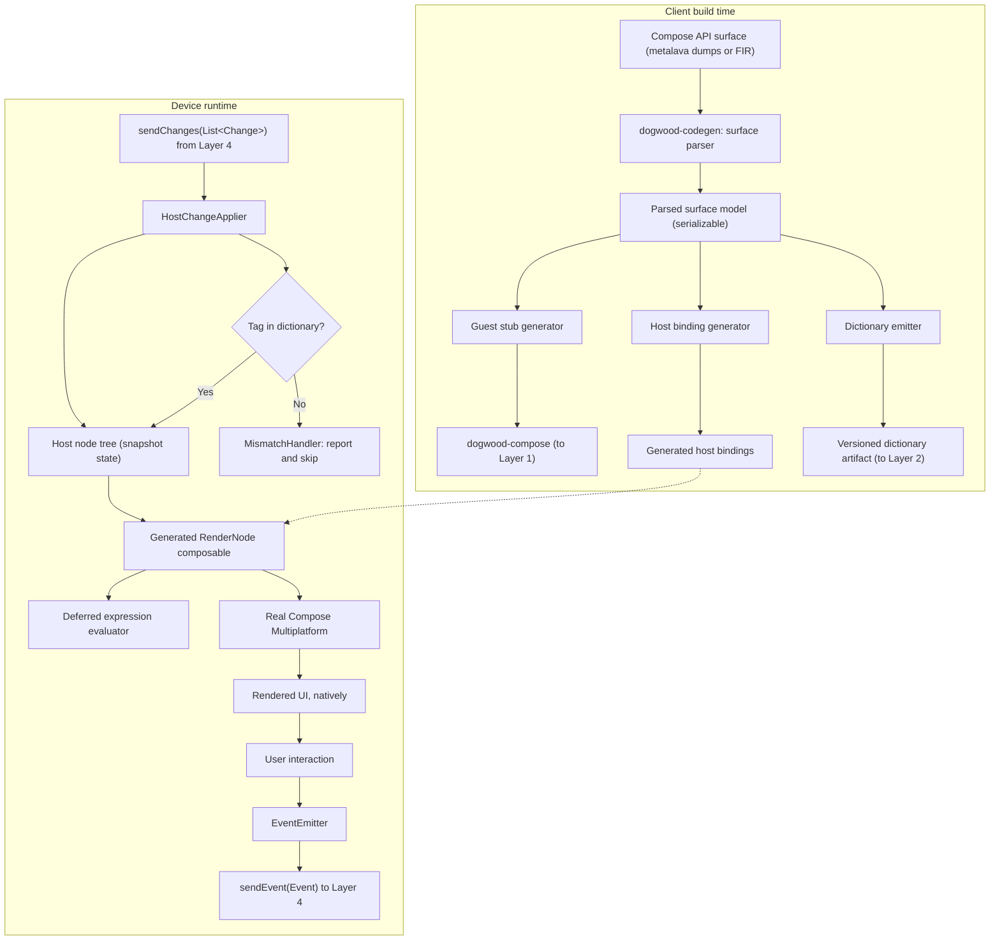

# Layer 5: The Native Host & Generated Binding Layer

## 1. Responsibilities & Scope

Layer 5 is the client-side half of the bridge and the home of `dogwood-codegen`, the tool that generates both halves. It receives batched changes from [Layer 4](layer-4-sandbox.md), maintains a mirror of the node tree, renders that tree with **real Compose Multiplatform**, and routes user events back to the guest.

This layer is what makes the product promise true: because its bindings are generated across the whole Compose surface rather than hand-written per component, the host already knows essentially everything a developer might call.

**What it does:**
- Generates, at client build time, the host binding layer, the guest stub library, and the binding dictionary — all from one parsed description of the Compose Application Programming Interface (API) surface.
- Applies inbound `Change` batches to a host-side node tree.
- Renders that tree by dispatching each node's `WidgetTag` to the real Compose function it names.
- Evaluates deferred constructor expressions for non-primitive parameter types.
- Emits `Event` values back to the guest when the user interacts.
- Handles unknown tags by skipping and reporting, never by crashing.

**What it does NOT do:**
- It does **not** hold application state or logic. All of that lives in the guest.
- It does **not** interpret intent. It applies tags mechanically.
- It does **not** implement accessibility or text input. Those come free from Compose Multiplatform; see [ADR-001](../adrs/layer-5/ADR-001-host-native-compose-owns-semantics-and-input.md).

## 2. Technical Stack & Dependencies

- **Language:** Kotlin Multiplatform (KMP), Android and iOS.
- **Rendering:** [Compose Multiplatform](https://github.com/JetBrains/compose-multiplatform), running natively. On iOS this is Skiko over Metal; accessibility has been on by default since Compose Multiplatform 1.8.0.
- **Code generation:** KotlinPoet, driven by a standalone tool. **Not Kotlin Symbol Processing (KSP)** — see [ADR-002](../adrs/layer-5/ADR-002-standalone-codegen-tool-not-ksp.md).
- **API surface source:** **The embedded Kotlin frontend, not metalava dumps alone.** Metalava signature files are useful for enumerating the surface but **cannot supply default values** — the format emits only the keyword `optional`, with no expression, and 73.9% of parameters across the measured surface are optional. Since the generator must reproduce defaults, it needs a source that carries them: the Kotlin frontend over Compose sources or klibs. Redwood uses `kotlin-compiler-embeddable` with a `schemaParserFir.kt` for exactly this reason. Milestone 1 confirms the approach; it no longer chooses between two equals.
- **Transport:** Zipline services, as defined in [Layer 4](layer-4-sandbox.md).

## 3. Internal Architecture

### Diagram Node Definitions

* **Compose API surface:** The machine-readable description of what Compose offers. androidx publishes metalava signature dumps at `<module>/api/current.txt`; these parse cleanly and were used to produce the coverage measurements in [ADR-003](../adrs/layer-5/ADR-003-opaque-handle-binding-surface.md).
* **`dogwood-codegen`: surface parser:** Reads that surface and produces a normalised model — every bindable function, its parameters, their types, defaults, and its overload group.
* **Parsed surface model:** A serializable intermediate representation. Making it serializable matters: it is the single source of truth from which all three outputs are generated, and it can be diffed between Compose versions to see exactly what changed.
* **Guest stub generator:** Emits `dogwood-compose` — recording functions with signatures identical to the real ones.
* **Host binding generator:** Emits the host dispatch layer that maps a `WidgetTag` to a real Compose call.
* **Dictionary emitter:** Emits the versioned artifact naming every API this client build understands, consumed by [Layer 2](layer-2-compiler.md) and by Layer 1's checker.
* **`HostChangeApplier`:** Applies an inbound batch to the mirror tree. Creates nodes, sets properties, inserts and removes children, updates modifiers.
* **Host node tree (snapshot state):** The mirror of the guest's tree, held in Compose snapshot state so that mutating it triggers host-side recomposition naturally.
* **Tag in dictionary? / `MismatchHandler`:** The containment gate, not a feature. Its contract is specified in section 6 of the [overview](../high-level-tech-spec-final.md) and is binding here.

  Two corrections to an earlier draft. First, **skipping an unrecognised `Create` is not safe**: Redwood's `HostProtocolAdapter` does `protocol.widget(change.tag) ?: continue`, which registers no node, so any later change on that identifier reaches `checkNotNull(nodes[id.value])` and throws — Redwood's own tests assert this. Dogwood must insert a **placeholder node** instead, so index arithmetic in the rest of the batch stays consistent. Second, `ProtocolMismatchHandler.Throwing` is not test-only in Redwood; it is the **default parameter value** of `HostProtocol.Factory.create`. Dogwood must supply a reporting handler explicitly.
* **Generated `RenderNode` composable:** A generated `@Composable` that dispatches on `WidgetTag` to the real Compose function, recursing into children slots. This is, structurally, the large dispatch table the project set out to eliminate — the point is that **no human writes or maintains it**.
* **Deferred expression evaluator:** Resolves non-primitive parameters. See below.
* **Real Compose Multiplatform:** Layout, measure, draw, animation, accessibility, and text input, all native and full speed.
* **`EventEmitter`:** Converts a host-side callback into an `Event(id, tag, args)`.

### Parameter Marshalling

Parameters fall into four classes. The first three are generated; the fourth is not.

**1. By value.** Primitives, `String`, and Kotlin inline value classes over primitives (`Dp`, `Color`, `TextUnit`, `IntSize`) travel as `JsonElement` inside `PropertyChange`.

Note an obligation this creates: those value classes live in `compose-ui`, `ui-unit`, and `ui-graphics`, **none of which Google publishes as a Kotlin/JavaScript artifact** — only `androidx.compose.runtime:runtime-js` and `runtime-saveable-js` exist. Depending on JetBrains' `ui-js` instead would drag layout, measure, and draw into a layer that must not contain them. Therefore **`dogwood-codegen` must also generate guest-side stand-ins for every value type it marshals.** This is a first-class generator output, not an incidental detail.

**2. By deferred expression, evaluated inside the host composition.** Non-primitive parameters — `Shape`, `PaddingValues`, `TextStyle`, `ButtonColors` — are recorded by the guest as a serialized *constructor expression* ("`RoundedCornerShape` with `8.dp`") and evaluated host-side. This avoids a synchronous guest-to-host round trip, which the asynchronous boundary makes impossible.

Three constraints are binding, and an earlier draft of this specification violated all three:

- **Evaluation happens inside the host composition, not in `HostChangeApplier`.** Many factories are `@Composable` — `ButtonDefaults.buttonColors()` is annotated `@Composable`, as is `MaterialTheme.colorScheme`. A composable function cannot be called from an applier.
- **The memo cache is keyed on the composition-local snapshot as well as the expression.** Keying on the expression alone means a dark-mode toggle never re-evaluates `buttonColors()` and every button keeps its light-theme colours.
- **Mixed guest/host expressions are unsupported.** `MaterialTheme.colorScheme.primary` is readable only inside a host composition, so the guest cannot compute from it — `.copy(alpha = 0.5f)`, `luminance()`, or `lerp()` over a theme value have no representation. [Layer 1](layer-1-authoring.md)'s checker must reject them.

The expression form is a second protocol in its own right, with a grammar, a tag space, dictionary entries, and version-skew rules. **It requires its own Architecture Decision Record before Milestone 6**, and it must be specified as a peer of `Change`, not as a footnote.

**3. By slot — but only composition-time slots.** A lambda is generable **only** if it is materialised once at composition time (a `content` block, becoming a `ChildrenTag`) or is a discrete fire-and-forget event (`onClick`, becoming an `EventTag`).

**4. By bespoke protocol — hand-written.** Everything else. See below.

### Bindability: The Real Rule

A composable is generable if and only if **every** lambda parameter is a composition-time slot or a discrete event, and no parameter is a live object the guest must read or call.

This rule, and not parameter-type marshallability, is what determines coverage. It excludes:

| Excluded | Why |
|---|---|
| `LazyColumn`, `LazyRow`, `LazyVerticalGrid` | `LazyListScope.() -> Unit` is invoked by the host per visible index during layout; `key` and `contentType` are `Any?` |
| `Canvas`, `Modifier.drawBehind`, `drawWithContent` | `DrawScope.() -> Unit` runs every draw pass |
| `Modifier.pointerInput` | A suspending `PointerInputScope` coroutine awaiting pointer events |
| `BasicTextField`, `TextField`, `OutlinedTextField` | Controlled components; the edit buffer is host-side and the value is guest-side |
| `BoxWithConstraints` | `maxWidth` is a host-measured value that guest logic reads |
| `SubcomposeLayout`, `Layout` | Custom measure policy |
| `HorizontalPager`, `AnimatedContent`, `DropdownMenu` | Host-owned live state and per-frame invocation |

**Measured coverage.** The classifier is committed at [`tools/measure-compose-surface.py`](../tools/measure-compose-surface.py) and runs over ten modules pinned to `androidx-main` commit `5bd169266a7ea9b28c5caf2c040e021677a7adc0`. Of **450** public `@Composable` User Interface functions in scope — after excluding 26 composition-control constructs that execute in the guest and 4 Android-only functions:

| Verdict | Count | Share |
|---|---:|---:|
| Generable with no bespoke dependency | 33 | 7.3% |
| Generable once the `Modifier` subsystem exists | 332 | 73.8% |
| **Total generable after `Modifier`** | **365** | **81.1%** |
| Requires a per-holder live-state protocol | 58 | 12.9% |
| Structurally unreachable | 27 | 6.0% |

Three cautions on reading this. The 73.8% hinge on **one** shared subsystem, so `Modifier` is the highest-leverage deliverable in the project. Function coverage overstates *parameter* coverage: many of the 81.1% carry an optional live-state parameter such as `MutableInteractionSource` that guest code cannot pass until a live-state protocol exists. And 28 of the 450 (6.2%) are `@Deprecated`, with no policy yet on whether they are bound.

An earlier figure of 1.3% unbindable, published in [ADR-003](../adrs/layer-5/ADR-003-opaque-handle-binding-surface.md), is **withdrawn**: it omitted `foundation-layout` entirely, classified by parameter type rather than bindability, and had no reproducible script.

### The Bespoke Subsystems

The excluded set is not open-ended; it is a bounded list of subsystems that must be designed once and hand-written. Redwood needed six. Each is a named, schedulable deliverable with its own Architecture Decision Record.

1. **`Modifier`.** Compose's `Modifier.Element` implementations are `internal` — `PaddingElement` does not appear in any public signature dump. A guest cannot name, cast, or serialize them. Dogwood must define its own tagged, serializable `Modifier` type, as Redwood did with `ModifierElement(tag, value)`. **Consequence: guest signatures differ from Compose signatures, and the "identical signatures" claim is withdrawn** (see [Layer 1](layer-1-authoring.md)). Scoped modifiers (`RowScope.weight`, `BoxScope.align`) are interface methods on scopes, so the tag space must be scope-aware and the generator must emit each children slot's dispatch *inside* its parent's scope.
2. **Lazy layouts.** A cut-down `LazyListScope` with guest-side windowing, a placeholder pool, and throttled `onViewportChanged(first, last)` callbacks. Redwood needed ten modules and a hand-tuned loading strategy for this one case.
3. **Text input.** A version-vector protocol with optimistic host-side state. Redwood's `TextFieldState` carries a `userEditCount` and its host binding discards stale guest updates outright.
4. **Live state holders.** `LazyListState`, `FocusRequester`, `SnackbarHostState`, `PagerState`, `DrawerState` — each needs mirrored state and a conflict rule.
5. **Host environment.** `LocalDensity`, `LocalLayoutDirection`, `MaterialTheme`, safe-area insets, dark mode, viewport size — delivered to the guest as a `StateFlow` of a serializable configuration, as Redwood's `UiConfiguration` does.
6. **Node identity and reuse.** See below.

### Host Composition, Identity, and Reuse

The host renders the mirror tree with a generated `@Composable RenderNode`. **Compose identity is positional**, so a generated `RenderNode` that does not wrap each child in `key(node.id)` will destroy and recreate a subtree on any reorder — losing host-side scroll position, animation state, focus, and the input method editor connection. Wrapping every child in `key(node.id)` is a **generator requirement with a test**, not a note.

Two consequences follow:

- `Id` values must be monotonic and never reused within a composition's lifetime, so a stale event cannot be delivered to a different node that inherited its identifier.
- Reuse must be expressed as *key stability*, not object pooling. Redwood pools because platform views are expensive to allocate; Dogwood's host nodes are composables whose state is positional, so the failure mode is lost state rather than lost allocations.

**An alternative worth benchmarking before Milestone 3 commits:** Redwood's host does not recompose at all. `HostProtocolAdapter` mutates widget objects imperatively and then calls `onEndChanges()`. Composing the mirror instead adds a second full composition and a guaranteed extra frame of latency. Both designs must be measured — apply-to-pixel latency and per-node cost at batch sizes of 1, 10, 100, and 1,000 — before this specification commits to the snapshot mirror.

## 4. Interfaces & Boundary

- **Inputs:** Batched `List<Change>` from Layer 4; user interaction from the platform.
- **Outputs:** Rendered native UI; `Event` values sent to Layer 4; the dictionary artifact produced at build time.
- **Memory ownership:** The host owns the mirror tree, the memoized expression cache, and all Compose objects. The guest owns its own heap. Nothing is shared by reference; every protocol message is a serialized copy.

  **The memo cache must be bounded.** Expressions with animated arguments — `PaddingValues(animatedDp)`, `TextStyle(fontSize = animatedSp)` — produce a structurally distinct key every frame, which at 60 Hz is 3,600 retained entries per minute. Specify a least-recently-used cache with a hard entry cap and byte budget, and a bypass so an expression derived from an animated property is evaluated without being cached. Redwood's analogous pool is capped at 16 entries with an explicit comment about balancing hit rate against memory.

  **Cross-boundary reference cycles are a known hazard and must be tested for, not asserted away.** Generated host bindings hold `@Composable` lambdas capturing event tags; the emitter holds the Zipline service; the service holds a reference into the guest. On iOS that cycle spans Kotlin/Native garbage collection and Swift automatic reference counting. Redwood ships `redwood-leak-detector` (Apache 2.0) and calls `leakDetector.watchReference(...)` on every detached node, with an explicit comment about mixing garbage-collected Kotlin objects with reference-counted Swift objects. Dogwood should adopt that module rather than reinvent it.

## 5. Implementation Roadmap

Milestones 1 to 5 build the generated path. Milestones 6 onward build the bespoke subsystems, which are the larger half of the work.

1. **Milestone 1 — Surface parser spike.** Evaluate metalava dumps against the embedded Kotlin frontend. Budget for the frontend being expensive: Redwood's equivalent module sets `maxHeapSize = '3g'` and `forkEvery = 1`.
2. **Milestone 2 — Re-derive bindability.** Reclassify the Compose surface under the rule in section 3 — every lambda must be a composition-time slot or a discrete event — and publish an honest coverage number plus the full excluded list. **This gates the roadmap**, because the excluded list defines the bespoke work.
3. **Milestone 3 — Hand-written vertical slice.** Bind ten simple composables by hand and render a guest-driven tree end to end on Android. Before committing to the snapshot mirror, benchmark it against an imperative host applier (Redwood's design) for apply-to-pixel latency at batch sizes 1, 10, 100, 1,000.
4. **Milestone 4 — Change application, keying, and events.** Implement `HostChangeApplier`, `key(node.id)` in generated `RenderNode`, monotonic non-reused `Id`s, and the event path including `onUnknownEvent` and `onUnknownEventNode` telemetry. Add the placeholder-node behaviour for unrecognised `Create` required by section 6 of the [overview](../high-level-tech-spec-final.md).
5. **Milestone 5 — The generator.** Build `dogwood-codegen` and replace the hand-written slice, emitting guest stubs, guest-side value-type stand-ins, host bindings, and the dictionary from one model.
6. **Milestone 6 — Deferred expressions.** Write the ADR first, specifying grammar, tag space, and skew rules. Then implement evaluation *inside the host composition*, with a bounded cache keyed on the composition-local snapshot.
7. **Milestone 7 — `Modifier`.** Dogwood's tagged modifier type, `then()` semantics, scope-aware tags, and per-scope generated dispatch.
8. **Milestone 8 — Host environment.** A `DogwoodConfiguration` `StateFlow` carrying density, layout direction, dark mode, safe-area insets, and viewport size.
9. **Milestone 9 — Live state holders.** Mirrored-state protocols, starting with `LazyListState` and `FocusRequester`.
10. **Milestone 10 — Lazy layouts.** Cut-down `LazyListScope`, guest-side windowing, placeholders, throttled viewport callbacks.
11. **Milestone 11 — Text input.** Version vector plus optimistic host state.
12. **Milestone 12 — Leak detection.** Adopt `redwood-leak-detector`; port its leak test. Bind, unbind, and assert every node, widget, and lambda is collected. **Before iOS, not after.**
13. **Milestone 13 — Skew containment drill.** Build a guest against a newer dictionary and confirm the three requirements in overview section 6 hold: placeholder nodes keep index arithmetic consistent, unknown properties fall back to documented defaults, and safety-relevant parameters trigger a declared fallback rather than rendering wrong.
14. **Milestone 14 — iOS parity.** Confirm VoiceOver, the input method editor, and text selection work, and that no cross-language reference cycles leak.
