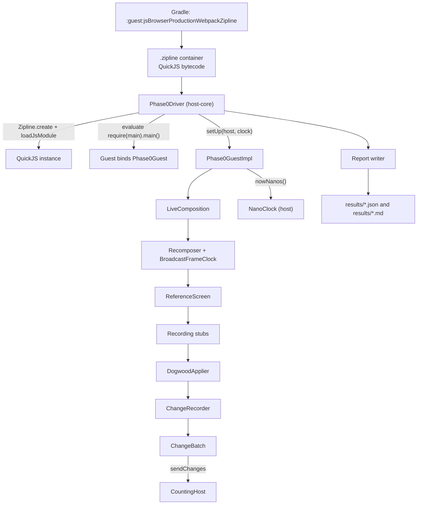

# Phase 0 Harness

The measurement harness for **Phase 0 — Falsify It Cheaply** ([roadmap.md](../../roadmap.md)).
Every experiment here exists to produce a number that could stop the project.

This directory is **measurement scaffolding, not the engine**. Nothing in it ships. Where it
resembles the architecture — the applier, the node tree, the change recorder — that is
deliberate, because experiment 0.2 measures "a real composition with a trivial Dogwood
`Applier` and Dogwood-shaped stubs", and a bare `Applier` would understate recording cost.

## What it proves

The single highest-risk unknown in [Layer 4](../../specs/layer-4-sandbox.md) is Milestone 1:
that `androidx.compose.runtime` compiled to Kotlin/JavaScript runs inside Zipline's QuickJS at
all. This harness does that first, and everything else measures it.

## How a measurement flows



### Diagram node definitions

- **Gradle task** — compiles the guest's Kotlin/JavaScript, runs it through webpack in
  production configuration, and hands the result to Zipline's compiler.
- **`.zipline` container** — an eight-byte magic prefix, a version, then a QuickJS bytecode
  section. The harness unwraps it exactly as `ZiplineLoadReceiver` does before loading.
- **`Phase0Driver`** — the experiment driver, in `host-core/`, compiled by both hosts.
- **QuickJS instance** — a fresh `Zipline.create` per cold run, so no interpreted code,
  object shape, or atom carries over between measurements.
- **Guest binds `Phase0Guest`** — the manifest's `mainFunction` runs and binds the guest's
  measurement service, which the host then takes by name.
- **`Phase0GuestImpl`** — the guest half of the harness; every method is scaffolding.
- **`LiveComposition`** — one live composition of the reference screen with its recorder,
  lambda slot table, and hand-ticked frame clock.
- **`Recomposer` + `BroadcastFrameClock`** — Compose's real scheduler, driven frame by frame
  from the harness so each recomposition is synchronous and therefore timeable.
- **`ReferenceScreen`** — the committed reference screen. One file, reused verbatim by 0.1,
  0.2, and 0.3.
- **Recording stubs** — the hand-written `Text`, `Column`, `Row`, `Box`, `Spacer` (dictionary
  segment 0) and `PrimaryButton`, `AsyncImage`, `Card`, `Badge`, `Divider` (segment 1). Both
  segments are exercised from the first run.
- **`DogwoodApplier`** — an `AbstractApplier` over the guest node tree, attaching widgets
  bottom-up and performing the depth-first purge on removal.
- **`ChangeRecorder`** — accumulates protocol changes and stamps each batch with a sequence
  number.
- **`ChangeBatch`** — one composition pass's changes, the unit experiment 0.3 measures.
- **`NanoClock`** — the host-injected monotonic clock, because the pinned QuickJS has no
  `performance.now`.
- **`CountingHost`** — the host end of the boundary. It counts and discards, so no host-side
  work is charged to the crossing.
- **Report writer** — renders the results file, including the mechanical gate evaluation.

## Layout

| Module | Contents |
| --- | --- |
| `protocol/` | The provisional v0 wire format from [ADR-004](../../adrs/layer-4/ADR-004-change-event-protocol-v0.md), transcribed field for field, plus the Zipline service boundary. Kotlin Multiplatform: JavaScript, Java Virtual Machine (JVM), Android. |
| `guest/` | Kotlin/JavaScript. The reference screen, the recording stubs, `DogwoodApplier`, the change recorder, the lambda slot table, and the guest half of the harness. Compiled to `.zipline` bytecode. |
| `host-core/` | The experiment driver, host services, statistics, and report writer. Compiled by **both** hosts from one directory, so the development host and the device run identical code. |
| `host-jvm/` | Command-line host. The development loop. |
| `host-android/` | On-device host. **This is the gate host** — see below. |
| `results/` | Generated. One JavaScript Object Notation (JSON) file and one Markdown file per run. |

## Running it

Prerequisites: a Java Development Kit (JDK) 21 (the Gradle daemon is pinned to it in
`gradle.properties`) and, for the Android host, an Android Software Development Kit (SDK)
with platform 36.

```bash
cd tools/phase0

# Development host. Compiles the guest first.
./gradlew :host-jvm:run --args="--label 'my machine'"

# On-device. Install, launch, then pull the results.
./gradlew :host-android:assembleDebug
adb install -r host-android/build/outputs/apk/debug/host-android-debug.apk
adb shell am start -n dev.dogwood.host.android/.Phase0Activity
adb logcat -s Dogwood            # progress
adb pull /sdcard/Android/data/dev.dogwood.host.android/files/results
```

Flags for `:host-jvm:run` (all optional): `--label`, `--rows` (default `23,50`), `--warmups`
(20), `--iterations` (200), `--composition-iterations` (50), `--cold-runs` (10), `--churn`
(500), `--out`.

Experiment 0.5 is a separate, longer run, because it answers a different question and takes
thousands of iterations to answer it:

```bash
# Development host.
./gradlew :host-jvm:allocGc --args="--label 'my machine'"

# On device or emulator. Opt in with an intent extra; without it the activity runs 0.1-0.4.
./gradlew :host-android:assembleDebug
adb install -r host-android/build/outputs/apk/debug/host-android-debug.apk
adb shell am start -n dev.dogwood.host.android/.Phase0Activity --es experiment alloc
```

Flags for `:host-jvm:allocGc`: `--label`, `--rows`, `--alloc-iterations` (2000),
`--big-alloc-iterations` (200), `--tail-iterations` (8000), `--trace-iterations` (2000),
`--thresholds` (kibibytes, comma-separated; repeats allowed so two thresholds can be
interleaved and an ordering effect told apart from a threshold effect), `--phases`
(`alloc,tail,trace`), `--out`. The Android host reads the same knobs as intent extras:
`--ei tail-iterations 6000`, `--es phases alloc`.

Experiment 0.5 is timed on the **host**, not in the guest. One `MonotonicClock` round trip
costs tens of microseconds — the same order as the crossing being measured — so the
sustained loops are timed by timestamping arrivals at `sendChangesEncoded`, and the traced
loop by bracketing one call. Results go to `results/alloc-gc-*.json`; the written-up findings
are in [results/allocation-and-gc.md](results/allocation-and-gc.md).

## What is gate-valid, and what is not

The Phase 0 gate is defined on **a low-end Android device of roughly 2022 entry tier**. No
number produced on a development machine, and no number produced on an emulator, opens or
closes that gate. An emulator on an Apple-silicon Macintosh runs ARM code on the development
machine's processor; it is a correctness check for the Android path, not a performance
measurement of a phone.

The report generated by each run states this at the top and evaluates the gate mechanically,
so the thresholds cannot be reinterpreted after the numbers are seen.

## The experiments

| # | What it measures | Where |
| --- | --- | --- |
| 0.1 | Payload sizes, module-load time, `main()` time, cold start to first composition, `QuickJs.memoryUsage` | `Phase0Driver.experiment01` |
| 0.2 | Monotonic-clock overhead, initial composition, recomposition after a one-node and a two-node state change | `Phase0Driver.experiment02` |
| 0.3 | Batch build, three encodings, transport-only crossing, and the real `sendChanges` crossing, at 1 / 10 / 100 / 1000 changes and at the reference screen's initial batch | `Phase0Driver.experiment03` |
| 0.4 | Recomposition tail and forced collection pauses at `gcThreshold` 256 KiB, 8 MB, and 16 MB | `Phase0Driver.experiment04` |
| 0.5 | Allocation per batch by encoding, the tail of a sustained steady-state stream (p99, p99.9, maximum), and whether a collection lands inside a frame | `AllocationGcExperiment` |

### Timing rules

Taken from the Phase 0 harness appendix and implemented literally:

- The pinned QuickJS (Bellard `2021-03-27`) has no `performance.now`, and `Date.now` is
  millisecond-granular, so the host injects a `MonotonicClock` Zipline service backed by
  `System.nanoTime`. Its own round-trip cost is measured over a thousand calls and the median
  is subtracted from every guest-timed sample.
- Recomposition timers start after the state write and stop when the batch is handed over,
  so bridge cost is excluded there and measured separately in 0.3.
- Two hundred iterations after twenty warm-ups by default; the host reports p50, p95, p99,
  minimum, maximum, and mean.
- "Cold" means a fresh `Zipline` instance, so no interpreted code, shape, or atom is carried
  over.

## Deviations from the appendix, and why

All four are recorded as decisions in
[ADR-005](../../adrs/layer-4/ADR-005-phase-0-harness-resolutions.md), not left as harness
folklore:

1. **The reference screen is 23 rows, not 50.** The appendix's stated construction and its
   stated node count contradict each other; 23 rows is the row count at which they agree
   (exactly 160 widget nodes). 50 rows is measured too, as a second point.
2. **Chip selection derives from `quantity`** so the state-holder count stays at exactly 24.
3. **Row clicks use an `onClick` parameter** as a stand-in for `Modifier.clickable`, whose
   lambda argument needs the Phase 2 modifier grammar.
4. **Experiment 0.4 uses the host-forced `gc()` fallback**, which the appendix permits, not
   the patched-QuickJS `JS_RunGC` hook it prefers. Standing up a patched native Zipline build
   requires the Android Native Development Kit (NDK) and is outstanding work.

Experiment 0.3 likewise reports end-to-end crossing plus bytes rather than the five-pass
internal breakdown, which the appendix permits when the patched Zipline build slips. The
guest-side encode legs are separated anyway, because the guest can time those itself.
